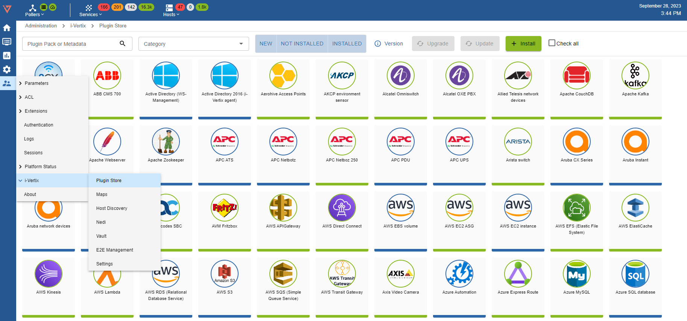
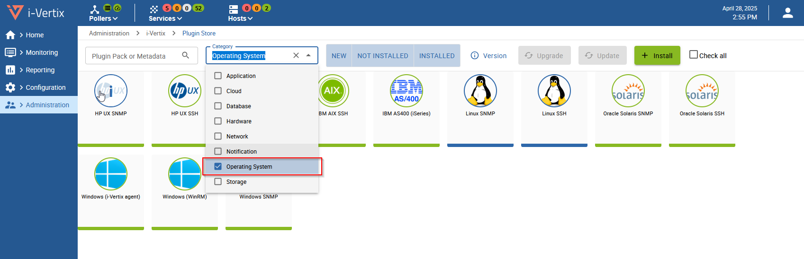
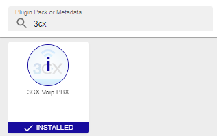
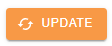
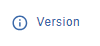

import ImageCounter from "../../../../src/components/ImageCounter";

A Plugin Pack is an installable package that provides a set of configuration templates, simplifying and accelerating the monitoring of your IT infrastructure.

Applying a template from a Plugin Pack is the easiest way to monitor a host.

- A plugin pack contains commands, host templates and service templates. Packs are installed through the i-Vertix interface. For each type of equipment,
  the templates determine which indicators will be
  monitored and set default warning and critical thresholds (that can be
  fine-tuned later on).

- Some packages also include discovery modes.

:::tip

In case you did not follow the Quick Start Guide, you must configure the Plugin Store Credentials before accessing the Plugin Packs catalog, as explained [here](../../quick-start-guide/how-to-configure-central-and-poller/plugin-store-configuration.md).

Contact the i-Vertix support (support@i-vertix.com) if not already done, to obtain your access.
:::

<!---

TODO: Temporarily commented because
- the vmware agent is already installed
- the NSClient++ plugin needs additional explanation, i.e. in a dedicated page like Monitoring Windows
- the AS400 section should point to https://helpdesk.i-vertix.cloud/front/knowbaseitem.form.php?id=10

which explains how to install the AS400 package

### Connectors

Some Plugin Packs also require a Connector (e.g. AS400, VMWare) or an agent
(e.g. Windows NRPE). In that case, it is explained in the monitoring procedure for the Plugin Pack. The connectors are
included in the Plugin Packs license.

| Connector       | Description                                                                   |
|-----------------|-------------------------------------------------------------------------------|
| i-Vertix Client | NSClient++, packaged by i-Vertix, ready to use with embedded i-Vertix Plugins |
| VMWare          | Perl daemon using VMware SDK to monitor VMware platforms                      |
| AS400           | Java-based connector allowing you to execute checks on an AS400               |

--->

### Browsing Plugin Packs

To install a new Plugin Pack, visit the Plugin Store page at
**Administration > i-Vertix > Plugin Store**

You can search by name or metadata, using the **Plugin Pack or Metadata** field

A short and not comprehensive list of values for metadata:
    - API
    - HTTP
    - HTTPS
    - SNMP
    - SSH
    - UPS
    - VOIP

For example, searching for UPS will return all the packs that have the UPS tag

It is also possible to refine the search using the **Category selector** (in the second image **Operating System**) selection

or by installation status

To get more information about a Plugin Pack, it is possible to show the Description tab, clicking on the **i** icon

### Installing a Plugin Pack

To install a pack, hover over the icon with the mouse and click on the ``+``

Once the pack is installed, it has a green outline and a green check mark.

| **Before installation**                                                      | **After installation**                                                             |
|------------------------------------------------------------------------------|------------------------------------------------------------------------------------|
|  |  |

It is possible to select a group of Plugin Packs for installation like in the screenshot at <ImageCounter num={1} /> :

and install all of them in a single operation clicking on <ImageCounter num={2} />

<!--

TODO: What are the dependencies that still need to be managed?
The section is not clear.

### Managing dependencies

During installation, some objects in the pack may not be installed. These objects are often additional configuration
objects and are not required to deploy the configuration templates provided by the pack.
--->

Please note that some Plugin Packs might require additional configuration to function correctly, particularly those involving Rest APIs, SNMP, SSH, and similar protocols.

For example the AS400 monitoring plugin requires some packages to be installed in the Central Virtual Machine.
Similarly, monitoring Windows Hosts via the i-Vertix agent, requires the package to be installed and configured for each monitored host.

:::tip

Always check the Description sidebar of the Plugin for more information about the installation procedure and the extra steps needed to complete the installation.
:::

---

### Updating/Upgrading the Plugin Store

The Plugin Stores receives updates directly from the internet, but user intervention is required for installation.
Most of the time, new Plugin versions introduce new features or fix existing bug.

Updates are handled through two separate procedures:

- **Update**: involves changes limited to template configurations, such as the addition of a new parameter or the adjustment of a service threshold

- **Upgrade**: introduces new functionalities, such as support for a new monitoring protocol

**Updates** can be performed at any time and do not require an **Upgrade**.
However, performing an **Upgrade** will automatically include an **Update**.

:::note

When installing a new Plugin, any pending **Update** will be applied automatically before installation.

:::

1) to update the Plugin Store click on **Administration >
   i-Vertix > Plugin Store**

If this orange image (on the left) appears on a Plugin Store it means that an update is available.

If this blue image (on the left) appears on a Plugin Store it means that an update is available.

In some case we can have both.

If you want to see what kind of implementations will be upgraded/updated you can click on

and on the left side will appear this overview

After an update or an upgrade of the Plugin Store it's a good idea to deploy the configuration to all the
poller/s ([Deploy the configuration](../../monitoring-resources/monitoring-basics/config-deploy.md)).

---

<!---

TODO: Currently re-installation is not possible

### Re-Install a Plugin Pack

You can re-install a plugin pack (in case of some issue) by clicking the **Re-Install** button.

:::caution
At the moment, the re-install resets **every** template contained in the plugin pack (also the generic-host and generic-service template for
example).

Any custom data or setting of every template which is part of this plugin pack will be removed.
:::

--->