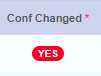
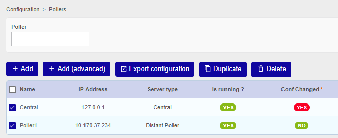
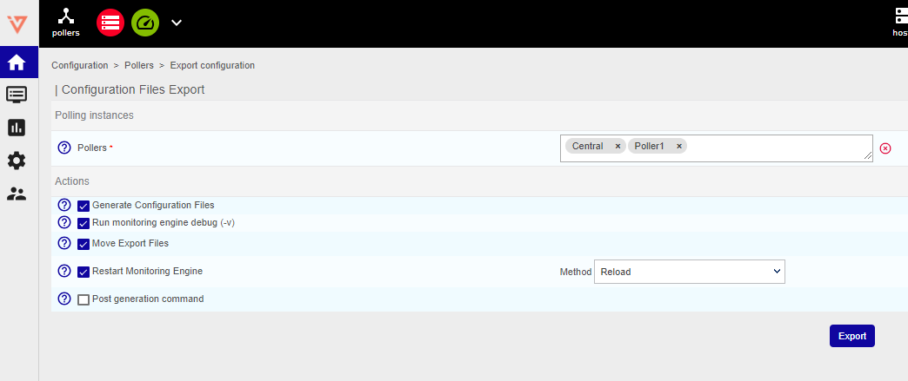
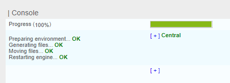

## Configuration Export
This step is essential to apply the configuration and therefore to monitor Hosts and Services. It has to be performed after the Discovery jobs/scans (Host Discovery, Network Topology Discovery, VMware Discovery, Cisco Meraki Discovery).

Generally speaking, any configuration changes performed on Hosts and/or Services will be  highlighted with a red YES in “Conf changed” column and will take effect only once it is exported to the Smart Poller(s). 
Select Configuration -> Pollers -> Pollers

“Conf changed”: 

Select **Configuration -> Pollers -> Pollers**

1. Select Central Manager or the Smart Poller in which the configuration has changed
2. Click on **”Export configuration”**

3. In the Actions section, select: 
* **Generate Configuration Files**
* **Run monitoring engine debug**
* **Move Export Files**
* **Restart Monitoring Engine -> Method: Reload**

4. Click on **Export**

