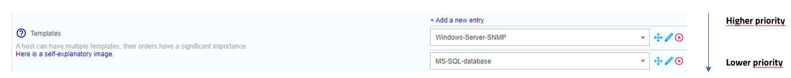

## Definition

A template is a preset set of object settings that can be used to configure an object. The main benefit is the ability to set default values for specific objects, speeding up the creation of similar objects.

:::note

A template can inherit properties from another template.

:::

Templates from plugin packs make monitoring hosts easy by providing out-of-the-box checks [commands](../generic-object-actions/commands.md).

## Inheritance

A host or host template can inherit from one or more host templates. This inheritance can be:

* associative (addition of multiple host templates)
* parent-child type

### Parent-child type inheritance

This is a predefinition of settings on "n" levels. The object inherits from its template, which in turn can inherit from its template. If the child redefines a setting, it overwrites the setting defined in the parent templates. Otherwise it is added to the settings.

### Associative type inheritance

This consists of adding together multiple templates within the same object to sum up all the available settings. If a host inherits from more than one host template, and the same setting is defined on more than one template, then the host template on top of the other templates takes precedence over its ancestors.

### Configuration

To add a host template:

Go into the **Configuration > Hosts > Templates** menu and click on **Add**

> Refer to the chapter covering configuration of [hosts](monitoring-host.md) to configure a template because the form is identical.
>
> By default, locked host templates are hidden. Check the "Locked elements" box to list all templates.
