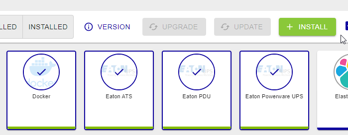

The list of Hosts that are configured for monitoring is shown on page **Configuration > Hosts > Hosts**.

New Hosts can be configured in two ways:

- [create hosts manually](create-host-manually.md), [using host templates](host-templates.md)
- use the [discovery feature](../discovery/description.mdx)

:::tip

If you are looking for the actual status of the already configured Hosts,
it is reported on page **Monitoring > Resource Status**

:::

## Requirements

Before you run automatic network scans and start monitoring hosts/services, make sure that:

* you configured the devices that are to be monitored so that they can be queried by i-Vertix IT Monitoring and monitoring protocols are allowed on any Firewalls that are in the middle
* you have all the **required credentials**:

> * Network devices: SNMP communities (required for Host Discovery and Network Discovery)
> * Linux OS devices: SNMP communities and/or SSH credentials (required for Host Discovery)
> * Windows systems: SNMP communities and/or WinRM credentials (you can also deploy an Agent)
> * VMware: a read-only vCenter user
> * Meraki: token API

* you installed from all the **Plugin Packs** needed to monitor your IT environment, otherwise see the [Plugin Packs](../monitoring-basics/plugin-packs.md) section of this guide

<!---
> Select: **Administration -> i-Vertix -> Plugin Store**.

## Installation procedure
1. Search for the required plugins by using the filters
2. Click on plugin icon to see which application/DB/device/device family/etc. the plugin applies to, which monitoring protocol/technology it uses to collect monitoring information, which status parameters and performance metrics it monitors, which discovery types can apply plugin components automatically

3. Select required plugins and click on "+ INSTALL"

--->