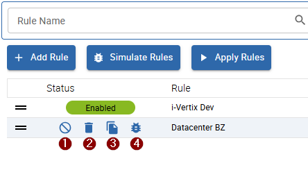

import Tabs from '@theme/Tabs';
import TabItem from '@theme/TabItem';
import ImageCounter from "../../../../src/components/ImageCounter";

## Overview

It is possible to modify certain parts of a host's configuration dynamically.
This feature is especially useful if certain host configurations need to change frequently based on different conditions.
For example, you may want to switch between various notification configurations for multiple hosts when a host is part of a specific group.

To configure such dynamic updates, you must create rulesets that filter hosts by conditions based on host properties and access groups.

Currently, the following host fields can be updated:

- Timezone
- Host Severity
- Geo Coordinates
- Host Macros
- Notifications:
    - Enable/Disable
    - Options (down, unreachable, recovering, etc.)
    - Notified Contacts
    - Notified Contact Groups

To view all existing rulesets or add a new one, navigate to `Configuration -> Hosts -> Host Configuration Rules`.

On the list page, you will see:

- <ImageCounter num={1} /> a list of all current rulesets
- <ImageCounter num={2} /> options to filter the list:
    - filter by rule name
    - filter by macro names (macros to set on the host)
    - filter by contactgroups (to set on the host)
    - filter by contacts (to set on the host)
    - filter by status (enabled/disabled)
    - filter by access groups (for admin)
- <ImageCounter num={3} /> options to paginate the list
- <ImageCounter num={4} /> a button to add a new ruleset
- <ImageCounter num={5} /> a button to simulate all rulesets and to analyze which hosts will be updated
- <ImageCounter num={6} /> a button to apply all rulesets manually
- <ImageCounter num={7} /> the possibility to [reorder rules](./updating-hosts-dynamically#order-rulesets)

## Create a new ruleset

To create a new ruleset, click <ImageCounter num={4} /> `+ Add Rule` above the list.

In the sidebar that opens, enter the following information:

### General

- <ImageCounter num={1} /> enter a descriptive name for the ruleset
- <ImageCounter num={2} /> (optional) enter a description for the ruleset
- <ImageCounter num={3} /> select the access groups for the rule; only hosts which are accessible by the selected 
access groups will be affected, and only users with access to all selected access groups will be able to interact with the rule

### Set Host Fields

> Each field is *optional*; provide a value only if you want to set the value directly on the hosts.
>
> Fields left empty have no effect on matched hosts.

- <ImageCounter num={4} /> choose a timezone
- <ImageCounter num={5} /> choose a severity
- <ImageCounter num={6} /> set geo coordinates

### <ImageCounter num={7} /> Set Host Macros

You can also configure host macros, which will be set on matched hosts.

To add a new macro, click the `+` button next to the label.

### Set Notification Options

> Each field is *optional*; provide a value only if you want to set the value directly on the hosts.
>
> Fields left empty have no effect on matched hosts.

- <ImageCounter num={8} /> enable or disable notifications
- <ImageCounter num={9} /> choose the desired notification options to specify when a notification should be sent

#### <ImageCounter num={10} /> Contacts

> Setting contacts is optional

Select contacts that will be assigned to matched hosts.
When `Incremental` is checked, selected contacts are **added** to hosts; when unchecked, selected contacts are **overwritten** on hosts.

- <ImageCounter num={11} /> Contactgroups

> Setting contactgroups is optional

Select contact groups that will be assigned to matched hosts.
When `Incremental` is checked, selected contact groups are **added** to hosts; when unchecked, selected contact groups are **overwritten** on hosts.

### <ImageCounter num={12} /> Define Conditions

> At least one condition is required

Define the conditions used to match the hosts you want to update.

To add a new condition, click the `+` button next to the label.

When adding a new condition, a dialog will appear.
In this dialog, provide the following information:

- the host property to check
- the operator to use for matching the value
- the value of the selected property to check against the host

:::info

When a host matches **all* defined conditions, it will be affected by the ruleset and updated.

You can combine as many conditions as you like, but ensure that conditions are strict enough to avoid matching unwanted hosts.

:::

:::tip

Remember that, in addition to the conditions, the selected access groups are also part of the conditions.
This behavior ensures that only hosts from a certain organization are affected by the ruleset (MSP compliance).

:::

#### Special Conditions

The following combinations allow for more specific configuration:

- property `host address` with operator `match cidr` to check if the host address belongs to a certain subnet
- property `host address` with operator `in range` to check if the host address is inside a certain ip range
- property `host macro`

<Tabs groupId="conditions">
<TabItem value="cidr" label="CIDR">

</TabItem>
<TabItem value="ip_range" label="IP range">

</TabItem>
<TabItem value="macros" label="Macros">

When selecting the property `host macro` you must also define the macro name to check.
You can choose the macro name from the list, which contains all utilized macro names among the monitoring system.
Alternatively, you can freely enter an unlisted (custom) macro name.

Macros may be inherited from other templates or directly set on the host.
This is especially useful when you want to target hosts more specifically—such as when they belong to a certain organization,
or in the case of VMware hosts, a particular container.

The value of the specified macro on a host (if present) will be checked against the provided value or regex (when operator is `matches`).

:::note

If a host doesn't have the macro set or inherited, the condition will fail when the operator is:
`equals`, `contains`, `matches` (when using `matches`, an empty value will be checked if the macro is missing).
If the selected operator is `not equals` or `not contains`, the condition will always be true.

This behavior applies to all other properties as well.

:::

</TabItem>
</Tabs>

When you filled in all required rule information and defined the conditions, you can save the the rule.

You can always edit your rule afterward.

## Order Rulesets

The order of rules has a significant effect when applying the rules.

Rules are applied from top to bottom in the displayed order, so keep this behavior in mind if multiple rules affect the same hosts.
One rule may overwrite fields set by another rule.

To reorder your rules, drag and drop a rule by grabbing the icon at the beginning of a row.

## Test your rulesets

Before applying your rulesets directly, it is recommended to test them to identify any misconfigured rules or hosts that might be incorrectly updated.

To do this, click <ImageCounter num={5} disableMargin /> `Simulate Rules` to test all available rules (only enabled ones),
or simulate a single rule by hovering over it and clicking the *simulate* button.

:::danger

Simulating only one rule won't inform you of any conflicts with other rules!

:::

A dialog will display the simulation results.

> If one or more rules conflict, a special view appears at the top of the simulation results, detailing the conflicts.

<Tabs groupId="simulation" queryString>
<TabItem value="conflicts" label="Conflicts">

A special orange entry appears in the simulation results when conflicts are detected. The information is as follows:

- <ImageCounter num={1} /> the header contains details about the number of conflicting rules and hosts
- <ImageCounter num={2} /> clicking the header opens a detailed view with a list of conflicts grouped by field
- <ImageCounter num={3} /> the <code>Field</code> column shows the host field in conflict
- <ImageCounter num={4} /> the <code>Rule</code> column and <ImageCounter num={5} /> <code>Value</code> column indicate the value set by each rule 
- <ImageCounter num={6} /> the <code>Hosts</code> column lists all hosts affected by the conflict

</TabItem>
<TabItem value="results" label="Results">

Simulation results are shown by rule, with the order matching the apply-order.

Click on a result item to display details about the rule, including which fields are set and which hosts are affected.

Each simulation result provides the following information:

- <ImageCounter num={1} /> the header displays the rule name, the number of fields set by the rule, and the number of hosts affected
- <ImageCounter num={2} /> a warning icon appears if the rule conflicts with other rules (see the "Conflicts" tab for more information)
- <ImageCounter num={3} /> the rule description
- <ImageCounter num={4} /> a list of all hosts affected by this rule; these hosts will be updated with the specified field values upon applying the rule
- <ImageCounter num={5} /> all fields and their corresponding values set by this rule
- <ImageCounter num={6} /> a warning icon is displayed for a field if it conflicts with other rules

</TabItem>
</Tabs>

Now, when you apply the rule(s), the hosts will be updated according to the defined rules.

### How to Deal with Conflicts

If you encounter conflicts during simulation, you may decide to adjust rule configurations or leave them as is. 
Keep in mind that rule application relies on order. For example, if multiple rules affect a host,
it may not be necessary to adjust a rule if the **last** value applied is the desired one.

Using the [simulation conflict detail](./updating-hosts-dynamically?simulation=conflicts#test-your-rulesets) view during
simulation helps you identify conflicting rules and view different values set for a field.

To resolve conflicts, you have several options:

1. Use more specific conditions on conflicting rules to prevent overlap
2. Reorder your rules so that the preferred value is always applied last
3. Leave the rules as they are if the final value already meets your requirements

:::tip

We recommend preventing or resolving conflicts whenever possible.
Handling conflicts can be complex, as you need absolute clarity on the final value that will be set on a host.

When many conflicts exist across different rules, this process can become confusing and hard to estimate.

:::

## Applying Rulesets

By default, **all enabled** rules are **applied every hour**.

To apply rules manually, click the <ImageCounter num={6} disableMargin /> `Apply Rules` button above the list.
After applying, ensure that you [export the corresponding poller configurations](../monitoring-hosts/export-configuration.md) for your rules to take full effect.

## Other Actions

When hovering over a rule in the list, additional actions are available:

- <ImageCounter num={1} /> enable/disable the rule; a disabled rule has no effect when rules are applied
- <ImageCounter num={2} /> delete the rule
- <ImageCounter num={3} /> duplicate the rule
- <ImageCounter num={4} /> simulate the rule
