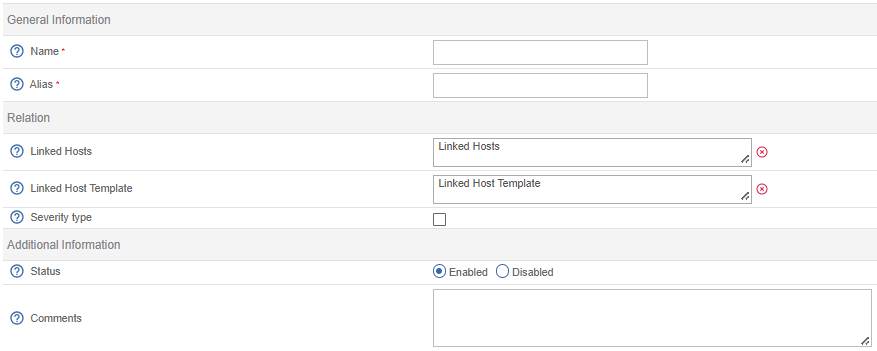
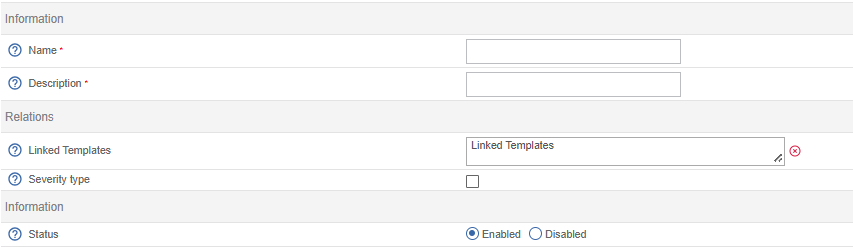

Categories allow you to:

- organise hosts or services to define user permissions on them using [ACLs](../../managing-users-contacts/acl.md)
- [Filtering the view](../../events-alerts/viewing-events/resources-status.md#filtering-events) on the **Resources Status** page.

A special type of category is called a severity. Severities can be used to achieve all of the above, but also to

- sort the view on the **Resource Status** page by severity, e.g. to show the most important alerts first. (Severity levels are displayed in the **S** column on the **Resource Status** page).

- Filter data in the **Host Monitoring** and **Service Monitoring** widgets in [Custom Views](../../events-alerts/viewing-events/create-custom-view.md).

## Hosts category

Go to the **Configuration > Hosts > Categories** menu and click on **Add**.

* The **Host Category Name** and **Alias** fields contain the name and alias of the host category respectively.
* The **Linked Hosts** list allows us to add hosts to the category.
* If a host template is added to the **Linked Host Template** list, all hosts that inherit from that template are listed as belonging to that category.
* The **Severity type** field indicates that the category of hosts has a level of severity.
* The **Level** and **Icon** fields define a criticality level and associated icon respectively.
* The **Status** and **Comment** fields allow us to enable or disable the host category and to comment on it.

## Services category

Go to the **Configuration > Services > Categories** menu and click on **Add**.

* The **Name** and **Description** fields define the name and description of the service category.
* When a service template is added to the **Service Template Descriptions**, all services that inherit from that template are listed as belonging to that category.
* The **Severity** field indicates that the service category has a criticality level.
* The **Level** and **Icon** fields define a criticality level and associated icon respectively.
* The **Status** field allows us to activate or deactivate the service category.

## Severities

### Creating a severity

To create a severity:

1. Go to **Configuration > Hosts > Categories** or **Configuration > Services > Categories** and click **Add**.
2. Fill in the **Name** and **Alias** fields, then select **Severity Type**.
3. Define a severity level (a number used to sort hosts or services in the **Resource Status** page) and an icon to appear in the **S** column of the **Resource Status** page.
4. Click on **Save**. The severity will appear in the severity list.

### Applying the severity to a host or service

1. Edit the host or service (go to **Configuration > Hosts > Hosts** or **Configuration > Services > Services by Host** and then click on the host or service).
2. In the **Extended Info** tab, in the **Monitoring Engine** section, select the required severity from the **Severity Level** list.
3. Click on **Save**.
4. [Deploy the configuration file](../monitoring-basics/config-deploy.md). On the **Resource Status** page, the severity icon will appear in the **S** column. A tooltip displays the level and name of the severity. Clicking the column header will sort the view by severity level.