import Tabs from '@theme/Tabs';
import TabItem from '@theme/TabItem';
import ImageCounter from "../../../../src/components/ImageCounter";

You can organize hosts and services dynamically into host and service groups, as well as into host and service categories.
To understand the concept of organizing your monitoring system, please refer to the concept pages for [groups](./groups.md) and [categories](./categories.md).

The i-Vertix Monitoring system offers you dedicated pages to define rulesets, which are used to categorize your hosts and services into such groups.
The rulesets are be executed periodically and update the targeted groups and categories.

## Organizing hosts and services dynamically

You can organize your hosts dynamically into:

- Hostgroups
- Host categories

and your services into:

- Servicegroups
- Service categories

## Create rulesets

<Tabs groupId="organize">
<TabItem value="hostgroups" label="Hostgroups">

<h2>Assign hosts to hostgroups</h2>

To add a new ruleset for assigning hosts dynamically to hostgroups, open your i-Vertix Monitoring web interface and navigate to `Configuration -> Hosts -> Dynamic Hostgroups`.

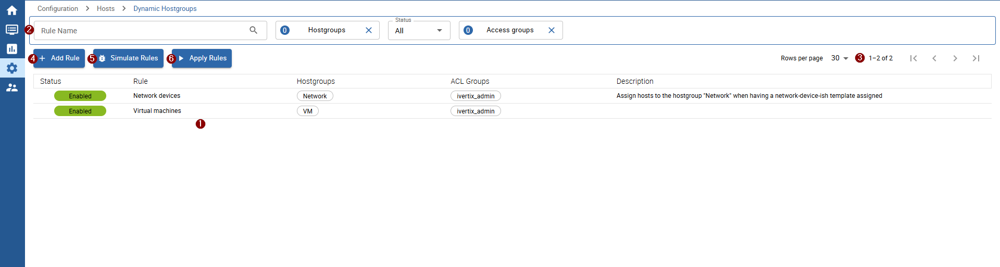

- <ImageCounter num={1} /> list of all current rulesets
- <ImageCounter num={2} /> possibilities to filter the list:

    - filter by rule name
    - filter by targeted hostgroups
    - filter by status (enabled/disabled)
    - filter by access groups (for admin)

- <ImageCounter num={3} /> paginate the list
- <ImageCounter num={4} /> add a new ruleset
- <ImageCounter num={5} /> simulate all rulesets to analyze, which hosts will be assigned to which hostgroup
- <ImageCounter num={6} /> apply all rulesets manually

To add a new ruleset, click <ImageCounter num={4} /> `+ Add Rule`.

<h3>Add a new hostgroup ruleset</h3>

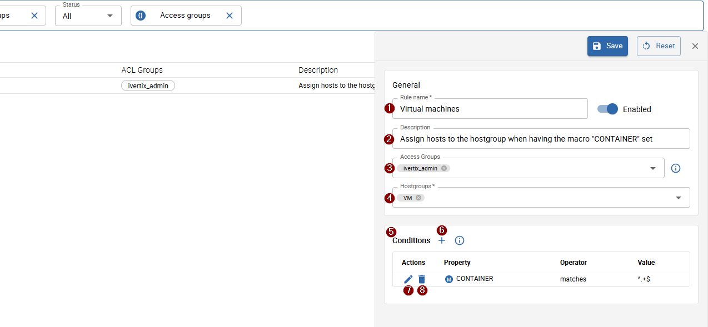

- <ImageCounter num={1} /> insert a descriptive name for the ruleset
- <ImageCounter num={2} /> (optional) insert a description for the ruleset
- <ImageCounter num={3} /> choose the access groups for the rule, only hosts which are accessible by the selected 
access groups will be affected and only users with access to all selected access groups are able to interact with the rule
- <ImageCounter num={4} /> choose the targeted hostgroups to which all matched hosts will be assigned to
- <ImageCounter num={5} /> define conditions which are used to match the hosts you want to have assigned to the selected hostgroups (at least one condition is required)

    - <ImageCounter num={6} /> add a new condition
    - <ImageCounter num={7} /> edit an existing condition
    - <ImageCounter num={8} /> remove an existing condition

</TabItem>
<TabItem value="host_categories" label="Host categories">

<h2>Assign hosts to host categories</h2>

To add a new ruleset for assigning hosts dynamically to host categories, open your i-Vertix Monitoring web interface and navigate to `Configuration -> Hosts -> Dynamic Categories`.

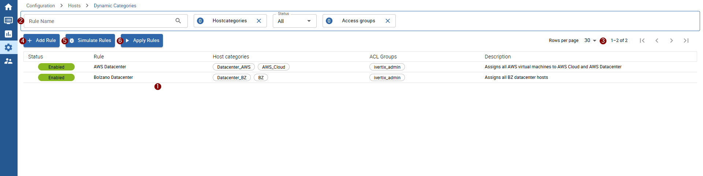

- <ImageCounter num={1} /> list of all current rulesets
- <ImageCounter num={2} /> possibilities to filter the list:

    - filter by rule name
    - filter by targeted host categories
    - filter by status (enabled/disabled)
    - filter by access groups (for admin)

- <ImageCounter num={3} /> paginate the list
- <ImageCounter num={4} /> add a new ruleset
- <ImageCounter num={5} /> simulate all rulesets to analyze which hosts will be assigned to which category
- <ImageCounter num={6} /> apply all rulesets manually

To add a new ruleset, click <ImageCounter num={4} /> `+ Add Rule`.

<h3>Add a new host category ruleset</h3>

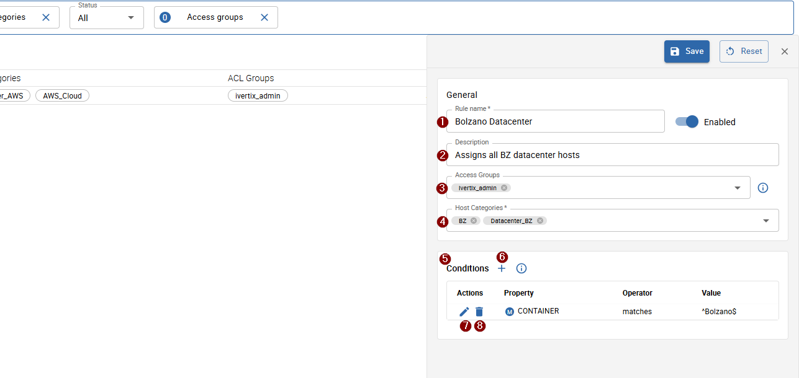

- <ImageCounter num={1} /> insert a descriptive name for the ruleset
- <ImageCounter num={2} /> (optional) insert a description for the ruleset
- <ImageCounter num={3} /> choose the access groups for the rule, only hosts which are accessible by the selected 
access groups will be affected and only users with access to all selected access groups are able to interact with the rule
- <ImageCounter num={4} /> choose the targeted host categories to which all matched hosts will be assigned
- <ImageCounter num={5} /> define conditions which are used to match the hosts you want to have assigned to the selected host categories (at least one condition is required)

    - <ImageCounter num={6} /> add a new condition
    - <ImageCounter num={7} /> edit an existing condition
    - <ImageCounter num={8} /> remove an existing condition

</TabItem>
<TabItem value="servicegroups" label="Servicegroups">

<h2>Assign services to servicegroups</h2>

To add a new ruleset for assigning services dynamically to servicegroups, open your i-Vertix Monitoring web interface and navigate to `Configuration -> Services -> Dynamic Servicegroups`.

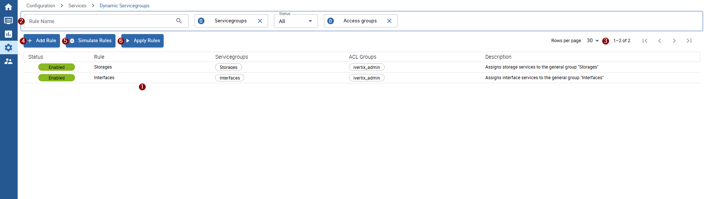

- <ImageCounter num={1} /> list of all current rulesets
- <ImageCounter num={2} /> possibilities to filter the list:

    - filter by rule name
    - filter by targeted servicegroups
    - filter by status (enabled/disabled)
    - filter by access groups (for admin)

- <ImageCounter num={3} /> paginate the list
- <ImageCounter num={4} /> add a new ruleset
- <ImageCounter num={5} /> simulate all rulesets to analyze, which services will be assigned to which servicegroup
- <ImageCounter num={6} /> apply all rulesets manually

To add a new ruleset, click <ImageCounter num={4} /> `+ Add Rule`.

<h3>Add a new servicegroup ruleset</h3>

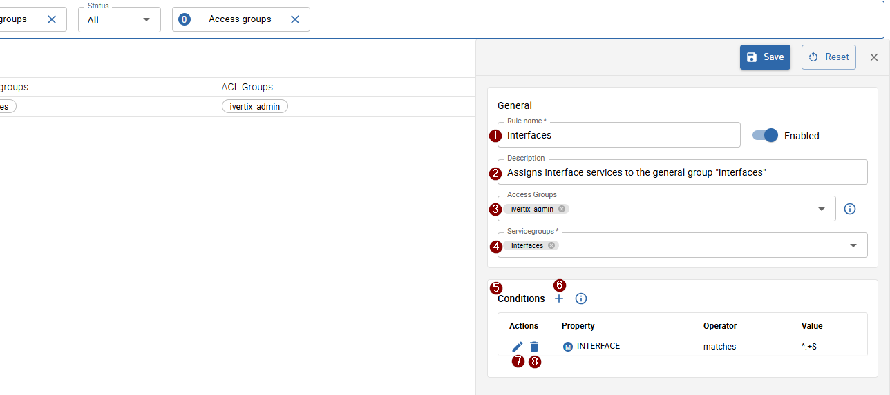

- <ImageCounter num={1} /> insert a descriptive name for the ruleset
- <ImageCounter num={2} /> (optional) insert a description for the ruleset
- <ImageCounter num={3} /> choose the access groups for the rule, only services which are accessible by the selected 
access groups will be affected and only users with access to all selected access groups are able to interact with the rule
- <ImageCounter num={4} /> choose the targeted servicegroups to which all matched services will be assigned to
- <ImageCounter num={5} /> define conditions which are used to match the services you want to have assigned to the selected servicegroups (at least one condition is required)

    - <ImageCounter num={6} /> add a new condition
    - <ImageCounter num={7} /> edit an existing condition
    - <ImageCounter num={8} /> remove an existing condition

</TabItem>
<TabItem value="service_categories" label="Service categories">

<h2>Assign services to service categories</h2>

To add a new ruleset for assigning services dynamically to service categories, open your i-Vertix Monitoring web interface and navigate to `Configuration -> Services -> Dynamic Service categories`.

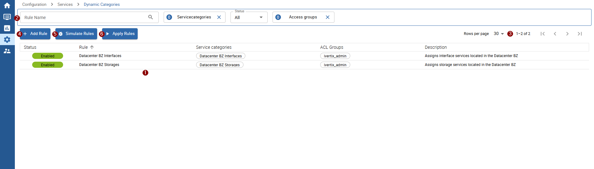

- <ImageCounter num={1} /> list of all current rulesets
- <ImageCounter num={2} /> possibilities to filter the list:

    - filter by rule name
    - filter by targeted service categories
    - filter by status (enabled/disabled)
    - filter by access groups (for admin)

- <ImageCounter num={3} /> paginate the list
- <ImageCounter num={4} /> add a new ruleset
- <ImageCounter num={5} /> simulate all rulesets to analyze, which services will be assigned to which category
- <ImageCounter num={6} /> apply all rulesets manually

To add a new ruleset, click <ImageCounter num={4} /> `+ Add Rule`.

<h3>Add a new service category ruleset</h3>

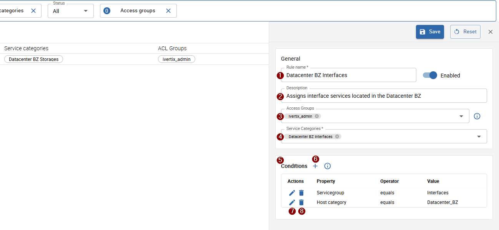

- <ImageCounter num={1} /> insert a descriptive name for the ruleset
- <ImageCounter num={2} /> (optional) insert a description for the ruleset
- <ImageCounter num={3} /> choose the access groups for the rule, only services which are accessible by the selected 
access groups will be affected and only users with access to all selected access groups are able to interact with the rule
- <ImageCounter num={4} /> choose the targeted service categories to which all matched services will be assigned to
- <ImageCounter num={5} /> define conditions which are used to match the services you want to have assigned to the selected service categories (at least one condition is required)

    - <ImageCounter num={6} /> add a new condition
    - <ImageCounter num={7} /> edit an existing condition
    - <ImageCounter num={8} /> remove an existing condition

</TabItem>

</Tabs>

### Define rule conditions

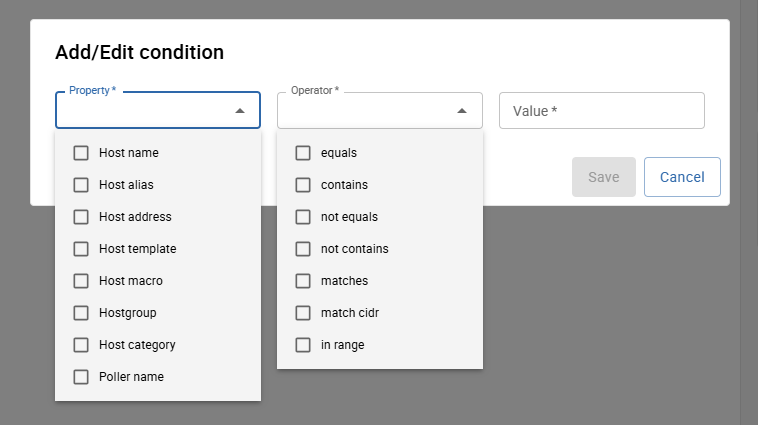

When adding a new condition, a dialog will appear.
In the dialog, you need to insert the following information:

- the property of the host/service to check
- the operator to use to match the value against
- the value of the selected property to to check against a host/service

:::info

When a host matches **all** defined conditions, it will be affected by the ruleset and assigned to the group/category.

You can combine as many conditions as you like, but ensure that conditions are strict enough to avoid matching unwanted hosts/services.

:::

:::tip

Remember that, in addition to the conditions, the selected access groups are also part of the conditions.
This behavior ensures that only hosts or services from a certain organization are affected by the ruleset (MSP compliance).

:::

#### Special conditions

The following combinations allow for more specific configuration:

- property `host address` with operator `match cidr` to check if the host address belongs to a certain subnet
- property `host address` with operator `in range` to check if the host address is inside a certain ip range
- property `host macro` or `service macro`

<Tabs groupId="conditions">
<TabItem value="cidr" label="CIDR">

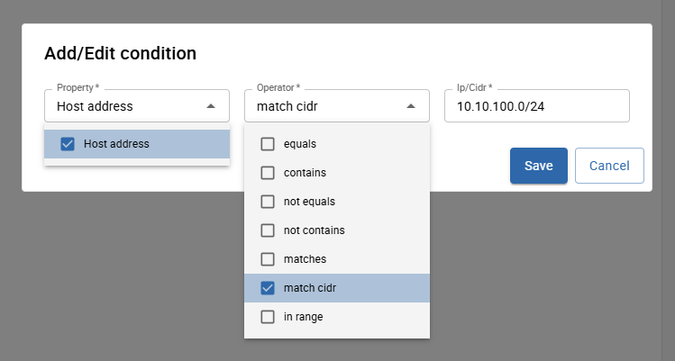

</TabItem>
<TabItem value="ip_range" label="IP range">

</TabItem>
<TabItem value="macros" label="Macros">

When selecting the property `host macro` or `service macro` you must also define the macro name to check.
You can choose the macro name from the list, which contains all utilized macro names among the monitoring system.
Alternatively, you can freely enter an unlisted (custom) macro name.

Macros may be inherited from other templates or directly set on the host/service.
This is especially useful when you want to target hosts/services more specifically—such as when they belong to a certain organization,
or in the case of VMware hosts, a particular container

The value of the specified macro on a host/service (if present) will be checked against the provided value or regex (when operator is `matches`).

:::note

If a host/service doesn't have the macro set or inherited, the condition will fail when the operator is:
`equals`, `contains`, `matches` (when using `matches`, an empty value will be checked if the macro is missing).
If the selected operator is `not equals` or `not contains`, the condition will always be true.

This behavior applies to all other properties as well.

:::

</TabItem>
</Tabs>

When you filled in all required rule information and defined the conditions, you can save the the rule.

You can always edit your rule afterward.

## Test your rulesets

Before directly applying your rulesets, it is strongly recommended to test your rules to identify any wrongly assigned hosts or misconfigured rules.

To do so, you can <ImageCounter num={5} disableMargin /> `Simulate Rules` from the list to test all available rules (only enabled rules), or simulate just a single rule
by hovering over the desired rule and clicking the *simulate button*.

A dialog will appear, displaying the simulation results.

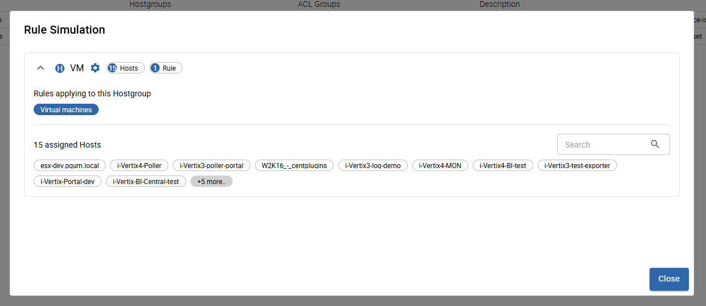

The list displays results by group/category. On the item header, you find the name of the group/category,
the number of hosts/services that will be assigned to it, and the number of rules that targeted the group/category.

When clicking on the header, you can view the list of rules and the affected hosts. By default, only 15 hosts/services are shown,
but you can display more by clicking on `+X more..` or by filtering the list using the search field above.

Now, when you apply the rule(s), the hosts/services will be assigned to the corresponding groups/categories.

## Applying rulesets

By default, **all enabled** rules are **applied every hour**.

To apply rules manually, click on the <ImageCounter num={6} disableMargin /> `Apply Rules` button above the list.
After applying, make sure to [export the corresponding poller configurations](../monitoring-hosts/export-configuration.md) to allow your rules to take full effect.

## Other actions

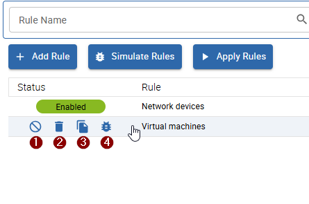

When hovering over a created rule in the list, further actions for the rule are available:

- <ImageCounter num={1} /> disable/enable the rule - when a rule is disabled, it won't have any effect when rules are applied
- <ImageCounter num={2} /> delete the rule
- <ImageCounter num={3} /> duplicate the rule
- <ImageCounter num={4} /> simulate the rule
