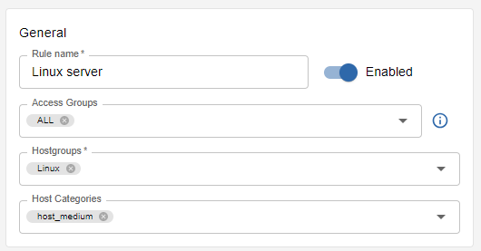
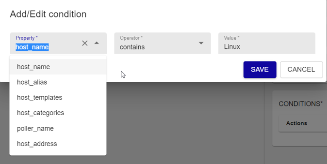
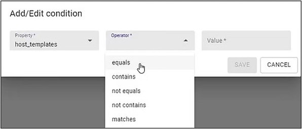
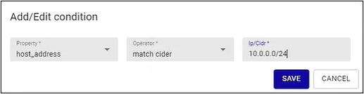
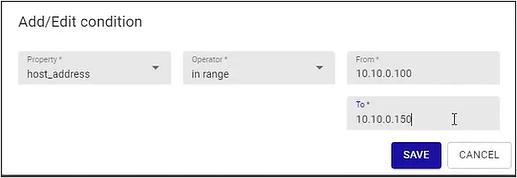
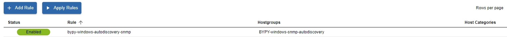

## Configuration

**Configuration -> Hosts -> Dynamic Hostgroups** then press on the button "+ ADD RULE"

### Rule configuration
* Rule name: rule description 
* Access Groups: user groups that can edit the rule and apply filters to objects
* Hostgroups: to which devices will be assigned
* Host Categories: categories are used to define ACLs on hosts and services
* Conditions: If met, devices will be automatically assigned to related hostgroups

Conditions can be based on different properties:
* host_name
* host_alias
* host_templates
* host_categories
* poller_name
* host_address

::: note

A single rule can have multiple conditions

:::

Fields entered by the user are used to check that condition is met. A rule can be made up of one or multiple conditions. You can use the AND operator to combine two or more conditions into a Rule.

The configuration is now complete. What happens now?

The Hostgroup is automatically updated every hour. Changes do not take effect until the configuration is exported to the Smart Poller.

If the user doesn’t want to wait for the next automatic update, he/she can use the "Apply Rules" function to update the hostgroup on demand, but again, changes do not take effect until the configuration is exported to the Smart Poller.

