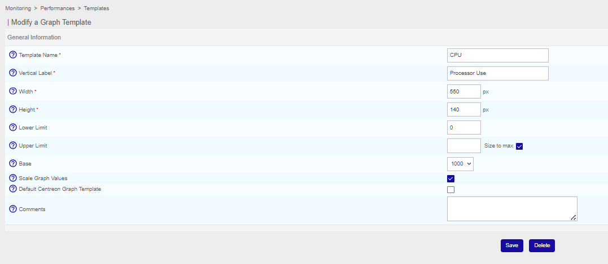

## Definition

Graph models are models which can be used to shape graph layouts. Graph models can be used to configure multiple
presentation settings including the y-axis measurement, the width and the height of the graph, or colors, etc.

## Configuration

Go to the **Monitoring \> Performances \> Templates** menu

* The **Template name** field represents the name for the graph model
* The **Vertical label** field contains the legend for the y-axis (type of data measured).
* The **Width** and **Height** fields are expressed in pixels and express respectively the width and the height of the model.
* The **Lower limit** field defines the minimum limit of the y-axis.
* The **Upper limit** field defines the maximum limit of the y-axis.
* The **Base** list defines the calculation base for the data during the scaling of the graph y-axis. Use 1024 for measurements like the Bytes (1 KB = 1 024 Bytes) and 1 000 for measurements like the volt (1 kV = 1 000 Volts).
* The **Scale Graph Values** checkbox enable auto scale of the graph and bypass previous options
* The **Default i-Vertix Graph Template** allows to display all chart without predefined template using these values

:::note

Regardless of the selected value, base 1024 will be used on following metric units :
* B
* bytes
* bytespersecond
* B/s
* B/sec
* o
* octets

:::

:::info

If the box **Size to max** is checked, the graph will automatically be scaled to the scale of the maximum value ordinates shown on the given period.

:::

## Using a graph template

You can add this layout model on edition a service (or a template of service) by going into the **Service Extended Info**
tab in configuration form:

