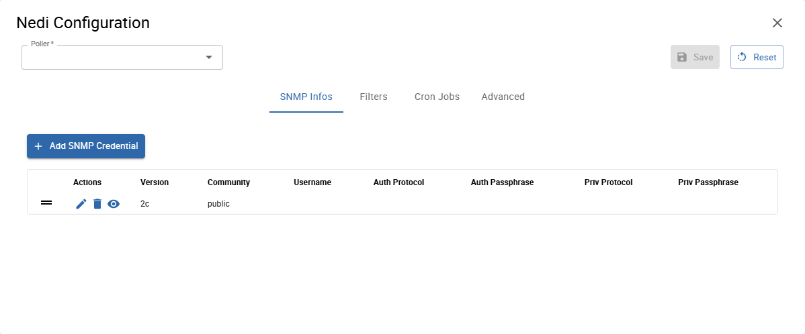

Go to **Administration -> i-Vertix -> Plugin Store** and install the required Network plugins

### Configure a new job
To add a new Discovery Job:

Go to **Configuration -> Hosts -> Discovery Jobs** 
* click on **+ADD JOB**
* select **Network Topology**

### Job settings

* **Job Name**: use a meaningful name 
* **Nedi Configuration**: select a configuration from the drop-down menu otherwise click on **+ ADD CONFIGURATION** to create a new one
    * **Poller**: select the Smart Poller that will run the scan

    * **SNMP info**: click on **+ ADD SNMP INFO** to enter the SNMP communities

### Template Rules

Mapping rules are preconfigured by i-Vertix

### Entry Points

Enter IP Address or IP Address range from which the discovery will have to start

### Finalize

Select **Start Job directly after saving** to run the scan as soon as it gets saved. Select the Entry Point added previously. 
Click on **Save** to save the discovery job.

The job will be run according to the configured schedule.

### Results

Once the scan completes, its **results are displayed**.

They depend on hosts reachability, template rules mapping, SNMP reachability and status filters that have been applied (Note: “new” and “existing (ip)” are applied by default).

**LIST** tab displays the hosts that were detected by the discovery

### Map tab

This tab displays the network infrastructure topology map: how network devices are interconnected to each other and the root device(s) (**RELATION ROOT(S)**).

To assign root role to a device, click on it and then select **RELATION ROOT**. A red circular border will appear. 
Multiple relation roots can be defined. 
You can replace the current one or add new ones. 

### How to monitor Hosts

Select the hosts you want to monitor and click on **SYNC WITH MONITORING**.

:::note

As previously stated, any changes will take effect only once they are exported to the **Smart Poller(s)**. 

:::

See the complete procedure for [Network Topology Discovery](../../monitoring-resources/discovery/nedi.md)