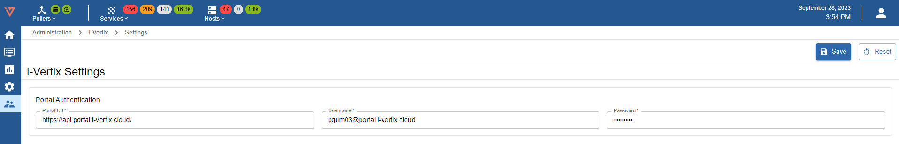

Some connections parameters have to be configured in order to access the monitoring profiles included in the Plugin
Store.

These parameters can be configured using the web GUI, by selecting **Administration -> i-Vertix -> Settings** from the
menu.

Please insert following authentication credentials:

**Portal Url** 
```text
https://api.portal.i-vertix.cloud/
```

**Username & Password** 

ask our [Support team](mailto:support@i-vertix.com) to receive your personal credentials



:::caution Mandatory
This task is mandatory to ensure a properly working monitoring experience.

After completion, please proceed to the next step to complete the procedure: [Plugin installation](plugin-update-installation.md)
:::
