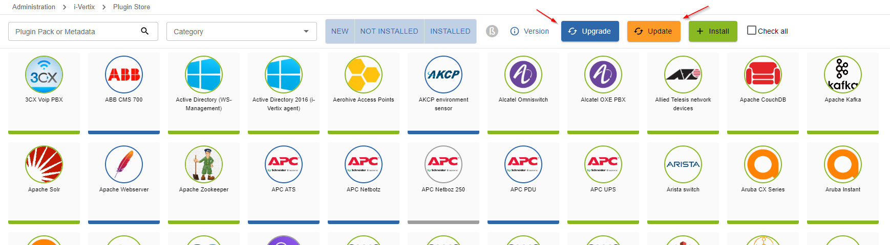
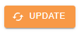
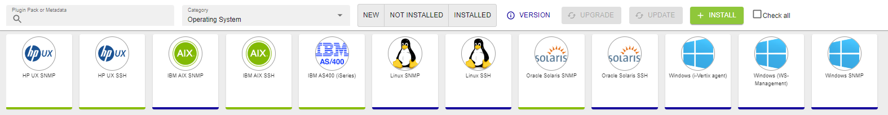
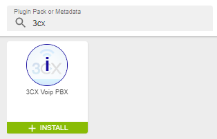
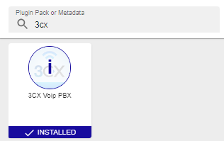

Access the Plugin Store from: **Administration -> i-Vertix -> Plugin Store**, then press the **Upgrade** button to install the latest plugins.

:::warning[Mandatory]
This task is mandatory to ensure a properly working monitoring experience
:::



### Difference between upgrade and update

New releases can be of two types: **upgrades** or **updates**. During the upgrade phase, plugins’ packages are downloaded with version and structure change. On the other hand, the update changes or adds the plugins’ configurations, that allow to run monitoring queries and to use the correct parameters.  

### Plugins’ upgrade


The upgrade changes the plugins’ version by downloading the actual plugins’ files (perl files) from the i-Vertix Cloud portal. This is a very important step as it is considered a major update. During this phase, the plugins and the related connectors that keep them cached may change. 

A sync is performed every 4 hours or force a sync with immediate deploy directly from the management CLI, using these commands:

```
scripts

cd i-vertix/

./sync_poller.sh
```

The result will be a series of successful synchronization confirmations. 

Perform a configuration export and restart the engine to clear the cache and delete old files. 
 

### Plugin’s update



Updates only add or modify templates configurations or commands. In this case, the plugin’s structure does not get changed and it is therefore not required to restart the poller. 

### Install a Plugin

Now you have access to the Plugin Store catalog, go to **Administration > i-Vertix > Plugin Store**:


You can search the plugin by type or by Category




In order to install a plugin, move the mouse over the icon and click on the button ``+ INSTALL``



You can also click on the **i** of the Plugin to display more details.


| **Before installation**                                                      | **After installation**                                                             |
|------------------------------------------------------------------------------|------------------------------------------------------------------------------------|
|  |  |