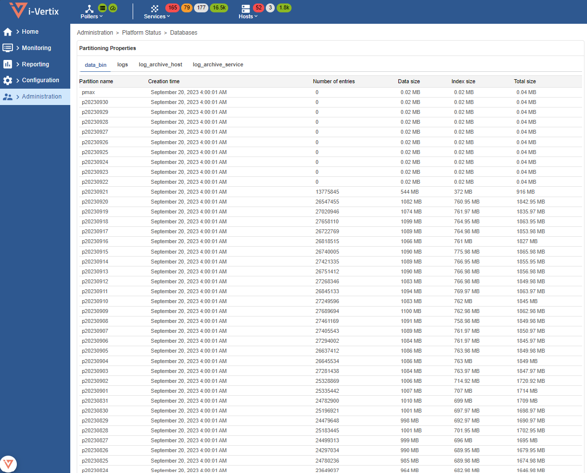
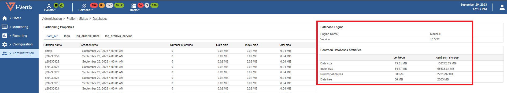

## Monitoring of partitioning operation

The **i-Vertix Database** Plugin Pack allows you to control that the number of
partitions created in advance is sufficient. It is recommended to install and
deploy this Plugin Pack.

It is also possible to view the partitioned tables and the consumption
associated with each partition via the `Administration > Platform Status >
Databases` menu:

More general information on the state of health of the databases is also
present:

