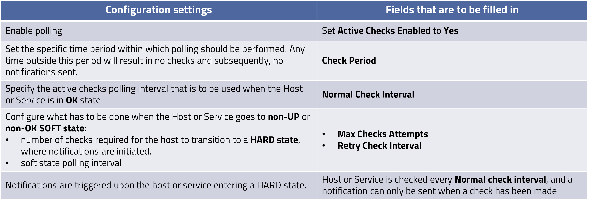
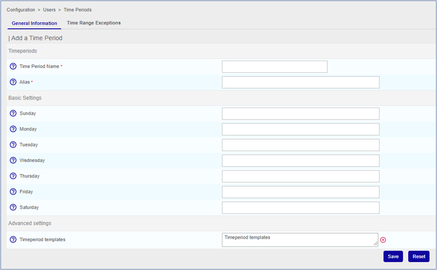
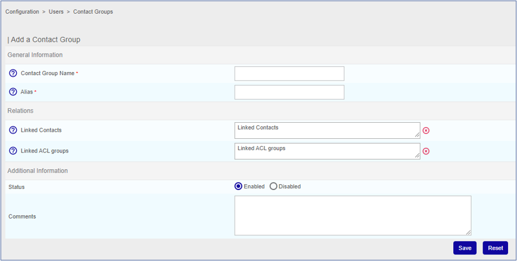
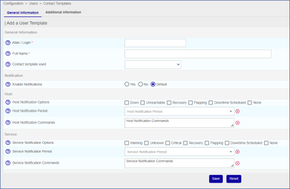
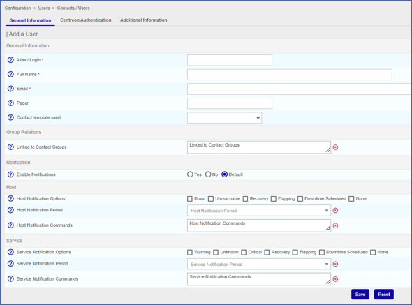

## Step 1: Polling configuration

1. Go to Configuration > Hosts > **Hosts** or Configuration > Services > **Services by host** and select a Host or a Service.
2. The Host Configuration > **View a Host** or General Information > **View a Service** opens, respectively 
3. Fill in the fields in Scheduling Options section. If no values are set here, the Host or Service will inherit the values from its **parent template**.

## Step 2: Notifications setting – Time Periods

**Configuration -> Users -> Time Periods**

Configure the time periods during which notifications will be sent. Preconfigured time periods are available

To add a new time period click on **Add**.

The **Add a Time Period** window opens.

### General Information tab
#### Timeperiods
**Time Period Name**: enter a meaningful name

**Alias**: additional description 

### Basic Settings
Enter start and end time (in this **format hh:mm-hh:mm**) of periods during which notifications are to be sent.

### Time Range Exceptions tab
Enter specific time periods whose settings override normal periods ones

## Step 3: Notifications setting - Contact Groups

Contact Groups are groups of contacts that should receive notifications (notification recipients). 

**Configuration -> Users -> Contact Groups**

To add a new Contact Group click on Add. The Add a Contact Group  window opens.

**General Information**

**Contact Group Name**: enter a meaningful name

**Alias**: additional description

**Relations** (optional. Can be configured at a later time)

**Linked Contacts**: enter the Contacts (group members).

**Linked ACL groups**: enter ACL group(s) that are to be linked to the Contact group. An **ACL group** is, as the name says, a group of **ACLs**. They are used to grant **users rights** on IT Monitoring GUI, monitored Hosts and Services, notification actions, etc.

**Additional Information**

**Status**: select Enabled in order to enable the group

## Step 4: Notifications setting – Contact Templates

**Configuration -> Users -> Contact Template**

**Contact Templates are used to associate notification settings to Contacts/Users.** 
A preconfigured generic template (generic-contact_template) is available. It can be edited or new ones can be created.

To add a new Contact Template click on **Add**. The **Add a User Template** window opens. 
 
### General Information**
* **Alias / Login**: use a meaningful name
* **Full Name**: description

**Notification**
* **Enable Notifications**: select Yes to enable notifications

**Host/Service**
* **Host/Service Notification Options**: select the Hosts/Service   status for which notifications have to be sent to the user that is being configured.
* **Host/Service Notification Period**: select the notification time period.
* **Host/Service Notification Commands**: specify the command(s) that is(are) to be used to notify the user that is being configured. Preconfigured templates are available for different notification channels: Email, Slack, Teams, Telegram, SMS.

## Step 5: Notifications setting – Contacts / Users

**Configuration -> Users -> Contact / Users**

This section lets you define new Users that will access the system and/or will receive notifications, configure existing ones and also and associate users to Contact Groups.

To add a new User click on **Add**. The **Add a User** window opens.

**Group Relations**

**Linked to Contact Groups**: links the user to the Contact Group(s) the he/she should belong to. 

**Notification**

**Enable Notifications**: select Default. 

**Host/Service**
* **Host/Service Notification Options**: select the Hosts/Service   status for which notifications have to be sent to the user that is being configured.
* **Host/Service Notification Period**: select the notification time period.
* **Host/Service Notification Commands**: specify the command(s) that is(are) to be used to notify the user that is being configured. Preconfigured templates are available for different notification channels: Email, Slack, Teams, Telegram, SMS.

