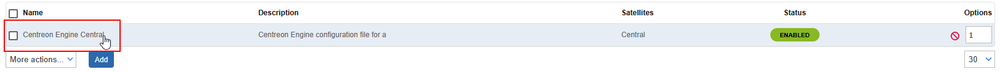

import Breadcrumb from "../../../../src/components/Breadcrumb";

:::info
Before configuring email notifications, please note that each Poller manages email notifications independently.
As a result, since emails are sent through the SMTP relay, every Poller must have a working SMTP configuration.
:::

:::info
The email sender address can—and must—be customized individually on each Poller.
:::

## Enable SMTP
The first step to configure email notification is to Enable SMTP using the Poller CLI.
Please see page [Enable SMTP](../../installation/setup-central-poller/smtp-configuration.md)
if not already done.

## Enable Notifications
Email Notifications are enabled through the procedure
reported in this page: [Configure notification](configuring-notification.md)

Please make sure to select
`host-notify-by-email` and `service-notify-by-email`
as notification commands in <Breadcrumb crumbs={["Configuration", "Users", "Contacts / Users"]} />

## Change sender for email notifications

In some cases it is useful to change the sender for the email notifications.
For example, it is needed in the case that the SMTP relay accepts emails only with a given sender.

To change the sender, perform the following steps.

1. Visit <Breadcrumb crumbs={["Configuration", "Pollers", "Engine configuration"]} />

2. Click on the poller for which the address should be changed

3. Enter Admin tab

4. Change the `Administrator Email Address` field

5. Click `Save` to to save the new changes

:::warning
To really apply the setting export the configuration to the Poller, making sure to
select the `Restart` Method for the `Restart Monitoring Engine` Field.
:::