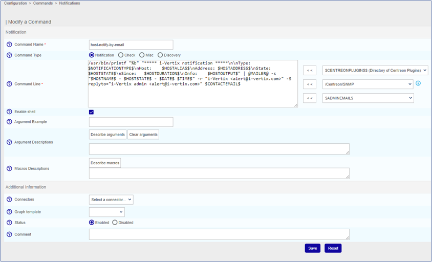

import Breadcrumb from "../../../../src/components/Breadcrumb";

The sender email address can be customized for each Poller, since the mail notifications are sent
from the Poller itself.

1. [Enable SMTP](../../installation/setup-central-poller/smtp-configuration.md)

2. [Configure notification](configuring-notification.md)

3. Go to <Breadcrumb crumbs={["Configuration", "Pollers", "Engine configuration"]} />

4. Click on the poller for which the address should be changed

5. Enter Admin Tab

6. Change the `Administrator Email Address` field

7. Click `Save` to to save the new changes
