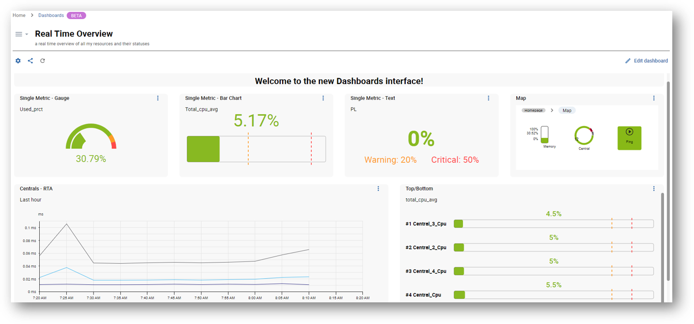
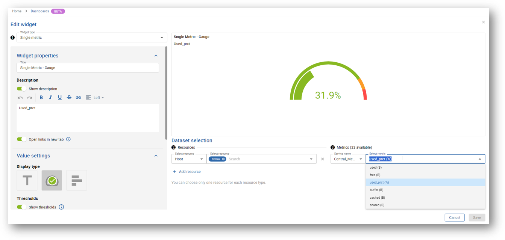
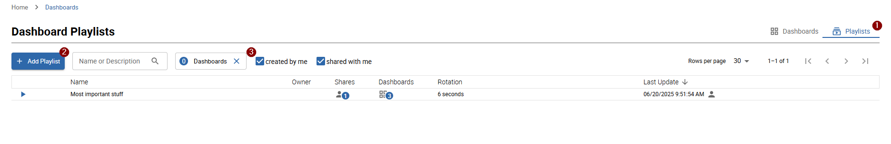
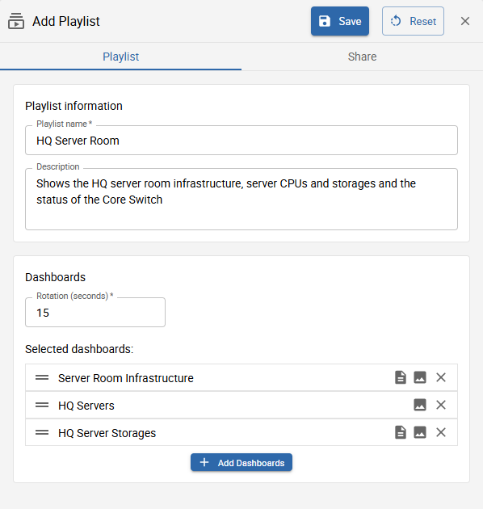
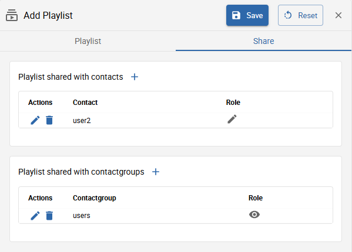
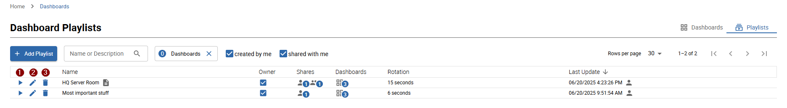
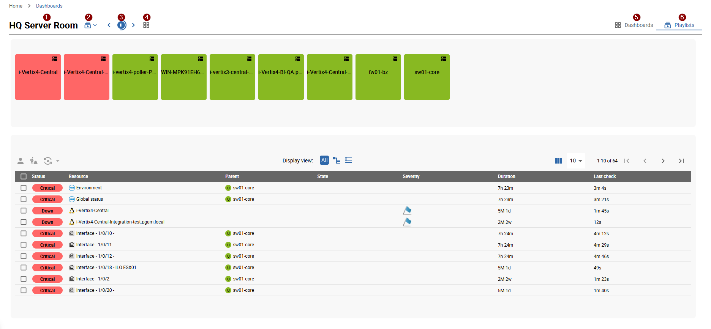

import Tabs from '@theme/Tabs';
import TabItem from '@theme/TabItem';
import Breadcrumb from "../../../../src/components/Breadcrumb";
import ImageCounter from "../../../../src/components/ImageCounter";

Get started with creating dashboards and adding widgets specially designed to optimize your user experience. Then benefit from data visualization options to display and monitor your resources in real time.

## Activating the Dashboards feature

Access to the Dashboards feature is not managed at the user level, but through access groups or ACLs (Access Control Lists). You allow users to access the feature by granting rights to the ACL to which they belong (read more [about ACLs](../../managing-users-contacts/acl.md)).

### Configure the ACL

> - You must be logged into the monitoring as an administrator.

- In this example, we will create a new ACL called **Dashboards users**. This ACL will contain users belonging to the **Guests** user group.

1. Go to **Administration > ACL > Menus Access**.
2. Click the **Add** button. This opens the **Add an ACL** form.
3. Name the **ACL Definition**. In this example: **Dashboards users**.
4. Select **Enabled** in the **Status** parameters.
5. Select the **Linked Groups** to include in this ACL. In this example: **Guests**.
6. In the **Accessible Pages** section, expand the **Home** menu, then the **Dashboards** one. This displays the list of profiles to select.

  > - **Viewer:** can only view dashboards to which they have access.
  > - **Creator:** can create and edit dashboards to which they have access.
  > - **Administrator:** can access and edit all dashboards.

7. Select the profile to be set for this ACL. In this example: **Viewer**.
8. Click **Save** to confirm your changes.

## Creating your first dashboard

> You must be logged into the monitoring system with administrator or an user accoutn with creator permissions.

 To create a dashboard, navigate to <Breadcrumb crumbs={["Home", "Dashboards"]} />.

1. In the **Dashboard library** page, click the **Create a dashboard** button. This opens the **Create dashboard** modal.
2. Name the dashboard and enter a description if needed.
3. Click **Create** to confirm the creation.

Your dashboard is now added! You can directly start adding widgets.

### Add widgets

> Your dashboard must be open in edition mode.

- If this is your very first widget, click the **Add a widget** area.
- If not, click the **+ Add a widget** on the right of the interface.

Most of the widgets usually follow these steps:

- **Step 1:** Select the type of widget. The widget parameters then depend on the widget you select.
- **Step 2:** Select resources.
- **Step 3:** Select metrics.

 > Make sure to save your changes. If you leave without saving your dashboard, changes will be permanently lost.

### More actions

Click the **three vertical dots** menu at the top right of the widget to edit it or to access more actions:

- Refresh
- Duplicate
- Delete widget

> In edition mode, you can easily organize your widgets by moving or resizing them. Make sure to save your changes.

### Link to Resources Status page

From the dashboard, you can click a screen pictogram at the top right of a widget: this button allows you to **See more on the Resources Status page**. It opens a new tab on the Resources Status page, with detailed information regarding the specific widget.

## Managing dashboards

> You must be in the **Dashboard library** page to get an overview of your dashboards.

### Edit a dashboard

#### Update properties

Click the **gear** button at the bottom right of the dashboard to update its name and description.

#### Edit dashboard widgets

1. Click the dashboard to open it in view mode.
2. Click **Edit dashboard** to access and manage widgets in edition mode.

### Delete a dashboard

Click the **trash** button at the bottom left of the dashboard to delete it. Then confirm the deletion.

### Share a dashboard

> You can share dashboards using the **Manage access rights** interface.

#### About access rights

You are using the Dashboards feature with a **viewer** or an **editor** profile:

- **Viewers:** can only view dashboards you share with them.
- **Editors:** can view and edit dashboards you share with them.

#### Manage access rights

1. Click the **share** button at the bottom right of the dashboard.
2. In the **Add contact** dropdown list, select the user to add.
3. Select either **Viewer** or **Editor** profile.
4. Click the **+** button to add it.
5. Repeat the action for each user you want to add.
6. Click the **Update** button to save your changes.

The users you have just added now have access to your dashboard sharing, according to the profile you have set for them.

> Use the **Copy link** feature to share the dashboard URL directly with users who have access to your platform.

## List of widgets

| Widget                   | Description                                                                                                                                                                                                                                                                                                    |
|--------------------------|----------------------------------------------------------------------------------------------------------------------------------------------------------------------------------------------------------------------------------------------------------------------------------------------------------------|
| Business Activity Diagram           | Displays graphically a business activity hierarchy of KPIs and lets you navigate through it.   |
| Clock/Timer           | Displays the time according to the selected time zone, or a timer.   |
| Generic text           | Allows you to add free text to your dashboards (section titles, information, etc.).   |
| Group monitoring           | Displays the distribution of current statuses on selected groups of resources, as a table.   |
| Map            |  Allows you to select and visualize a map created from i-Vertix Maps.  |
| Metrics graph         | Displays metrics for a given time period.                                                                                |
| Resource table                 | Displays data on resource status and events, centralized in a table.
| Single metric          | Displays the value of a single metric as a text, a gauge or a bar chart.   |
| Status chart     | Displays the distribution of current statuses on selected resources, as a chart.      |
| Status grid     | Displays the current status of selected resources, as a grid.      |
| Top/bottom              | Displays the top or bottom x hosts, for a selected metric.   |
| Topology Map            |  Allows you to select and visualize a topology map created from i-Vertix Topology Maps.  |
| Web page           | Displays a web page.   |

## Dashboard playlists

It is also possible to create dashboard playlists, which are used to present a slideshow of selected dashboards.

### Create a dashboard playlist

To configure new or list all dashboard playlist, navigate to the configuration list by selecting <ImageCounter num={1} /> `Playlists` on the top right of the `Dashboard library` page.
You can also <ImageCounter num={3} /> filter all available playlists.

Click <ImageCounter num={2} /> `Add Playlist` to create a new playlist.

<Tabs>
<TabItem value="general" label="General playlist information">

- **Name**:* insert a descriptive name for your playlist
- **Description**: you can also insert an additional description to better describe the playlist you are about to create
- **Rotation**:* choose the time interval for the slideshow duration
- **Selected dashboards**:* select all dashboards you want to present

</TabItem>
<TabItem value="share" label="Share playlist">

You can share the playlist with other users or users which are part of contactgroups.
You can choose between two different roles: *viewer* or *editor*. The roles define the granted permissions to the users.

</TabItem>
</Tabs>

After inserting all the required information you can save your playlist.

### View a dashboard playlist

You can <ImageCounter num={2}/> `edit` and <ImageCounter num={3} /> `delete` an already existing playlist.

To view the playlist, click the <ImageCounter num={1} /> `play` button. You will be redirected to the slideshow.

- <ImageCounter num={1} disableMargin={true} /> Name of the currently displayed playlist
- <ImageCounter num={2} disableMargin={true} /> Switch between other playlists
- <ImageCounter num={3} disableMargin={true} /> Pause the automatic rotation of dashboards contained in playlist or return to previous or go to next dashboard
- <ImageCounter num={4} disableMargin={true} /> View all dashboards contained in the playlist
- <ImageCounter num={5} disableMargin={true} /> Return to the dashboard library
- <ImageCounter num={5} disableMargin={true} /> Return to the playlist configuration
