import Tabs from '@theme/Tabs';
import TabItem from '@theme/TabItem';
import ImageCounter from "../../../src/components/ImageCounter";

:::note

Placing objects on maps is only available on graphical (normal) and geographical maps. If you are looking for a help on topology maps, see our documentation section on [creating topology maps](./managing-maps#create-a-new-topology-map).

:::

## Before you start

Make sure to have read all information about graphical and geographical maps in our documentation about [how to use and display maps](./visualize-maps#view-graphical-and-geographical-maps).

The next thing required for placing objects on maps is a map itself.
If you don't already have a map ready, have a look at our documentation on [how to create a graphical or geographical map](./managing-maps#create-a-new-graphical-or-geographical-map).

When you have your map created, open it from the [Map overview](./visualize-maps#map-overview).

## Editing mode

To make any changes on a map, you first need to enter the *Edit Mode*. To do so, click the `Edit` buttion on the top right corner of the page.
You should now be in *Edit Mode*, instead of the `Edit` button you should now see `Save Map`, `Reset` and `Exit Edit Mode` as well as a collapsed sidebar and 4 different controls on the right of the map area.

After entering the *Edit Mode*, the map is automatically locked and **real-time data is no longer refreshed!**.

### Map locked

When a map is locked, it prevents other users from entering the *Edit Mode*, which is needed to make any changes to the map.
Normally, the map gets unlocked again when a user exits the *Edit Mode* by clicking the button `Exit Edit Mode` on the top right corner.

:::note

Because of this it is always **highly** recommended to exit the *Edit Mode* before leaving the page.  

:::

If you encounter a map in locked state, it probably means somebody is currently working on the map.

> A map should not be edited by more than one person at the same time!

#### Unlock a map manually

If you find yourself in the situation that you made sure nobody is working on the map but the map is still locked you can manually *unlock* the map.
To do so, navigate to the map list on `Configuration -> Maps` and click the `unlock` button on the map you wish to unlock. The map should now be unlocked again.

:::info Nice to know

If a map remains in *locked* status, the last user which edited the map left the page without exiting the *Edit Mode* in the intended way.

:::

## Add new objects to the map

*only available in Edit Mode*

### Concept

All saved map changes are automatically applied to other visualizations of the map.
This ensures that maps displayed on hands-off screens are updated automatically, including map widgets and maps opened via `Monitoring -> Maps`.

<Tabs groupId="type">
<TabItem value="normal" label="Graphical (normal)">

Objects on a graphical (normal) map stand always for themselves - this means only objects which are manually added by the user are effectively placed on the map.
The position of objects is not shared between other maps and is *only maintained manually* by moving objects around (not like on geographical maps).

Graphical maps are static - the only thing which interferes with object positions is the background.
When the background of a graphical map is replaced and the new background is smaller in size, overflowing objects may reset their position.

The positions of objects do not change across different resolutions - this means the map looks the same even if it's displayed on different screen resolutions, only the zoom level may differ.

</TabItem>
<TabItem value="geo" label="Geographical">

Geographical maps have unique characteristics compared to graphical maps.
Objects connected to a host, service, host group or service group automatically inherit the saved position when the resource is selected.
The map automatically zooms to the position - if you can not encounter any movement there is probably no position saved for the resource.
In this case you need to set the correct position by yourself.

:::info

Since the position of objects is determined by their associated resource, the same position will appear on all geographical maps.

:::

By default, service resources inherit their position from the host and are placed alongside the host on the map. This means that when you add a service to the map, a host icon is automatically created as well.
Alternatively, services can be configured to be *standalone*. In this case, they do not inherit the host's position and can be placed independently of a host icon.

Objects on geographical maps can be added automatically by other tools, such as the [Meraki Discovery](../monitoring-resources/discovery/meraki-discovery).
Positions of resources can be changed by other tools, such as the [Meraki Discovery](../monitoring-resources/discovery/meraki-discovery) and [Host Configuration Rules](../monitoring-resources/monitoring-hosts/updating-hosts-dynamically).

</TabItem>
</Tabs>

### Map Controls

To place new objects on the map, use the controls on the right side of the map.

<Tabs groupId="type">
<TabItem value="normal" label="Graphical (normal)">

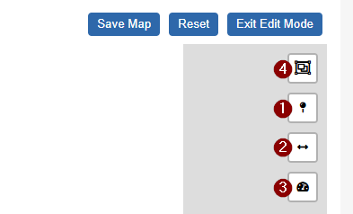

- <ImageCounter num={1} /> Place a new icon object on the map
- <ImageCounter num={2} /> Place a new line object on the map
- <ImageCounter num={3} /> Place a new gadget object on the map
- <ImageCounter num={4} /> tool to select multiple objects on the map - useful for deleting (*delete* key) or moving multiple objects

</TabItem>
<TabItem value="geo" label="Geographical">

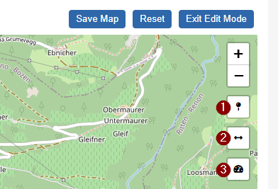

- <ImageCounter num={1} /> Place a new icon object on the map
- <ImageCounter num={2} /> Place a new line object on the map
- <ImageCounter num={3} /> Place a new map gadget object on the map

</TabItem>
</Tabs>

### Place and configure an object

<Tabs groupId="object_type">
<TabItem value="icon" label="1. Icon Object">

After clicking the <ImageCounter num={1} /> icon object control, you can choose a <ImageCounter num={2} /> position for your new object on the map.
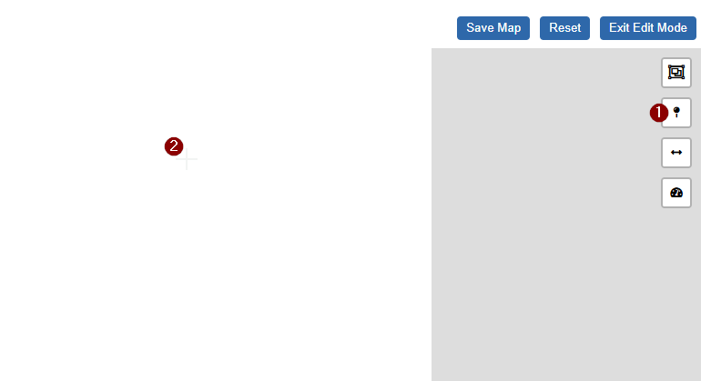

:::note

When working on a geographical map, it is not necessary to place the object on the correct position because it will be moved automatically
after the resource is associated (only if the resource has a saved position). 

:::

When you have found a good position for your new object, click again to create the object on the map.

:::tip

Don't worry if your object isn't perfectly placed at first - you can always adjust its position later.

:::

Created icon object

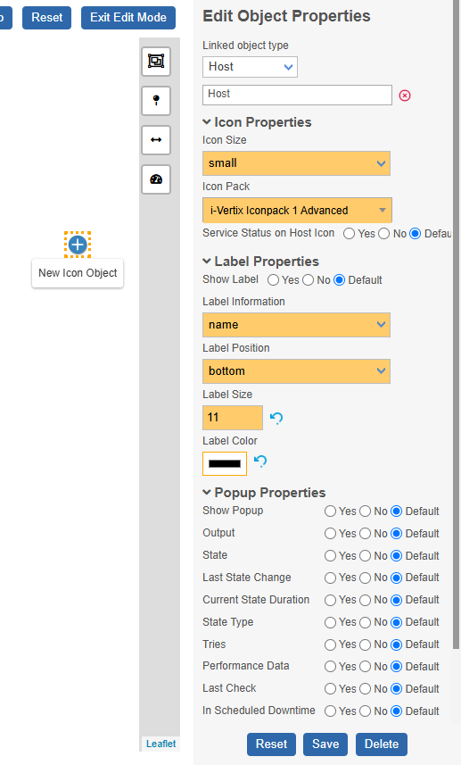

Now you need to associate a resource to the newly created icon.
You can choose between 5 different types of monitoring resources: host, service, host group, service group or map.
After you have chosen the type, search your desired resource in the below input and select it.

:::tip Advanced: Massive Add

You can select more than one resource of the same type when creating a new icon object.
For every additionally selected resource a copy of your current object configuration is created and placed next to the original one.

This is useful if you need to create a lot of objects with special settings and you don't want to change the defaults.

:::

Besides the linked resource, you can modify following object settings:

#### Icon Properties

- **Icon Size** 
- **Icon Pack:** currently we provide 2 very similar icon packs - it is recommended to choose the *i-Vertix Iconpack 1 Advanced* because it provides icons for all resource states
- **Service Status on Host Icon:** when enabled, an icon representing the summarized (highest severity) status of all host services is shown inside of the host status icon;
shall the summarized service status be problematic (critical, warning, unknown), the whole host inherits the state. This behaviour is relevant for objects connected to *Hosts, Host Groups or Maps*.

</TabItem>
<TabItem value="line" label="2. Line Object">

After clicking the <ImageCounter num={1} /> line object control, you can choose a <ImageCounter num={2} /> starting and an <ImageCounter num={3} /> ending position for your new line on the map.
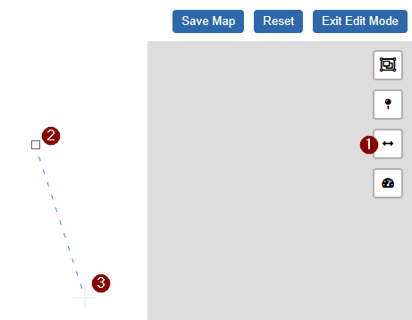

:::note

When working on a geographical map, it is only necessary to place the line end (second anchor) on the correct position because the starting position (first anchor) will be moved automatically
after the resource is associated (only if the resource has a saved position). 

:::

:::tip

Don't worry if your object isn't perfectly placed at first - you can always adjust both start and end of your line later.

:::

Created line object

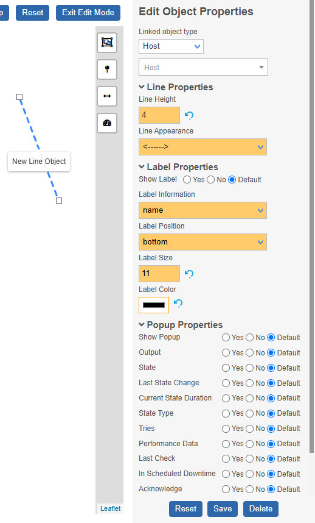

Now you need to associate a resource to the newly created line.
You can choose between 4 different types of monitoring resources: host, service, host group or service group.
After you have chosen the type, search your desired resource in the below input and select it.

Besides the linked resource, you can modify following object settings:

#### Line Properties

- **Line Height** 
- **Line Appearance:** choose between 5 different styles of lines (`----`, `--->`, `<---`, `-><-`, `<-->`)

Advanced line configuration (only when connected to service resource)

Besides the monitoring resource status, a line object can display up to 4 different service metrics.
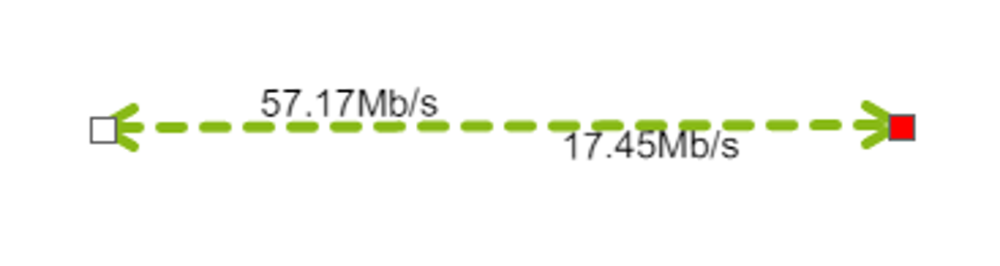

Here is how you can configure such line:

Sidebar

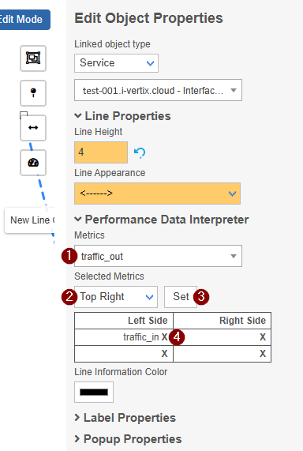

- <ImageCounter num={1} /> Choose a metric 
- <ImageCounter num={2} /> Choose the position where to put the metric 
- <ImageCounter num={3} /> Click Set

In the below list, the metric is now set on the selected position. Repeat the process with different metrics on different positions to fit your needs.

If you want to remove a metric, click the <ImageCounter num={4} /> `X` next to the metric name.

</TabItem>
<TabItem value="gadget" label="3. Gadget Object">

After clicking the <ImageCounter num={1} /> gadget object control, you can choose a <ImageCounter num={2} /> position for your new object on the map.
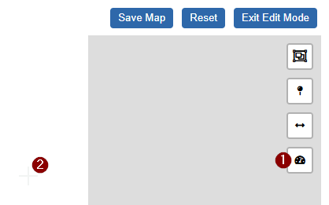

:::tip

Don't worry if your object isn't perfectly placed at first - you can always adjust both start and end of your line later.

:::

First you may want to change the gadget type.
Following types are available:

<Tabs groupId="gadget_type">
<TabItem value="gauge" label="Gauge">

*only available for graphical (normal) maps*

Created gauge gadget

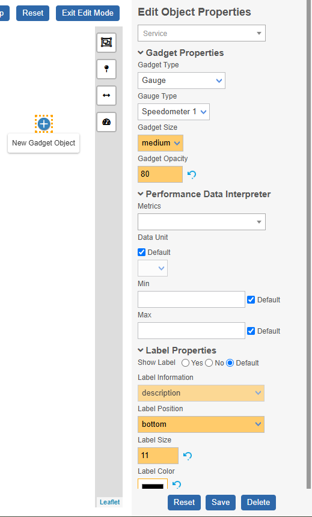

Now you need to associate a resource to the newly created gadget.
Only one service can be assigned to the object.

Besides the linked resource, you can modify following object settings:

#### Gadget Properties

- **Gauge Type:** choose between 4 different styles of gauges (`Speedometer 1`, `Speedometer 2`, `Thermometer 1`, `Thermometer 2`)
- **Gadget Size**
- **Gadget Opacity**: transparency of the gadget background (value from *0-100*)

#### Performance Data Interpreter

- **Metrics:** choose the service metric to be displayed by the gadget; the first metric is selected by default
- **Data Unit:** a variety of units are supported out of the box; if the unit of the selected metric is known,
    it is automatically selected; some metrics may lack a unit - in such cases you can manually select a unit or leave it blank to display the raw value
- **Min:** the default minimum value for the metric is selected automatically; if no minimum value is provided
    by the metric, you must set one manually
- **Max:** the default maximum value for the metric is selected automatically; If no maximum value is provided,
    you must set one manually *(if there is no true maximum value, choose a value that fits the approximate range + some buffer)*

</TabItem>
<TabItem value="graph" label="Performance Graph">

*only available for graphical (normal) maps*

Created performance graph gadget

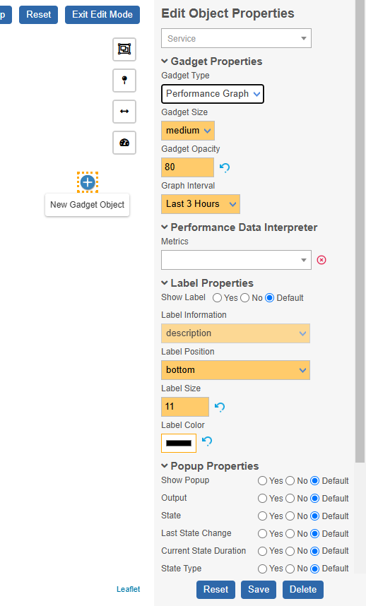

Now you need to associate a resource to the newly created gadget.
Only one service can be assigned to the object.

Besides the linked resource, you can modify following object settings:

#### Gadget Properties

- **Gadget Size**
- **Gadget Opacity:** transparency of the gadget background (value from *0-100*)
- **Graph Interval:** choose a timespan for the visualized data in the graph (*ranges from last 3 hours to 1 year*)

#### Performance Data Interpreter

- **Metrics:** *(optional)* choose only one service metric to be shown in the graph; otherwise all metrics of the selected service are shown in the graph

</TabItem>
<TabItem value="text" label="Big Text">

*only available for graphical (normal) maps*

Created big text gadget

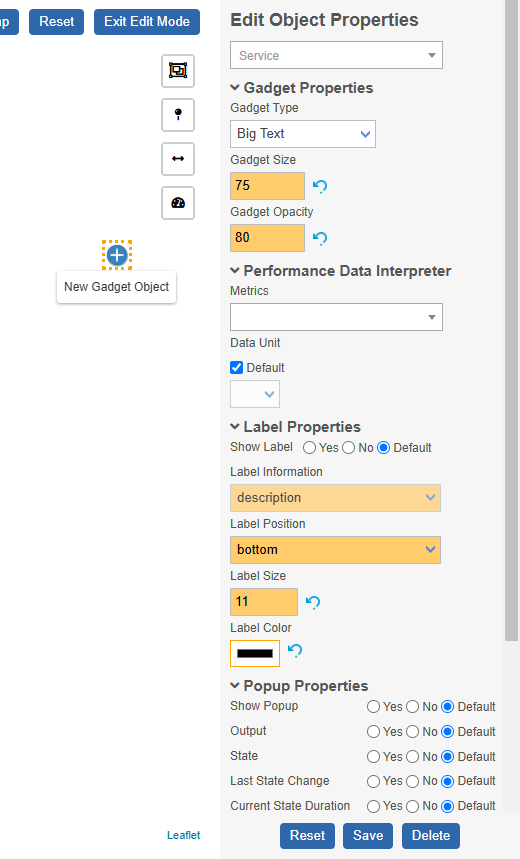

Now you need to associate a resource to the newly created gadget.
Only one service can be assigned to the object.

Besides the linked resource, you can modify following object settings:

#### Gadget Properties

- **Gadget Size:** numeric value; used for font size
- **Gadget Opacity:** transparency of the gadget background (value from *0-100*)

#### Performance Data Interpreter

- **Metrics:** choose the service metric to be displayed by the gadget; the first metric is selected by default
- **Data Unit:** a variety of units are supported out of the box; if the unit of the selected metric is known,
    it is automatically selected; some metrics may lack a unit - in such cases you can manually select a unit or leave it blank to display the raw value

</TabItem>
<TabItem value="map" label="Map">

:::info

The map gadget is not the only possibility to visualize nested maps.
You can also use an icon object to have a more compact visualization of a nested map in your map.

:::

Created map gadget

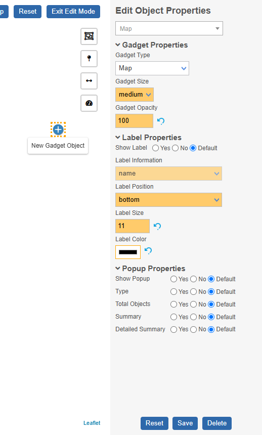

Now you need to associate a resource to the newly created gadget.
Only one map can be assigned to the object.

Besides the linked resource, you can modify following object settings:

#### Gadget Properties

- **Gadget Size**
- **Gadget Opacity:** transparency of the gadget background (value from *0-100*)

</TabItem>
</Tabs>

#### Label Properties

- **Show Label:** show or hide label
- **Label Information:** choose which resource information is shown in the label (differs betwen different associated resource types)
- **Label Position:** choose the position of the label relative to the object (`bottom`, `left`, `top`, `right`)
- **Label Size:** font size of the label (numeric value)
- **Label Color:** choose a color for the text displayed in the label

#### Popup Properties

- **Show Popup:** display a popup when clicking on the object (*when not in Edit Mode*); if disabled, the object acts as a hyperlink to the monitoring page of the associated resource

*All other popup properties depend on the associated resource type. Choose which information you want to display (yes) or hide (no).*

</TabItem>
</Tabs>

---

After you have filled all needed information four your new object, you can save the object by pressing the `Save` button at the very bottom of the sidebar on
the right *or* you can click the `Save Map` button on the top right of the page.

## Modify existing objects

*only available in Edit Mode*

### Principles

These are some important principles when modifying objects:

1. To select and modify a single object, simply click on it when in *Edit Mode*
2. You notice selected objects due to an orange dotted border 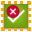
3. Remember to save your changes before leaving the page by clicking the `Save Map` button on the top right of the page

### Move objects

<Tabs groupId="type">
<TabItem value="normal" label="Graphical (normal)">

To move objects, simply drag and drop them to the desired location.

Make sure to save the object by clicking `Save Map` on the top right of the page *or* by clicking the `Save` button at the very bottom of the sidebar before exiting the *Edit Mode*!

:::tip Best practices

1. You **don't** need to enter single-object editing (sidebar) to move an object to a different location
2. You can move as many objects as you want to new positions before you **save the entire map** by clicking `Save Map`; thus you don't always need to save the map after
    every movement
3. When dragging an item, you may notice *orange guide lines* that help you align the object perfectly with other objects
4. Hold down the `CTRL` key while clicking on objects or use the 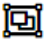 map control to select multiple objects; now when you drag a selected
    item to a new position, all selected items are moved relative to that new position

:::

</TabItem>
<TabItem value="geo" label="Geographical">

To move objects, simply drag and drop them to the desired location.
Keep in mind that changing the positions of objects connected to hosts, services, host groups, or service groups will also update their positions on other geographical maps.

Make sure to save the new object positions by clicking `Save Map` at the top right of the page *or* the `Save` button at the bottom of the sidebar before exiting *Edit Mode*!

:::note

Positions of objects connected to services can only be adjusted by **moving the host icon object** of the service.

:::

:::tip Best practices

1. You **don't** need to enter single-object editing (sidebar) to move an object to a different location
2. You can move multiple objects to new positions before you **save the entire map** by clicking `Save Map`
3. Use the zoom functionality (zoom controls or mouse wheel) to reposition your objects perfectly on the desired locations

:::

</TabItem>
</Tabs>

### Delete objects

<Tabs groupId="type">
<TabItem value="normal" label="Graphical (normal)">

To delete an object, click on it to select it and then press the `Delete` button at the bottom of the sidebar or the `Delete` key on your keyboard.
To delete multiple objects, hold down the `CTRL` key while clicking on the objects, or use the  map control to
select multiple objects, and then press the `Delete` key.

</TabItem>
<TabItem value="geo" label="Geographical">

To delete an object, select it by clicking on the object and pressing the `Delete` button on the bottom of the sidebar or by pressing the `Delete` key.

:::danger Caution

When you delete an object connected to a **host**, all *non-standalone* **objects connected to services** of this host are also **automatically deleted**.

:::

</TabItem>
</Tabs>

## Viewpoints

<Tabs groupId="type">
<TabItem value="normal" label="Graphical (normal)">

When a user opens a graphical (normal) map, the map area is always automatically scaled to display the entire map at its maximum size, regardless of the resolution.

</TabItem>
<TabItem value="geo" label="Geographical">

When a user opens a geographic map, the previously saved viewpoint is restored.

The viewpoint is saved as soon as you click the `Save Map` button in the top-right corner of the page.
This means that when saving your session for the last time, you should ensure the correct viewpoint is in focus,
from which you want to view the map the next time.

On top of the map you find tools that will help you finding a good viewpoint:

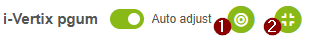

- <ImageCounter num={1} /> restores the last saved viewpoint
- <ImageCounter num={2} /> automatically zooms the map to bring all present objects into view

</TabItem>
</Tabs>
