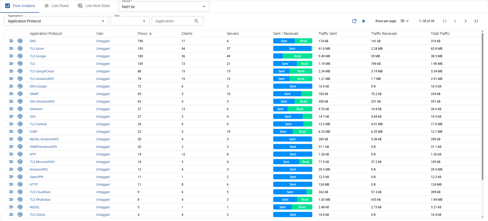
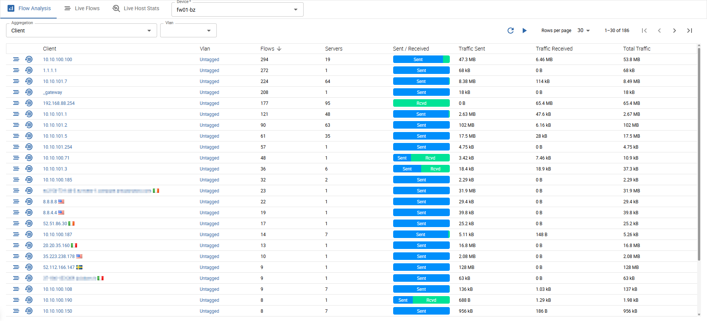
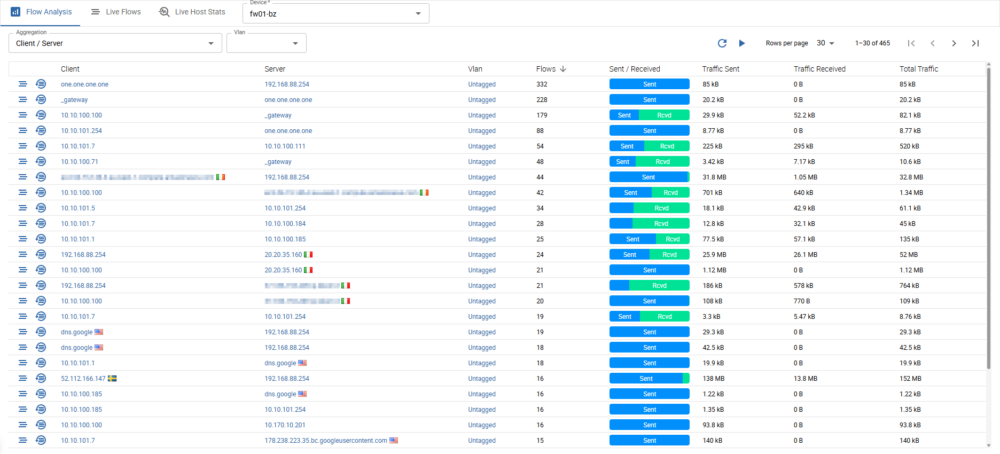
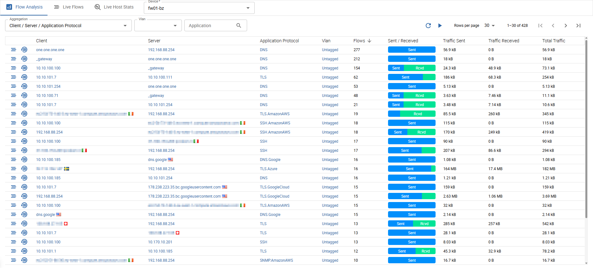
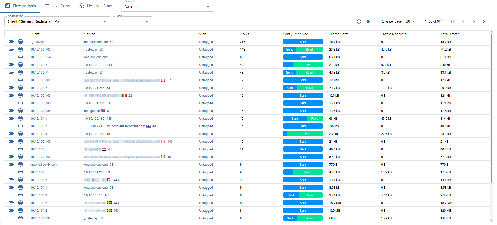
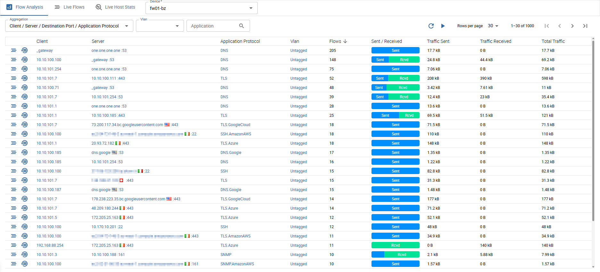
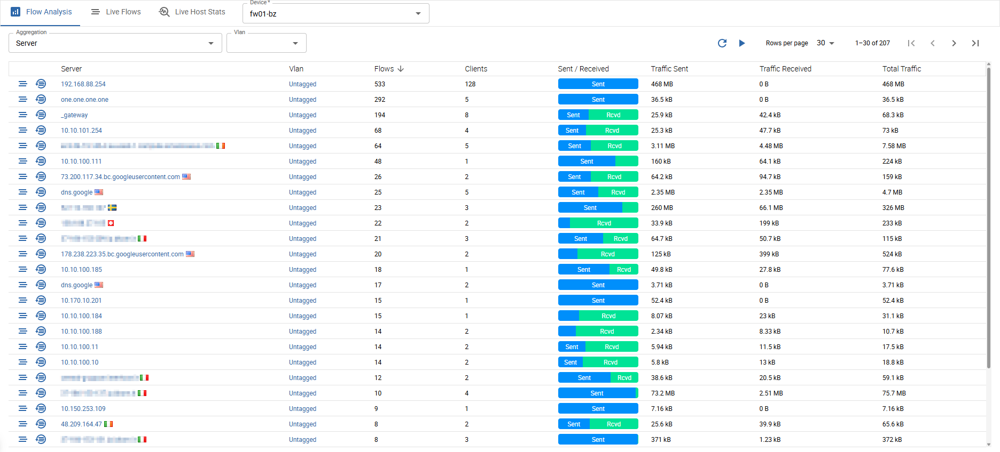
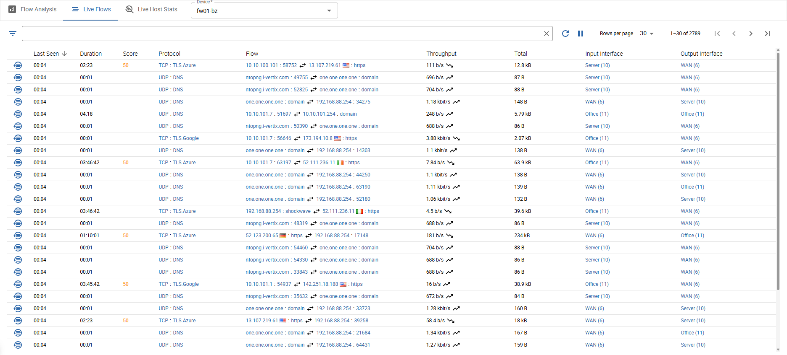
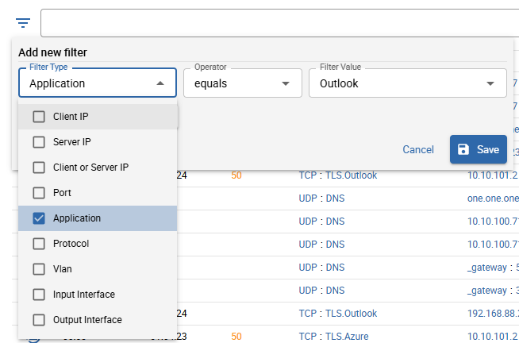
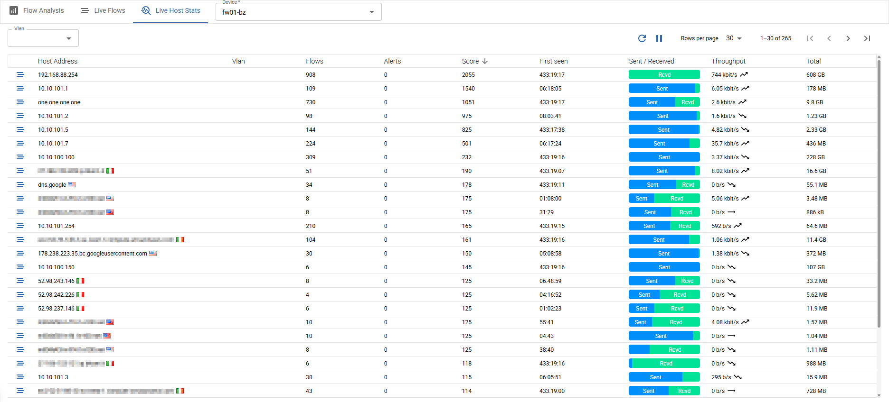

import Breadcrumb from "../../../src/components/Breadcrumb";
import ImageCounter from "../../../src/components/ImageCounter";
import Tabs from "@theme/Tabs";
import TabItem from "@theme/TabItem";

<Breadcrumb crumbs={["Monitoring", "Netflow", "Live Flow Analysis"]} />

The *Live Flow Analysis* is divided into three parts:

1. Flow Analysis
2. Live Flows
3. Live Host Stats

## Flow Analysis

This list visualizes flows, aggregated and grouped by different entities which were captured on the selected exporter.

Following aggregations are available:

<Tabs queryString="flow-analysis">

<TabItem value="application" label="Application Protocol" attributes={{className: "ivertix__tabItem-nowrap"}}>

The shown flows are grouped by *Application Protocol* and *Vlan*.

- *Application Protocol*
- *Vlan*
- *Flows*: count of flows
- *Clients*: count of clients that sent this kind of application traffic
- *Servers*: count of servers that received this kind of application traffic
- *Sent/Received*: ratio of sent/received traffic
- *Traffic sent*: total absolute traffic sent
- *Traffic received*: total absolute traffic received
- *Total traffic*: sum of traffic sent and received

The two icons at the very beginning of each row bring you to:

- a pre-filtered view of live flows (filtered by application protocol and vlan)
- a pre-filtered flow history (filtered by application protocol and vlan)

You can also filter the flows by *Vlan* and the *Application Protocol*.

</TabItem>
<TabItem value="client" label="Client" attributes={{className: "ivertix__tabItem-nowrap"}}>

The shown flows are grouped by *Client* and *Vlan*.

- *Client*
- *Vlan*
- *Flows*: count of flows
- *Servers*: count of servers that received traffic by this client
- *Sent/Received*: ratio of sent/received traffic
- *Traffic sent*: total absolute traffic sent
- *Traffic received*: total absolute traffic received
- *Total traffic*: sum of traffic sent and received

The two icons at the very beginning of each row bring you to:

- a pre-filtered view of live flows (filtered by client and vlan)
- a pre-filtered flow history (filtered by client and vlan)

You can also filter the flows by *Vlan*.

</TabItem>
<TabItem value="client-server" label="Client / Server" attributes={{className: "ivertix__tabItem-nowrap"}}>

The shown flows are grouped by *Client*, *Server* and *Vlan*.

- *Client*
- *Server*
- *Vlan*
- *Flows*: count of flows
- *Sent/Received*: ratio of sent/received traffic
- *Traffic sent*: total absolute traffic sent
- *Traffic received*: total absolute traffic received
- *Total traffic*: sum of traffic sent and received

The two icons at the very beginning of each row bring you to:

- a pre-filtered view of live flows (filtered by client, server and vlan)
- a pre-filtered flow history (filtered by client, server and vlan)

You can also filter the flows by *Vlan*.

</TabItem>
<TabItem value="client-server-application" label="Client / Server / Application" attributes={{className: "ivertix__tabItem-nowrap"}}>

The shown flows are grouped by *Client*, *Server*, *Application Protocol* and *Vlan*.

- *Client*
- *Server*
- *Application Protocol*
- *Vlan*
- *Flows*: count of flows
- *Sent/Received*: ratio of sent/received traffic
- *Traffic sent*: total absolute traffic sent
- *Traffic received*: total absolute traffic received
- *Total traffic*: sum of traffic sent and received

The two icons at the very beginning of each row bring you to:

- a pre-filtered view of live flows (filtered by client, server, application protocol and vlan)
- a pre-filtered flow history (filtered by client, server, application protocol and vlan)

You can also filter the flows by *Vlan* and *Application Protocol*.

</TabItem>
<TabItem value="client-server-port" label="Client / Server / Port" attributes={{className: "ivertix__tabItem-nowrap"}}>

The shown flows are grouped by *Client*, *Server*, *Server Port* and *Vlan*.

- *Client*
- *Server* : *Port*
- *Vlan*
- *Flows*: count of flows
- *Sent/Received*: ratio of sent/received traffic
- *Traffic sent*: total absolute traffic sent
- *Traffic received*: total absolute traffic received
- *Total traffic*: sum of traffic sent and received

The two icons at the very beginning of each row bring you to:

- a pre-filtered view of live flows (filtered by client, server, server port and vlan)
- a pre-filtered flow history (filtered by client, server, server port and vlan)

You can also filter the flows by *Vlan*.

</TabItem>
<TabItem value="client-server-port-application" label="Client / Server / Port / Application Protocol" attributes={{className: "ivertix__tabItem-nowrap"}}>

The shown flows are grouped by *Client*, *Server*, *Server Port*, *Application Protocol* and *Vlan*.

- *Client*
- *Server* : *Port*
- *Application Protocol*
- *Vlan*
- *Flows*: count of flows
- *Sent/Received*: ratio of sent/received traffic
- *Traffic sent*: total absolute traffic sent
- *Traffic received*: total absolute traffic received
- *Total traffic*: sum of traffic sent and received

The two icons at the very beginning of each row bring you to:

- a pre-filtered view of live flows (filtered by client, server, server port and vlan)
- a pre-filtered flow history (filtered by client, server, server port and vlan)

You can also filter the flows by *Vlan* and *Application Protocol*.

</TabItem>
<TabItem value="server" label="Server" attributes={{className: "ivertix__tabItem-nowrap"}}>

The shown flows are grouped by *Server* and *Vlan*.

- *Server*
- *Vlan*
- *Clients*: count of clients that sent traffic to this server
- *Flows*: count of flows
- *Sent/Received*: ratio of sent/received traffic
- *Traffic sent*: total absolute traffic sent
- *Traffic received*: total absolute traffic received
- *Total traffic*: sum of traffic sent and received

The two icons at the very beginning of each row bring you to:

- a pre-filtered view of live flows (filtered by server and vlan)
- a pre-filtered flow history (filtered by server and vlan)

You can also filter the flows by *Vlan*.

</TabItem>

</Tabs>

The list also can also be manually or automatically refreshed using the controls on the top right near the pagination.

## Live Flows

This list shows all recent flows captured on the selected exporter without any aggregation.
Exact same flows are only shown once and are handled as *recurring* flows (high duration).

The data is auto-refreshed by default every 10 seconds (can be turned off by hitting the pause button next to the pagination).

Following information is displayed:

- *Last seen*
- *Duration*: indicates a recurrent flow
- *Score*: [alert score](./netflow-flow-alerts#scores)
- *Protocol*: transport (L4) and application (L7) protocol
- *Flow*: client on the left (including country, vlan and port), server on the right (including country, vlan and port)
- *Throughput*: bits transferred per second with an indicator of a traffic increase/decrease since the last equal flow was sent
- *Total*: total bytes transferred by this exact flow (sum of all recurrent flows of same type)
- *Input Interface*
- *Output Interface*

Also a link to a pre-filtered history for every flow is provided in the first column.

The flows can also be filtered by:

- *Client IP*
- *Server IP*
- *Client or Server IP*
- *Port*
- *Application* (L7)
- *Protocol* (L4)
- *Vlan*
- *Input Interface*
- *Output Interface*

## Live Host Stats

The *Live Hosts Stats* list shows every traffic producing host in your network which was captured by the selected exporter.
Most noticeably you can see, how many flows and how much network traffic was produced by every single network host.

This can be very useful to find bottlenecks and/or high irregular network traffic. You can also see since when (first seen) a host is producing traffic in your network.

Following information is displayed:

- *Host Address*
- *Vlan*
- *Flows*: count of flows this host was involved (as client or server)
- *Alerts*: alerting flows this host was involved (as client or server)
- *Score*: total [alert score](./netflow-flow-alerts#scores)
- *Firt seen*: first time this host was involved in a flow (as client or server)
- *Sent / Received*: ratio of traffic sent/received
- *Throughput*: how many data (bit) are sent/received per second
- *Total*: total bytes transferred from/to this host

You can filter the hosts by *Vlan*.
