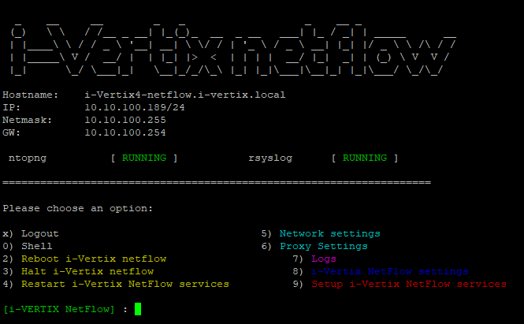
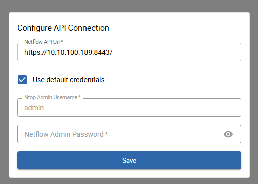
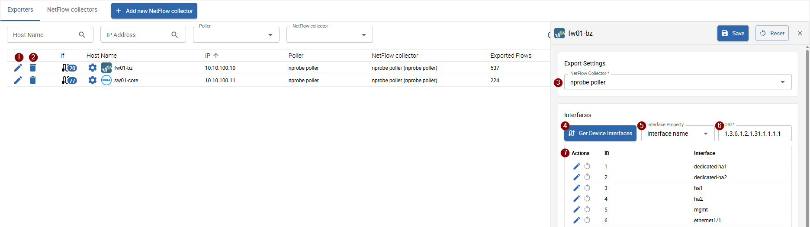

import Breadcrumb from "../../../src/components/Breadcrumb";
import ImageCounter from "../../../src/components/ImageCounter";

In our most recent monitoring version we introduced the additional add-on: *i-Vertix Netflow*.
This module enables you to collect and analyze network flows directly from the monitoring ecosystem.

You can use a lot of new views and reports to view **Live flows**, **Problematic network flows** or the **Flows over time**.
Since this add-on was recently published it is far from complete. New views and functionalities will follow over time.

## Netflow Infrastructure

The infrastructure for collecting network flows is similar to the normal monitoring infrastructure - consisting of decentralized collectors and a central processing and storage system. Some of the infrastructure, such as the i-Vertix Pollers can also be re-used (upgraded) to collect also flows.

### Netflow collector

Flows are sent from your L3 network devices, such as switches, routers or firewalls to our i-Vertix Netflow collector, which can be installed on any existing [i-Vertix Poller](../glossary.md#smart-poller) (hardware or virtual machine) when enough hardware resources are available.

Like the monitoring data which is gathered by the i-Vertix Poller engine, also the flows are sent to a centralized managing system.

### Netflow Analyzer

The centralized **i-Vertix Netflow analyzer** receives all collected flows from the netflow collectors and processes, aggregates, stores and provides the data afterwards for further use. It is best practice to align the Netflow analyzer system next to the *Central Monitoring Manager* to minify the time of data exchange between the monitoring system and the netflow analyzer when interacting with flows.

## Setup

To provide a fast and easy setup of the new netflow functionality, we prepared production-ready virtual images for the Netflow analyzer with a short guided setup process and a new package for the i-Vertix Poller.

### Prepare the Netflow Analyzer

When you pruchase the license for the netflow add-on you receive the latest version of our Netflow analyzer image for VMware.
Let us know if you need other virtual image formats.

Here is a guide on [how to import a virtual appliance into VMware](../installation/setup-central-poller/import-virtual-appliance.md).

<details>
<summary>System requirements</summary>

It is not easy to determine the required hardware resources for the netflow analyzer system just from the beginning.
It may be necessary to tune the resources over time, depending on the count of incoming flows.

#### Network definitions

|                       | Small Network | Medium Network    | Large Network |
| --------------------- | ------------- | ----------------- | ------------- |
| Network Traffic       | < 100 Mbps    | 100 Mpbs - 1 Gbps | > 1 Gbps      |
| Hosts in your Network | 0-1k          | 1k - 50k          | > 50k         |
| Flows*                | 0-1k          | 350 GB            | 500 GB        |

*Flows: flows processed at the same time (Live flows)

#### Resources by Network

|          | Small Network | Medium Network | Large Network |
| -------- | ------------- | -------------- | ------------- |
| CPU      | 2 Cores       | 4 Cores        | 6 Cores       |
| RAM      | 2 GB          | 8 GB           | 12 GB         |
| Storage* | 150 GB        | 350 GB         | 500 GB        |

*Storage: the required storage is highly dependant on the number of collected flows and the configured **retention**.
It may be necessary to tune the **retention** or add additional storage to the system in production!

</details>

#### First start of the Netflow analyzer system

After you have imported the netflow analyzer image start the new virtual machine and use the provided credentials to log in.



In case the menu does not appear, execute following command to enter the menu:

```bash

menu

```

Before starting with the setup procedure, please configure the system's network settings by choosing option `5) Network settings`.
Here is a guide on [how to configure the network](../installation/setup-central-poller/network-configuration.md).

After configuring the network settings you can proceed with the initial setup.
From the menu, choose option `9) Setup i-Vertix NetFlow services` to start the setup script.

Most actions of the setup script are done automatically:

- a random password for the clickhouse database is generated
- start of the clickhouse database server
- initialize basic netflow configuration

Now you are prompted to enter the IP address of the *Central Monitoring server*.
The central monitoring server must be reachable on this system using the entered IP address.

After confirming the entered IP address the setup continues and should finish without problems.
In case of any errors, please reach out to our [support](mailto:support@i-vertix.com).

You can now proceed with the monitoring module installation.

### Install the monitoring module

Open an SSH connection to your monitoring central system and install the ivertix-netflow-module package:

```bash

sudo dnf install ivertix-netflow-module

```

After the install is complete, log into your monitoring system with an administrator account.

Perform the extension installation from the `Extension Manager` under <Breadcrumb crumbs={["Administration", "Extensions", "Manager"]} /> and install the new `Netflow by i-Vertix` extension.

Now we need to configure the connection between the monitoring and the Netflow analyzer system.

Navigate to <Breadcrumb crumbs={["Administration", "Additional Modules", "Netflow Settings"]} /> to perform the initial module setup.



Please insert the IP address of the *Netflow Analyzer* system, as seen by the monitoring central system into the form.

Below you can choose to use the default credentials or insert custom ones for the admin account.
Keep using the default credentials if you are setting up a fresh netflow system.

:::note

If you are relocating your netflow system to a new monitoring system you may need to use custom credentials because the admin user is most likely already initialized.

:::

When hitting save following tasks will be executed:

- Connection check to Netflow analyzer API
- Login with provided (or default) credentials and check user permissions (admin account required)
- Generate a new secure random password for the provided admin user
- Create a new vault credential and save the connection information to the monitoring configuration db

:::caution Problems during setup

When you encounter any problems during the connectivity check or password reset, please check the provided error message for further information.

Most likely the monitoring system is not able to connect to the Netflow analyzer system due to firewall or network problems. Also make sure that the [Netflow analyzer system is properly set up!](#first-start-of-the-netflow-analyzer-system)

:::

After the connection information is successfully saved we can now set up and configure our first *NetFlow collector*.

## Add NetFlow collectors

As already stated in the introduction, *NetFlow collectors* receive the flows from network devices and send them to the central *NetFlow analyzer* system.

You can easily upgrade any existing i-Vertix Poller which is already connected to your monitoring system to become also a *Netflow collector*.

Please keep in mind that upgrading your poller to a *Poller + Netflow collector* increases the hardware consumption.
If your poller which you want to upgrade is already scratching the limit of it's available hardware resources you need to add further hardware resources.

You can also add a new dedicated poller which only functions as a *NetFlow collector*. Please follow [these steps to attach a new poller to the monitoring system](../installation/configuring-smart-poller/attach-a-poller-to-a-central-server.md).

After you have added a new poller or made sure enough hardware resources are available on your existing poller we can proceed with the installation of the netflow collector packages.

### Install required packages

Please open a SSH connection to the desired poller and install the `ivertix-netflow-poller` package from the ivertix netflow repository:

```bash

sudo dnf install ivertix-netflow-poller

```

:::note

To install the package `ivertix-netflow-poller` you first need to add the ivertix netflow repository.
You receive a dedicated guide to install the repository upon obtaining the license for the add-on. 

:::

After the package is installed you can configure the collector from the monitoring interface.

### Configure the new NetFlow collector

To configure new NetFlow collectors navigate to <Breadcrumb crumbs={["Configuration", "NetFlow", "Exporters"]} /> in the monitoring interface.

:::info

Only administrators can manage NetFlow collectors!

:::

Click the `+ Add new NetFlow collector` button located at the top of the page and insert following information in the opened form:

#### NetFlow Analyzer settings

These settings are written to the NetFlow analyzer system.

- **Poller:** choose the i-Vertix Poller which should operate as the NetFlow collector - [the `ivertix-netflow-poller` package must be already installed on the poller](#install-required-packages)
- **NetFlow Collector Name:** defaults to the poller name - choose another name if you like
- **NetFlow Analyzer Interface Port:** interface port to which the collector sends the flows to - must be unique and between **5556** - **5656**

#### NetFlow Collector settings

These settings are deployed to the poller.

- **NetFlow Collector Port**: this is the port to which the network devices send their flows
- **NetFlow Analyzer IP**: IP address of the NetFlow Analyzer system as seen by the poller (collector)
- **Netflow Analyzer Interface Port**: interface port to which the collecetor sends the flows to - by default the above configured interface port and this one are equal - only change if a firewall or proxy forwards the port

Save the new collector after you have filled all fields. A new netflow API user will be created for the new collector which is used to display the collected flows.

:::caution Problems during configuration

If you encounter any problems during the configuration of the new collector, please check the provided error message for further information.

<details>
<summary>Most common problems</summary>

##### Unable to deploy configuration

- Check if the `ivertix-netflow-poller` package is installed on the poller
- Check if the central is able to communicate with the poller (poller last update)

##### Unable to create new user

- Check if the admin user and the API url is properly configured in the global <Breadcrumb crumbs={["Administration", "Additional Modules", "NetFlow"]} /> config.

##### Interface port already in use

This error can occurr if you have custom interfaces configured on the NetFlow Analyzer itself. Simply select an other port number in the available range.

</details>

:::

## Configure Network Devices to send flows

Here are useful links to enable network devices of different vendors to send `Cisco NetFlows`, `sFlows` or `IPFIX` flows to configured collectors:

:::danger Handle with caution

Please note that the following configuration guides are provided for reference only. We do not take any responsibility for potential damage to your network devices or any issues that may arise as a result of applying these configurations.
Make sure to back up your device settings before making any changes.

:::

| Vendor   |                                                                                                                                                                                                                                                                |
| -------- | -------------------------------------------------------------------------------------------------------------------------------------------------------------------------------------------------------------------------------------------------------------- |
| Cisco    | [https://www.cisco.com/c/dam/en/us/td/docs/security/stealthwatch/netflow/Cisco_NetFlow_Configuration.pdf](https://www.cisco.com/c/dam/en/us/td/docs/security/stealthwatch/netflow/Cisco_NetFlow_Configuration.pdf)                                             |
| Juniper  | [https://www.juniper.net/documentation/us/en/software/junos/flow-monitoring/topics/example/jflow-v9-configuring-on-ms-mic.html](https://www.juniper.net/documentation/us/en/software/junos/flow-monitoring/topics/example/jflow-v9-configuring-on-ms-mic.html) |
| Fortinet | [https://community.fortinet.com/t5/FortiGate/Technical-Tip-How-to-Configure-Netflow/ta-p/196080](https://community.fortinet.com/t5/FortiGate/Technical-Tip-How-to-Configure-Netflow/ta-p/196080)                                                               |
| Mikrotik | [https://wiki.mikrotik.com/Manual:IP/Traffic_Flow](https://wiki.mikrotik.com/Manual:IP/Traffic_Flow) |
| Palo Alto | [https://docs.paloaltonetworks.com/pan-os/11-1/pan-os-admin/monitoring/netflow-monitoring/configure-netflow-exports](https://docs.paloaltonetworks.com/pan-os/11-1/pan-os-admin/monitoring/netflow-monitoring/configure-netflow-exports)|
| HP | [https://support.hpe.com/hpesc/public/docDisplay?docId=c03129101&docLocale=en_US](https://support.hpe.com/hpesc/public/docDisplay?docId=c03129101&docLocale=en_US) or [https://support.hpe.com/hpesc/public/docDisplay?docId=c03151006&docLocale=en_US](https://support.hpe.com/hpesc/public/docDisplay?docId=c03151006&docLocale=en_US) |
| Aruba | [https://arubanetworking.hpe.com/techdocs/AOS-CX/10.07/HTML/5200-7860/Content/Chp_sFlow/sfl-age-10.htm](https://arubanetworking.hpe.com/techdocs/AOS-CX/10.07/HTML/5200-7860/Content/Chp_sFlow/sfl-age-10.htm) and [https://arubanetworking.hpe.com/techdocs/AOS-S/16.11/MCG/WC/content/common%20files/cnf-sfl-cli.htm](https://arubanetworking.hpe.com/techdocs/AOS-S/16.11/MCG/WC/content/common%20files/cnf-sfl-cli.htm) |
| Nokia | [https://documentation.nokia.com/html/0_add-h-f/93-0073-10-01/7750_SR_OS_Router_Configuration_Guide/Cflowd_cli.html](https://documentation.nokia.com/html/0_add-h-f/93-0073-10-01/7750_SR_OS_Router_Configuration_Guide/Cflowd_cli.html) |
| Dell Series N | [https://www.dell.com/support/kbdoc/en-us/000116368/how-to-configure-sflow-on-dell-emc-networking-n-series-switches](https://www.dell.com/support/kbdoc/en-us/000116368/how-to-configure-sflow-on-dell-emc-networking-n-series-switches) |
| Dell OS9 | [https://www.dell.com/support/kbdoc/en-us/000121452/how-to-set-up-sflow-on-dell-networking-force10-switches](https://www.dell.com/support/kbdoc/en-us/000121452/how-to-set-up-sflow-on-dell-networking-force10-switches) |
| Dell SONiC | [https://www.dell.com/support/kbdoc/en-us/000218295/dell-networking-sonic-sflow-configuration?lang=de](https://www.dell.com/support/kbdoc/en-us/000218295/dell-networking-sonic-sflow-configuration?lang=de) |

This list is far from complete. If your device or vendor is not listed it is always a good shot to search the vendor's documentation for up-to-date guides regarding sFlow/NetFlow/IPFIX configuration.

### Register Network Devices as Flow Exporters

After you have configured your network devices to send flows to the NetFlow collector you must register them as NetFlow Exporters in the monitoring interface.

First of all, make sure the network devices are monitored.
If you don't have them configured yet, take a look at our [Network Discovery](../monitoring-resources/discovery/nedi.mdx) which can help you with the onboarding.

Navigate to <Breadcrumb crumbs={["Configuration", "NetFlow", "Exporters"]} />, select the `Exporters` tab (only when admin) and click the `+ Add Exporters` button on the top right of the list.

A popup containing a list will appear. Select the NetFlow collector to which you want to add exporters. On the right of the collector select you find the filter input.
With it you can easily filter all hosts by name, host templates, poller, ip, host group or host category.

Select all hosts you want to add as exporters to your selected collector and hit `Confirm`.
Upon the new exporters are saved, a new task is started in the background which scans the exporter interfaces.
This is no critical task because the scanned interfaces are only used for display purposes in some flow-views.
You can restart the scan process anytime.

#### View and edit Exporters



The list shows all accessible configured exporters along with the most important information regarding each exporter,
such as the collector, exported flows, dropped flows and last update.

##### Actions

- click the <ImageCounter num={1} disableMargin /> edit icon to start editing an exporter
- click the <ImageCounter num={2} disableMargin /> delete icon to delete an exporter

##### Edit an Exporter

You can change the <ImageCounter num={3} disableMargin /> *collector* to which the exporter sends to (this must also be configured obviously on the network device itself)
as well as customize the *scanned interfaces*.
To rescan the interfaces click the <ImageCounter num={4} disableMargin /> `Get Device Interfaces` button.
The provided <ImageCounter num={6} disableMargin /> OID is used for the scan.
You can also select a predefined OID from the <ImageCounter num={5} disableMargin /> `Interface Property` select or
set a custom name in the below <ImageCounter num={7} disableMargin /> interface list.

After you modified and saved an exporter, make sure to deploy the changes to the poller (collector) using the `Deploy changes` button above.
Otherwise your changes will not be taken into account.

:::tip Ready to analyze flows!

You should now be ready to start analyzing incoming flows. On the next page you find the documentation to view and alayze *Live Flows* and *Host Stats*.

:::

## Troubleshooting

<details>
<summary>No incoming flows</summary>

In the exporter list you find the counts of exported and dropped flows of every configured exporter (flow sending network device).

The most common reason to find the counts empty is a wrong network device configuration or a blocking firewall.

Make sure that the flow configuration is correct for your type of network device.
Check the offical vendor docs for *configuring sFlow/NetFlow/IPFIX* to find a helpful guide. 

Also check your firewall policy for:

- the defined collector port (default: 6363, Network device -> NetFlow collector)
- the defined NetFlow Analyzer interface port (NetFlow collector -> NetFlow analyzer)

</details>

<details>
<summary>Unable to connect to netflow API</summary>

- Check your firewall policies for the NetFlow Analyzer system - TCP port 8443.
- Make sure that the NetFlow Analyzer system is initialized and the `ntopng` and `clickhouse-server` service is running.
- Verify that you have a valid netflow license

</details>
