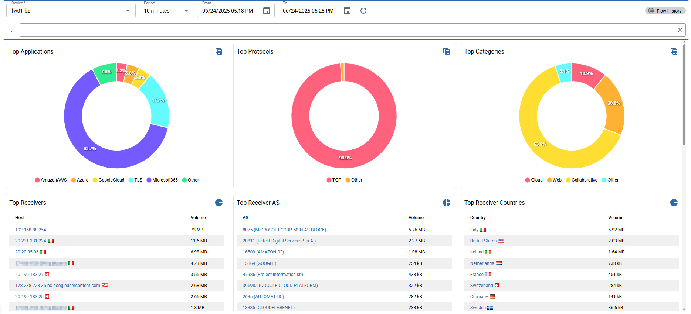
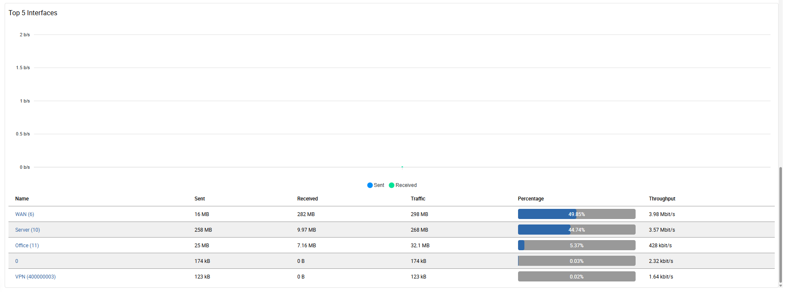
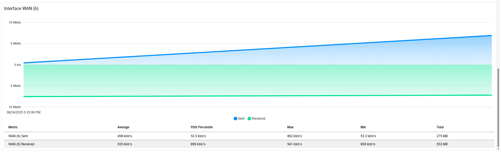

import Breadcrumb from "../../../src/components/Breadcrumb";
import Tabs from "@theme/Tabs";
import TabItem from "@theme/TabItem";

<Breadcrumb crumbs={["Monitoring", "Netflow", "Traffic Report"]} />

The *Traffic Report* can give you a quick overview, what is going on in your network and who are your top talkers.
The age of the data that can be displayed depends on the retention settings. By default the data is stored for 180 days.

You can choose between a pre-defined period or select a custom time range. Also the latest caputred data is available in this view.

In total 9 graphs + 1 timeseries are displayed. Each graph can be converted to a tabular view using the top right icon on every graph.

When clicking the top right *Flow History* button, the flow history opens with the same filters selected as in the current view.

Avilable filters

A lot of filters are avilable to get specific results:

- *Client IP*: filter by client ip
- *Server IP*: filter by server ip
- *Client Network*: filter by client IP using the network CIDR notation
- *Server Network*: filter by server IP using the network CIDR notation
- *Server ASN*: filter server by asn number
- *Client Country*: filter by client country
- *Server Country*: filter by server country
- *Application Protocol*: filter by application (L7) protocol
- *Application Category*: filter by application (L7) category
- *Protocol*: filter by transport (L4) protocol
- *Vlan*: filter by vlan
- *Interface*: filter by input or output interface

Following graphs are availble:

- *Top Applications*: shows the top 10 used L7 applications
- *Top Protocols*: shows the top 10 used L4 protocols
- *Top Categories*: shows the top 10 used L7 categories
- *Top Receivers*: shows the top 10 hosts that received the most traffic
- *Top Receiver AS*: shows the top 10 AS numbers that received the most traffic
- *Top Receiver Countries*: shows the top 10 countries that received the most traffic
- *Top Senders*: shows the top 10 hosts that sent the most traffic
- *Top Sender AS*: shows the top 10 AS numbers that sent the most traffic
- *Top Sender Countries*: shows the top 10 countries that sent the most traffic

Also a Interface graph is available with 2 modes:

<Tabs>

<TabItem value="sum" label="Summary">

A summary and the sent/received ratio of all network interfaces of the selected exporter is shown when **no interface filter** is set.

</TabItem>
<TabItem value="detail" label="Detailed">

When the view is filtered by an interface, the graph only shows the sent/received ratio of the selected interface.
Below you can find the detailed sent/received traffic data. 

</TabItem>

</Tabs>
