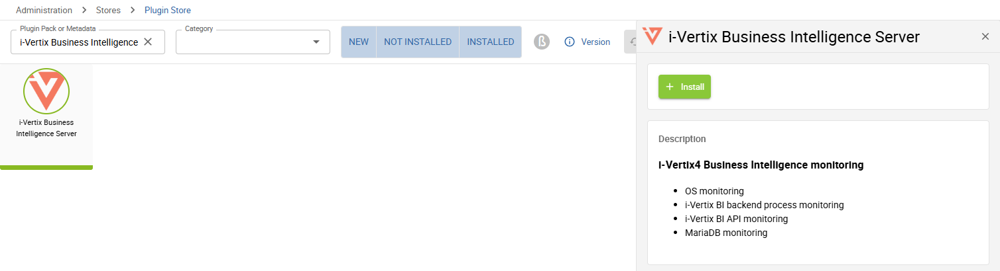
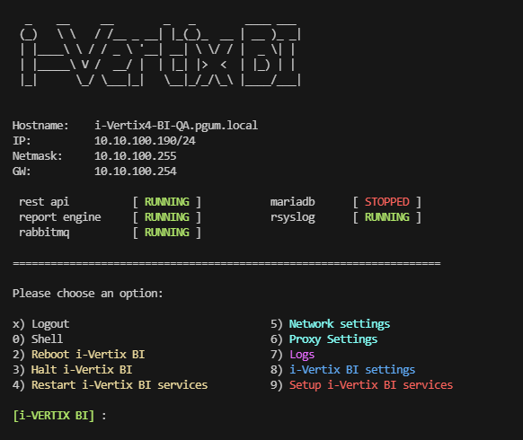
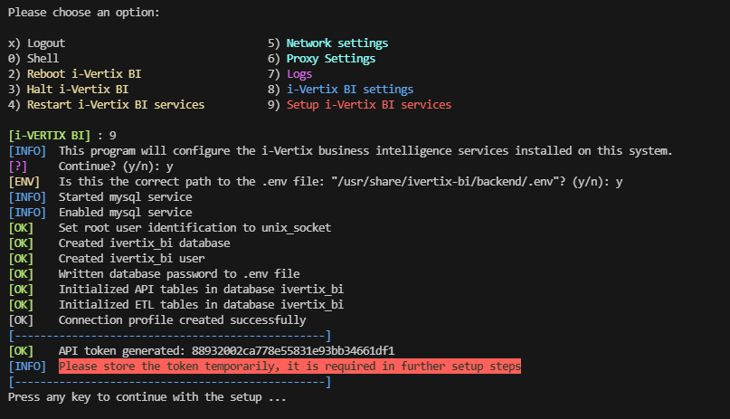
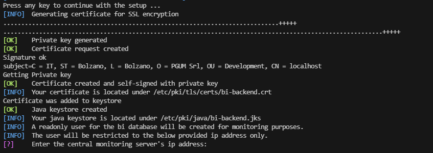
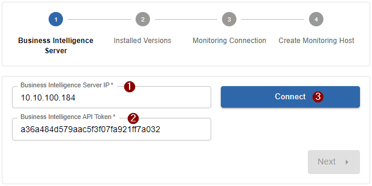
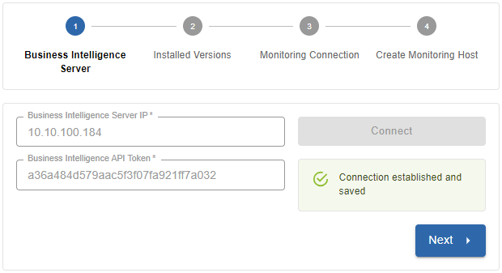
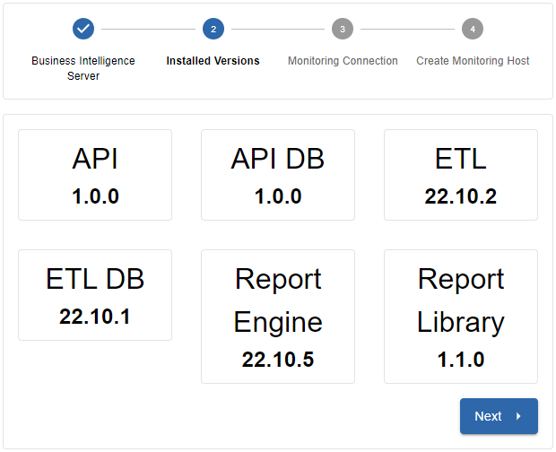
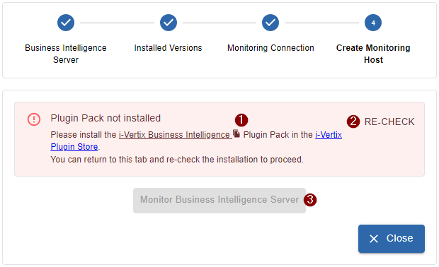

import ImageCounter from "../../../../src/components/ImageCounter";
import Breadcrumb from "../../../../src/components/Breadcrumb";

## Preparation

### Prepare the new Business Intelligence instance

The pre-configured i-Vertix Business Intelligence instance is available in OVA format for virtualization environments. Please contact our support ([support@i-vertix.com](mailto:support@i-vertix.com)) if you need other virtualization formats for your environment.

Please have a look at the [system requirements](./bi-requirements) when creating the new virtual machine.

:::info

If you need help on how to import the OVA into your VMware environment, please have a look at our [How to import a Virtual appliance](../../installation/setup-central-poller/import-virtual-appliance#steps-to-import-a-vm-in-vmware) documentation

:::

### Prepare the Central Monitoring system


#### Install the new module

On the Monitoring Central System you need to install the *i-Vertix Business Intelligence module*:

```bash
sudo dnf install ivertix-bi-module
```

After the install is complete, log into your monitoring system with an administrator account.

Perform the extension installation from the `Extension Manager` under <Breadcrumb crumbs={["Administration", "Extensions", "Manager"]} /> and install the new `Business Intelligence by i-Vertix` extension.

#### Install the Business Intelligence Plugin Pack

To monitor your Business Intelligence system, we created a new plugin pack which you can download from the [*Plugin Store*](../../monitoring-resources/plugin-packs).

```text
i-Vertix Business Intelligence Server
```



It is recommended to install the plugin pack right away so we can later keep focusing on the rest of the setup.

---

## Configure the i-Veritx Business Intelligence system

After completing the virtual machine import and configuration, start the newly created virtual machine.

After the startup-process is completed, log into the command line of the i-Vertix BI system with the credentials provided by the i-Vertix team.

The following menu should appear:



:::note

If the menu does not appear, or if you are in the normal command line interface, you can always re-open the menu with the command `menu` (which is a system alias)

:::

### Change password

The first real step after the initial system-startup should be changing the password.

To change the admin users password, select option `8) i-Vertix BI settings` from the menu.

Now select option `5) change user password`.

You can now enter your new password.

### Network configuration

Next you need to configure the network settings for your newly imported i-Vertix business intelligence system.

:::note

When configuring the network, keep in mind that the i-Vertix BI system requires to connect to the **Monitoring Central Server**!

:::

To change the network settings, select option `5) Network settings` from the menu. The *Network Manager* should open.

1. Choose `Edit a Connection`
2. Select the Ethernet connection to edit (should be `ens192`/`ens33` or similar) - navigate with keyboard arrows
3. Configure following fields:
   
   **IPv4 CONFIGURATION**: Manual
   
   - **Adresses**: *set the ip address*
   - **Gateway**: *set the gateway address*
   - **DNS server**: *set the DNS server*
   - **Search domains**: *set the domain (if necessary)*
   - *keep the rest unchecked*
   
   **IPv6 CONFIGURATION**: Ignore (*or configure if necessary*)
   
   [x] Automatically connect
   [x] Available to all users

4. Confirm by selecting `<OK>`
5. Return to the Network Manager main screen by selecting `<Back>`
6. `Quit` the Network Manager
7. Confirm restarting the *NetworkManager* service to make your changes effective

:::info

From now on you should be able to connect via SSH (port 22) to the i-Vertix BI server (first you may need to configure your firewall)

:::

### Timezone settings

By default, the timezone is set to Europe/Rome.

If you need to change the timezone, select option `7) i-Vertix BI settings` from the menu.

Now select option `2) change timezone`.

You will be asked to enter the new timezone. Here is a list of valid *TZ identifiers* to insert: [tz database on Wikipedia](https://en.wikipedia.org/wiki/List_of_tz_database_time_zones)

### Proxy settings

If you need to set a proxy server for your system, select option `6) Proxy settings` from the menu.

You will be guided through the further process by the program itself.

### Configure Bunsiness Intelligence Services and Database

To simplify the setup process of the core services and the database, we have created a setup script that automates the configuration process.

:::caution

During the setup you will be asked to **store the API key temporarily**.
The API key is later needed while configuring the *i-Vertix Business Intelligence module* on the Monitoring system itself.

:::

The setup is accessible from the `menu`:


1. Select option `9) Setup i-Vertix BI services`
   
   You will be asked for the correct path to the .env file, which is located by default in `/usr/share/ivertix-bi/backend/.env`.
   If no custom modifications were made, you can simply accept the provided path.

2. The database will now be configured automatically
3. A new API token is generated and printed on the screen. Please **store the API token for a moment**, this is important for the monitoring module setup!

   

4. Continue with the setup
6. A new certificate will now be created used for SSL encryption.

   You will be questioned some general information for the certificate. Please insert at least following information:

   - Country Name (2 letter code, you can find all valid codes on [iso.org](https://www.iso.org/obp/ui/))
   - State or Province Name
   - Locality Name
   - Organization Name (company name)
   - Common Name (server hostname)
   - Email Address

   All other fields can be left blank (enter `.` or just skip the question by pressing Enter).

5. You will now need to insert the IP address of the Central Monitoring server for the creation of a readonly database user on the BI database.
   This database user will be user to monitor the database of the BI server. By default, the BI server will be monitored from the **Central poller**.
   In case you want to monitor the BI server from another poller, use the IP of this poller instead.

   

   After providing the IP address, the credentials of the readonly user will be printed on the screen.
   There is **no need to save** the credentials, they will be later imported automatically during the module setup.

6. The **setup is now finished** and the backend restarted.

> If any problems happen during the setup, please contact us at [support@i-vertix.com](mailto:support@i-vertix.com) with the corresponding error messages.

---

## Monitoring module setup

After finishing the above setup steps on the i-Vertix BI system you can now move on to the module setup part.

For that, log in to your i-Vertix monitoring platform using an account with admin privileges
and navigate to <Breadcrumb crumbs={["Administration", "i-Vertix", "Business Intelligence"]} />.

The setup wizard should now appear.

### 1st Step: Business Intelligence Server Connection



- <ImageCounter>1</ImageCounter> Insert the previous set-up ip address of the i-Vertix Business Intelligence Server
- <ImageCounter>2</ImageCounter> Insert the previously generated API token which was exposed during the setup program
   
   :::note

   In case you no longer have access to the token (for whatever reason), you can re-run the setup on the Business Intelligence machine again.
   You will be asked if you'd like to re-generate a new token.

   :::

- <ImageCounter>3</ImageCounter> Click <code>Connect</code> to test the connection



After a successful connection you can proceed with the next step by clicking `Next`.

:::note

If the connection cannot be established, head over to the [Troubleshooting](./bi-troubleshooting) section which may help you finding the cause

:::

### 2nd Step: Verify installed versions



Quick overview of the installed versions on your fresh i-Vertix BI server. Click `Next` to proceed with the next step.

### 3rd Step: Monitoring database connection


During this step the monitoring database connection for the BI server will be configured.
For that, a new database user must be configured on the monitoring database.
To create the new user with all required access permissions, a command is prepared for you, which you need to execute as `root` user on the database server.

Provide following information:

- <ImageCounter>1</ImageCounter> Monitoring database server IP address
   - Most probably your monitoring database is present on the monitoring server itself, in that case please **insert the monitoring server IP** (must be reachable by the BI server)
   - In case you have a [remote database server architecture](../../installation/before-you-start/architecture#dbms), use the **IP of the remote database server** (must be reachable by the BI server)
- <ImageCounter>2</ImageCounter> Monitoring database port (default <code>3306</code>)
- <ImageCounter>3</ImageCounter> Username (default <code>ivertix_bi</code>)
- <ImageCounter>4</ImageCounter> Password (pre-generated randomly, change as you like)

Copy now the <ImageCounter>5</ImageCounter> *Command to create database user for BI* and execute it on the monitoring database server as `root` user.
After the query command was executed, you can click <ImageCounter>6</ImageCounter> <code>Test & Save Connection</code> to finish the step.

:::note

If the connection cannot be established, head over to the [Troubleshooting](./bi-troubleshooting) section which may help you finding the cause

:::

When the connection is saved, click `Next` to proceed with the next step.

### 4th Step: Monitor the i-Vertix Business Intelligence Server



Almost done! The 4th and last step of the monitoring module setup is optional but highly recommended.

By monitoring the Business Intelligence Server you always have the most important components of the i-Vertix BI server in view.

If you don't already have the dedicated Plugin Pack installed, head over to the i-Vertix Plugin Store (preferably in a new tab) and
search for the <code>i-Vertix Business Intelligence</code> plugin pack (you can copy the plugin pack name by clicking on the file icon inside
the alert <ImageCounter disableMargin>1</ImageCounter>).
After installing, return to the setup page, click on <ImageCounter disableMargin>2</ImageCounter> <code>Re-Check</code>.
After the system has recognized, that the plugin pack was installed,
click on <ImageCounter disableMargin>3</ImageCounter> <code>Monitor Business Intelligence Server</code> to automatically create the monitoring host
with all relevant checks assigned.

---

The setup is now complete and almost everything is ready now for your first report job.

To create your first report job, Report Templates are required. You can get them from the integrated [i-Vertix Report Store](./bi-report-store).
