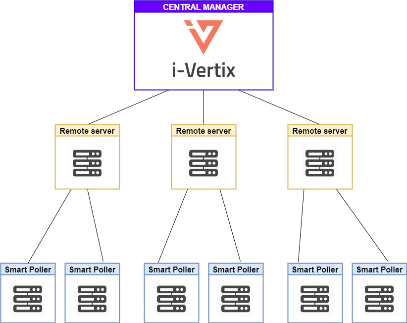

According to your needs, your platform can consist of several elements: a [Central Manager](#central-manager), one or several [remote servers](#remote-server), and one or several [Smart Pollers](#smart-poller).

- If you are only monitoring a few resources, you will only need a Central Manager.
- If you are monitoring a large number of resources, spread the charge across a [distributed architecture](#distributed-architecture).

## Central Manager

In i-vertix IT Monitoring, the Central Manager is the main console where you monitor resources. The central server allows you to:

- configure the monitoring of your whole infrastructure,
- monitor resources
- see what all your i-Vertix servers monitor (Central Manager, [remote servers](#remote-server) and [Smart Pollers](#smart-poller)), using its web interface.

## Remote server

A remote server is attached to a Central Manager. Smart Pollers can be attached to a remote server.

- A remote server monitors resources. It has a monitoring engine.
- It has a graphical interface, but no configuration menus.
- The resources it monitors are displayed in its interface, and in the interface of the Central Manager it is attached to.

## Smart Poller

A poller can be attached to a [remote server](#remote-server), or directly to a [Central Manager](#central-manager).

- An i-Vertix Smart Poller monitors resources. It has a monitoring engine.
- A Smart Poller has no graphical interface: the resources it monitors are displayed in the interface of the Central Manager and of the remote server it is attached to.

## Distributed architecture

See also [**Architectures**](architecture.md).