## Smart Poller Configuration

### Poller configuration

To attach a Smart Poller **i-Vertix4** to a Central Management, please follow these instructions:

1. go to Configuration -> Pollers -> Pollers

    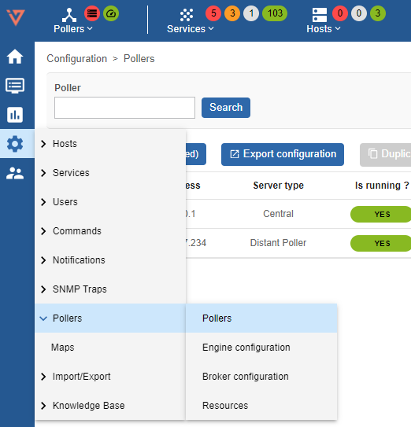

2. Click on Poller1 **Poller1**

3. Rename **Poller1** with a new name, according to your internal naming convention

4. Enter the IP address of the Smart Poller

    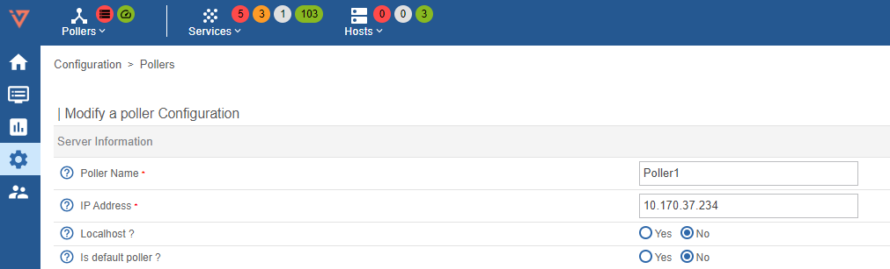

5. Save this configuration by clicking **Save** at the top right corner

    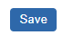

---

### Broker configuration

1. go to Configuration -> Pollers -> Broker configuration

    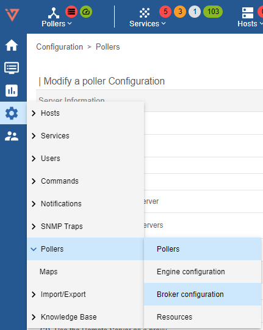

2. Click on Poller1 **Poller1**

3. In the **General** tab rename **Poller1** with a new name, according to your internal naming convention

4. Set the field **"Event queue max size"** to **250000**

    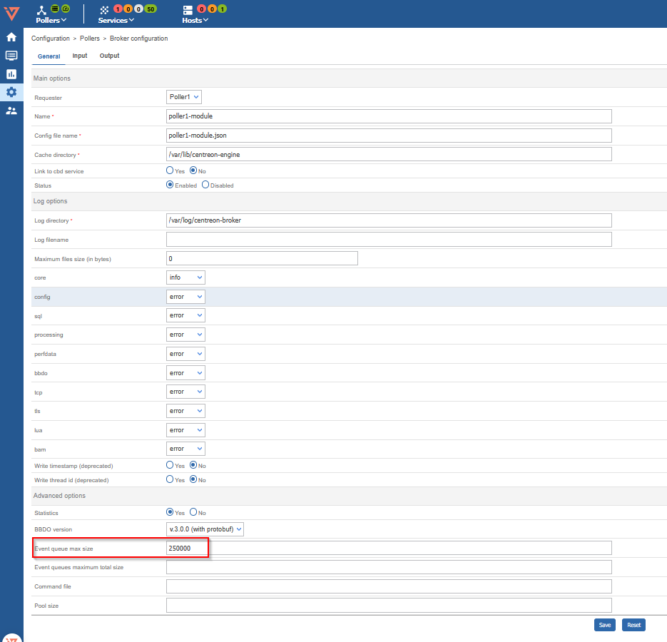

5. Select **Output** tab and enter the Central Manager IP **"Host to connect to"** filed

    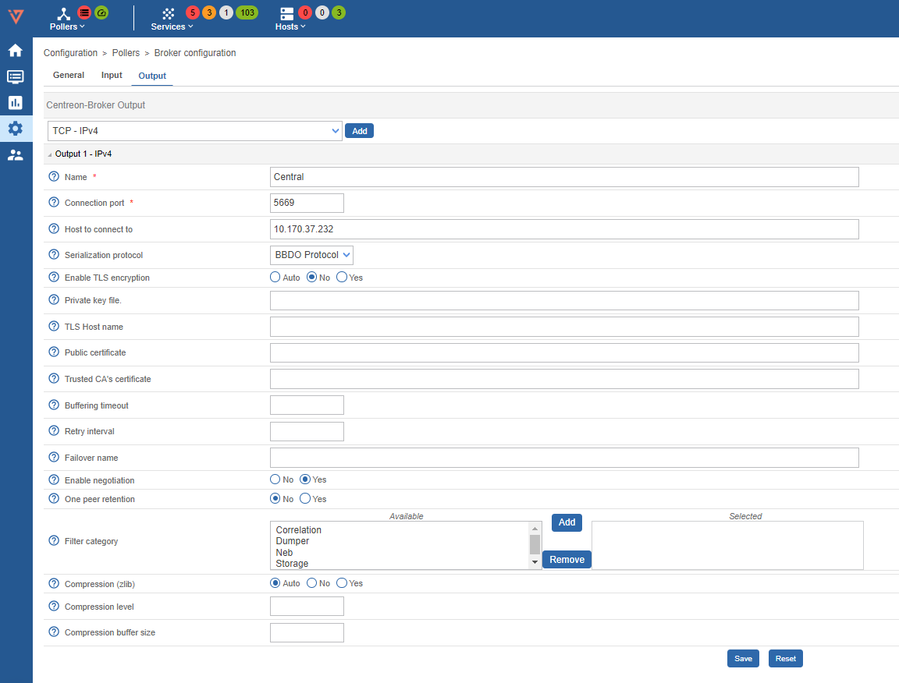

6. Save this configuration by clicking **Save** at the top right corner

    

---

### Engine configuration

1. go to Configuration -> Pollers -> Engine configuration

    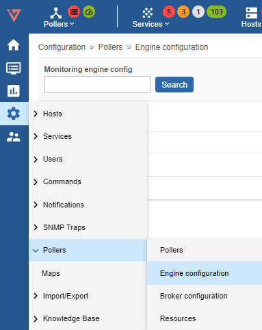

2. Click on Poller1 **Poller1**

3. In **Files** tab configuration Name: replace "Poller1" with a new poller name, as per your naming convention

    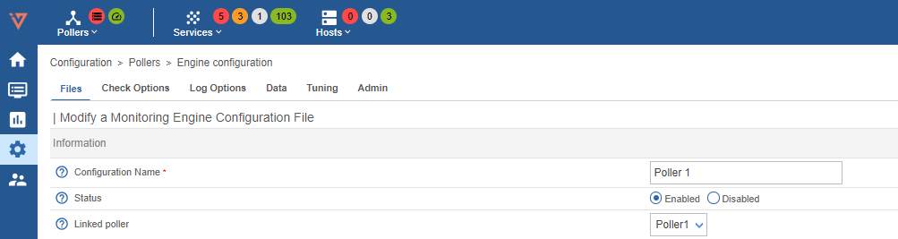

4. Go to **Data** tab

    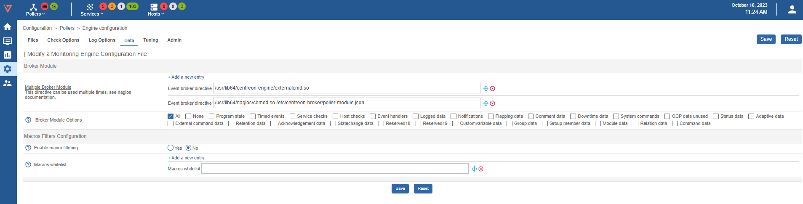

5. Enter two **empty** brocker directive like the image below (clik **+ Add a new entry** twice):

    

    And write the first path on the first directive and the second on the following one

    ```text
    /usr/lib64/centreon-engine/externalcmd.so
    ```

    ```text
    /usr/lib64/nagios/cbmod.so /etc/centreon-broker/poller-module.json
    ```

    The result should be like the image below

    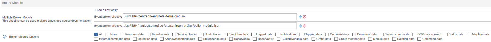

---

## Gorgone configuration export

### Create the Gorgone configuration for the new Poller

1. logon on your i-Vertix Central GUI and go to **Configuration -> Pollers**

2. click on the ICON **“Gorgone configuration”** under **Actions**

    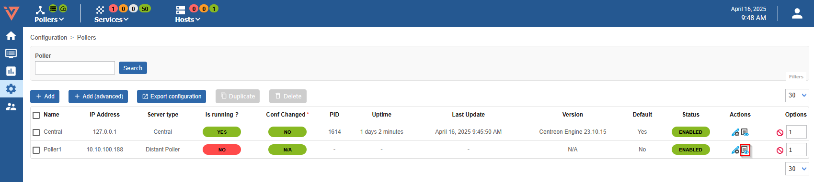

3. following page should appear

    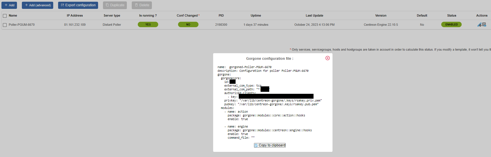

4. click **Copy to clipboard**

    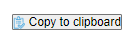

5. Now login to the i-Vertix4 Poller through SSH and become **root**

6. Paste the copied information and submit

    

7. Restart the gorgone deamon on your Poller

    ```bash
    systemctl restart gorgoned.service
    ```

    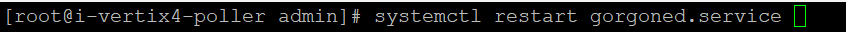

---

## Pollers restart

1. Go to Configuration -> Pollers -> Pollers

    

2. Select the Smart Poller that is being configured

    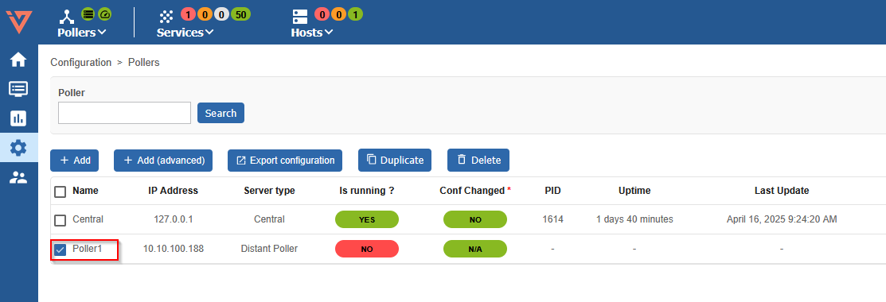

3. Click on **Export configuration**

    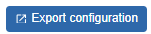

4. Select the first 4 options (at left) , then select **Method -> Restart** in the drop down menu

    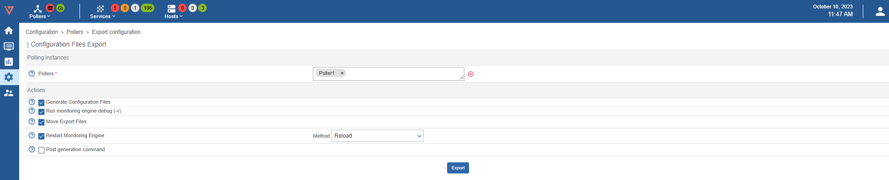

5. Log on to the Central Management (SSH) do a sudo bash and enter the password

    :::caution Mandatory
    The following steps are mandatory in any case Central Manager performs such a synchronization every 4 hours
    :::

6. Launch the following command:

    ```bash
    sudo ./opt/pgum/scripts/i-vertix/sync_poller.sh
    ```

7. Final check in the GUI under **Configuration -> Pollers -> Pollers**

    Check if the configuration is like the one shown in the picture.

    

:::note

If you want to start immediately with the monitoring, make sure to also manually synchronize the plugins from the central to the newly created poller!

:::

### Synchronize Plugins from Central to Poller

By default, syncing all plugins to the pollers is done every 4 hours on the Central server.

In case of adding a new poller where you want to start immediately with the monitoring,
you need to **execute following command** on the **Central Monitoring Server** to immediately sync the plugins:

```bash
sudo ./opt/i-vertix/scripts/i-vertix/sync_poller.sh
```
