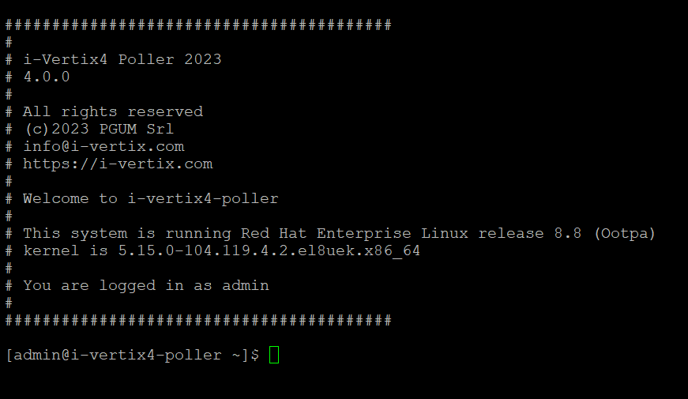
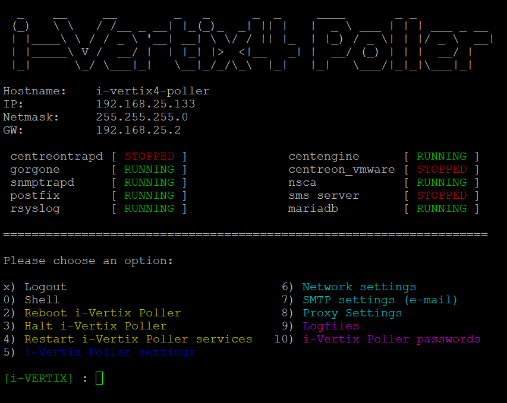

After completing the VM configuration procedure in the chosen hypervisor, **start** the Central Manager and Smart Poller VMs.

The following configuration steps must be performed on both the Central Manager and the Smart Poller.
Startup can take from a few seconds to some minutes.

It is recommended that the startup process is checked through the **hypervisor console**.

Once the VM is started, the following screen with a login prompt will be displayed:



On an **i-Vertix4** system you will need to log into the i-Vertix Monitoring console to configure the network settings, using the following credentials:

- User: '**admin**'

- Password: '**changeme**' (change as soon as possible, see [Password Modification](./password-modification.md))

:::danger

If you fail the login process 3 times, the IP Address will be blocked for 30 minutes (see [fail2ban](../../installation/fail2ban)).

:::

After the authentication, a menu that allows you to configure the next steps is displayed



:::info

If the menu doesn’t appear automatically at startup, simply type on the console the command

```bash
menu
```

:::

---

:::info

Please proceed now with the [network configuration](network-configuration).

:::

---

:::info

An internet connection should always be available, most importantly for:

- [License installation](./license.md)

- [Plugin Packs installation](../../monitoring-resources/plugin-packs)

- [NTP configuration](./ntp-configuration)

:::
