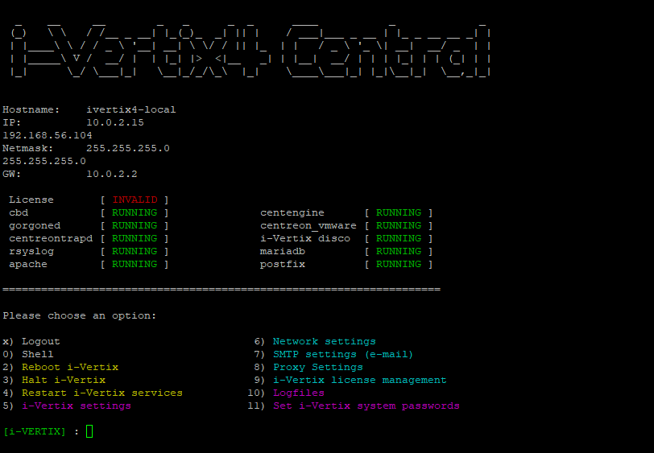
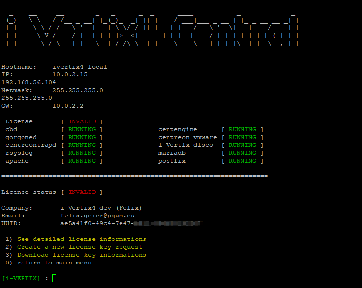

:::warning

The Central Manager must access the Internet so the license can be activated.

:::

## Obtain the UUID

1. Access *Central Manager CLI* and authenticate via SSH

2. Launch the command `menu` if you are not already viewing the menu

   

3. Choose `9) i-Vertix license management`

   

4. Copy the Unique Identifier (UUID) associatedwith the VM

5. Send an email to i-Vertix technical support [support@i-vertix.com](mailto:support@i-vertix.com) with:

        • Subject: License request
        • Email body that includes
        • the UUID
        • your company name
        • the email address of the person/team the license has to be associated with

        As in the example the informations will be:
        1) UUID=df604d56-1dca-ed6f-851b-c84a680aec78
        2) Company name=PGUM GmbH
        3) E-mail=info@pgum.eu

## Activate the license

You will receive an email from i-Vertix tech support that confirms the license activation (and also provides the credential to access the Plugin Store).

Follow the instructions in the email and download the license using the following steps:

1. Access *Central Manager CLI* and authenticate via SSH
2. Launch the command **menu**

   

3. Select `9) i-Vertix license management`

   

4. Type `3) Download license key informations`
5. If the vm can go on the internet (tcp 80, 443 enabled) it will download the license and install it. Command lines will appear and then press "Enter"
6. Type `0` to go back to the main menu
7. License status field will change from:

        `License       [ INVALID ]`
        to
        `License       [ VALID ]`

8. Type 2 to reboot the VM so that all the services will be started

The system is now ready. Proceed with the [first access to the web console](../first-web-access.md)

:::note

The current license configuration does not allow access to the Plugin Store yet.
You can find the configuration steps in the [Plugin Store Configuration](../../quick-start-guide/plugin-store-configuration.mdx) section.

If you haven't already, please contact i-Vertix Support at [support@i-vertix.com](mailto:support@i-vertix.com) to request access.
:::
