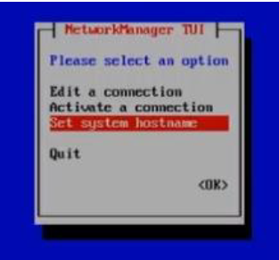

import Tabs from '@theme/Tabs';
import TabItem from '@theme/TabItem';

:::caution

Before you start, please be careful to meet the technical requirement (see [Technical Information](../before-you-start/technical-information.md))

Before proceeding to modify the network, be sure to operate from the hypervisor console to avoid loss of connectivity.

:::

1. Select option `6) Network settings` from the menu
2. Select Edit Connection
3. Select the proper NIC (for example **ens192**) and then **Modify** followed by your network settings:
4. IPv4 Configuration: **Manual**
5. Addresses: IP address you want to assign to the Central Manager
6. Gateway: your default gateway IP address
7. DNS server: your DNS Server IP Address
8. Search domain: Insert the domain (if necessary)
9. IPv6 Configuration: **Ignore**

Confirm the settings with **OK**


---

Get back to main menu NMTUI (on the left-hand side)

1. To activate the new settings, select **Activate a connection** from the NMTUI menu
2. Select the **NIC** (ens192 by default ), then
3. **Deactivate**
4. **Activate**
5. Finally select **Back**

---

Get back to the main NMTUI menu

1. Select **Set a system hostname** to configure the system hostname then select **OK**
2. Select **Quit** to quit the **NMTUI** menu and get back to the **i-Vertix menu**



---

Now the network configuration is complete.
Restart the system if necessary. Afterwards the system should be accessible via a network connection (for example using **Putty**).

:::note

Check that **DNS** is working

```bash
nslookup www.google.com
```

You should see following or a similar result:

```text
nslookup www.google.com
Server:         192.168.25.2
Address:        192.168.25.2#53

Non-authoritative answer:
Name:   www.google.com
Address: 142.251.209.4
Name:   www.google.com
Address: 2a00:1450:4002:402::2004
```

:::
