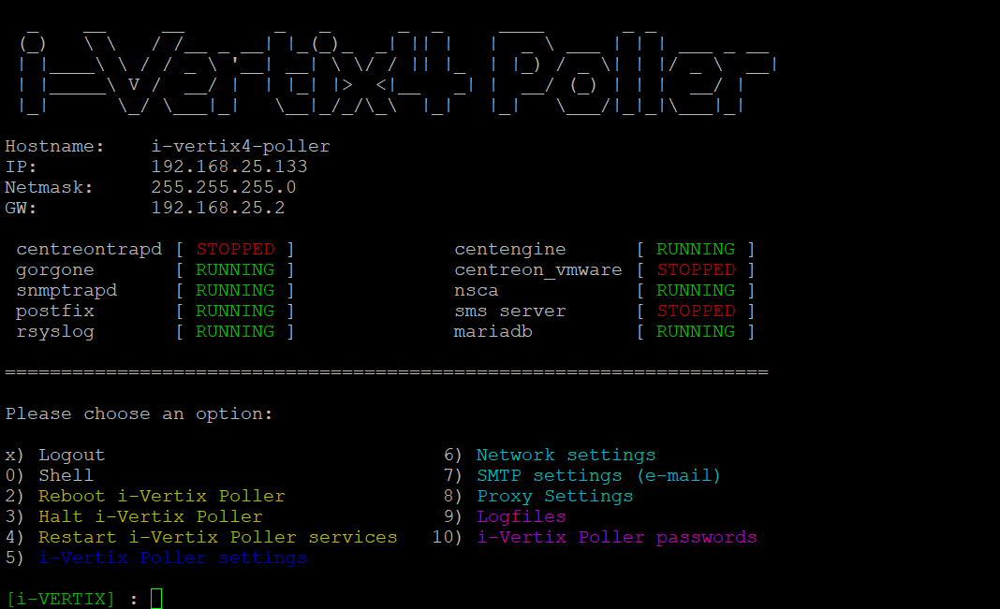
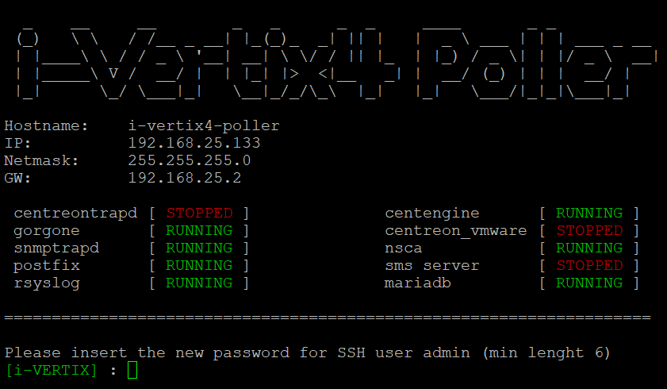
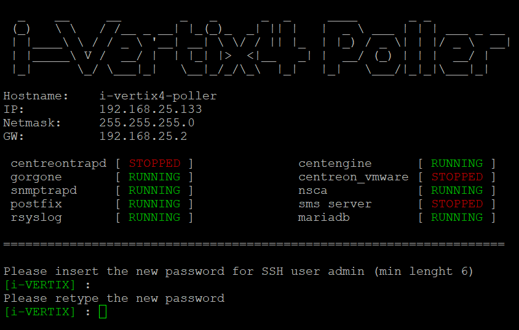

import Tabs from '@theme/Tabs';
import TabItem from '@theme/TabItem';

<Tabs>
<TabItem value="i-Vertix4" label="i-Vertix4" default>

In order to **modify the password**:

1. Log into the system

2. Enter **menu** command

3. Select option **`10`** **i-Vertix Poller passwords** _(in case of Smart Poller)_ or **`11`** **i-Vertix Central passwords**  _(in case of Central Manager)_

4. Type the new password **_(min. 6 characters)_** for **SSH user admin**, twice

</TabItem>
</Tabs>
