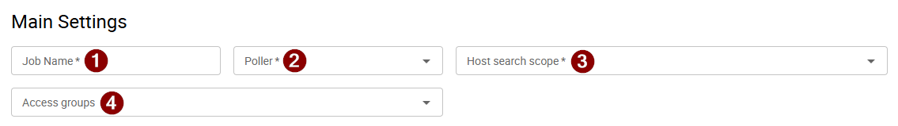
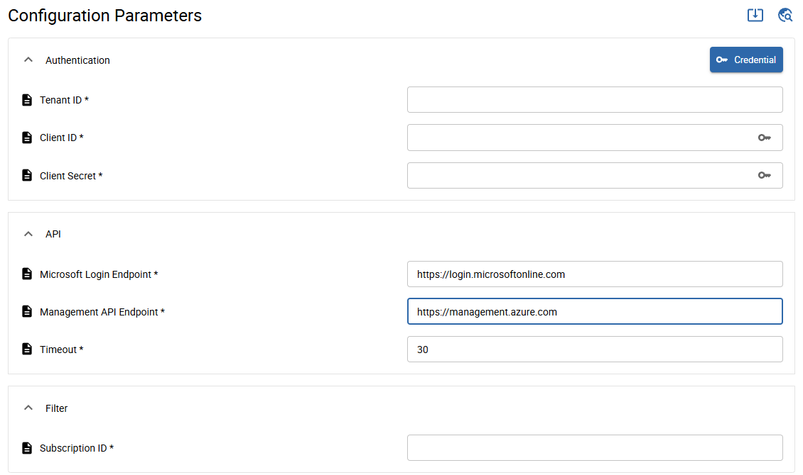
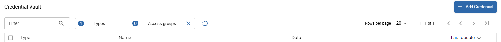
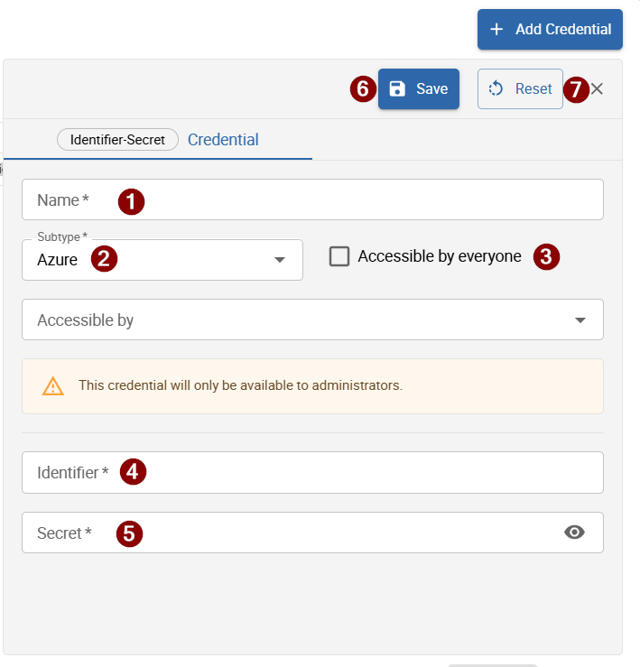
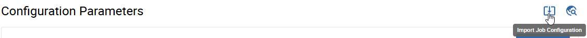
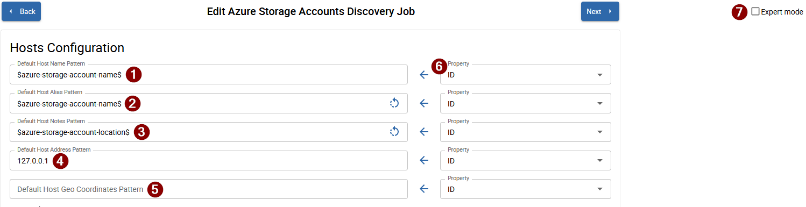
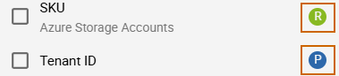
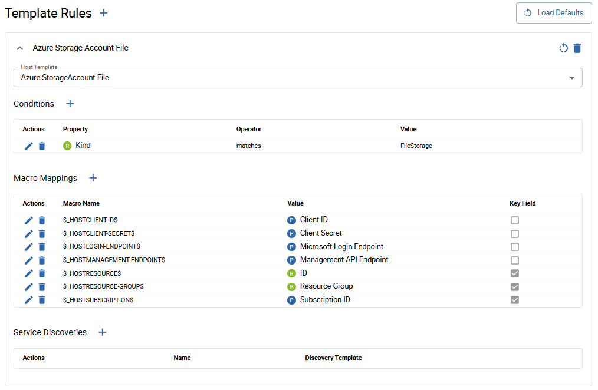
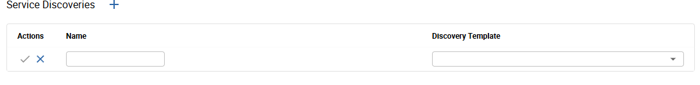

import ImageCounter from "../../../../src/components/ImageCounter"

## Introduction

In i-Vertx there are several discovery modules that can be used to discover devices and services in your network. The common discovery module is a shared module that provides common functionality for this discovery:
* AWS
* Azure
* VMware VeloCloud

### Main Settings

The section "Main Settings" are equal for all discovery modules:

#### Mandatory fields
* **Job Name** <ImageCounter num={1} />: Use a meaningful name for your discovery job.
* **Poller** <ImageCounter num={2} />: Select the poller that will be used for this discovery.
* **Host search scope** <ImageCounter num={3} />: Select the host search scope that will be used for this discovery.

#### Optional fields
* **Access groups** <ImageCounter num={4} />: Select the access groups that will be used for this discovery. If no access group is selected, the discovery will be available for all access groups.

### Configuration Parameters
For a successful discovery, you need to provide the following mandatory configuration parameters:

#### Authentication
* **Tenant ID**: The tenant ID is a unique identifier for your Azure Active Directory (AAD) instance. It is used to authenticate and authorize access to Azure resources. You can find your tenant ID in the Azure portal under "Azure Active Directory" > "Properties".
* **Client ID**: The client ID is a unique identifier for your application registered in Azure Active Directory (AAD). It is used to authenticate and authorize access to Azure resources. You can find your client ID in the Azure portal under "Azure Active Directory" > "App registrations" > "Your Application" > "Overview".
* **Client Secret**: The client secret is a password-like value that is used to authenticate your application with Azure Active Directory (AAD). You can create a client secret in the Azure portal under "Azure Active Directory" > "App registrations" > "Your Application" > "Certificates & secrets".

:::info Credential Button
By clicking the "Credential" button, you can save the credentials for other discovery jobs. This allows you to reuse the same credentials for multiple discovery jobs without having to enter them again.

For add a new credential, click the "Add Credential" button and fill in the required fields:

* **Name** <ImageCounter num={1} />: Set a meaningful name for your credential.
* **Subtype** <ImageCounter num={2} />: Select the subtype for your credential. The subtype determines the type of authentication that will be used for this credential. For Azure, select "Azure". It is set by default on "Azure".
* **Accessible by everyone** <ImageCounter num={3} />: If this option is selected, the credential will be accessible by all users. If this option is not selected, the credential will only be available to administrators. If this option is selected, the credential will be available and visible for every user.
* **Identifier** <ImageCounter num={4} />: Set a unique identifier for your credential. This identifier will be used to reference the credential in your discovery job.
* **Secret** <ImageCounter num={5} />: Set the secret for your credential. This secret will be used to authenticate your application with Azure Active Directory (AAD).
* **Save** <ImageCounter num={6} />: **Please click the "Save" button** to save your credential. Your credential will be saved and available for use in your discovery job.
* **Reset** <ImageCounter num={7} />: Click the "Reset" button to reset the fields in the credential form. This will clear all the fields and allow you to start over.
:::

:::info Import Job Configuration Button

By clicking the "Import Job Configuration" button, you can import a job configuration from another discovery job. This allows you to reuse the same configuration for multiple discovery jobs without having to enter them again.
Note that will be imported only the discovery job of the same type (Azure discovery jobs can only import Azure discovery jobs, same for AWS), and only the corrispondents configuration parameters will be imported, not all the parameters. 
There is no possibility to import a discovery job of a different type (for example, you cannot import an AWS discovery job into an Azure discovery job).
:::

:::info Globe Button

By clicking the "Globe" button, a new tab will open in your browser and take you to the guide page for the disocovery module.
:::

#### API
* **Microsoft Login Endpoint**: Set the URL for the Microsoft Login Endpoint. Default is 'https://login.microsoftonline.com'.
* **Management API Endpoint**: Set the URL for the Microsoft Management API Endpoint. Default is 'https://management.azure.com'.
* **Timeout**: Set the timeout for the API requests. Default is 30 seconds.

#### Filter
* **Subscription ID**: The subscription ID is a unique identifier for your Azure subscription. It is used to identify the subscription that you want to use for this discovery. You can find your subscription ID in the Azure portal under "Subscriptions" > "Your Subscription" > "Overview".

### Host Configuration
In this section, you can configure the host settings for your discovery job. The host settings determine how the discovered devices will be cathed by the discovery job.

The following fields are equal for the most of the discovery modules:
* **Default Host Name Pattern** <ImageCounter num={1} />: The macro is set by default in this field, will be used to collect the host name of your devices.
* **Default Host Alias Pattern** <ImageCounter num={2} />: The macro is set by default in this field, will be used to collect the host alias of your devices.
  > In every field you can return to the default value by clicking the "Reset" button. This will reset the field to its default value.

* **Default Host Note Pattern** <ImageCounter num={3} />: The macro is set by default in this field, will be used to collect the host note of your devices.
* **Default Host Address Pattern** <ImageCounter num={4} />: The ip address is set by default in this field, will be used to collect the host address of your devices.
* **Default Host Geo Coordinates Pattern** <ImageCounter num={5} />: By default, this field is empty. You can set a macro to collect the host geo coordinates of your devices.
* **Property** <ImageCounter num={6} />: By default, this fields are populeted with "ID". This parameter can be changed by clicking the dropdown selection to assign a different property to the discovered devices.
* **Expert Mode** <ImageCounter num={7} />: By default, this option is disabled. If you enable this option, you can modify the Template Rules configuration, set conditions, macro mappings and service discoveries.

:::info Property

If you click the dropdown selection of the "Property" field, you can select a different property to assign to the discovered devices. 
By default is the "R" symbol, which means that is a result parameter.
The are some properties that have the symbol "P", wich means that are configuration parameters.
:::

### Expert Mode
If you enable the "Expert Mode" option, you can modify the Template Rules configuration, set conditions, macro mappings and service discoveries. This is an example:

By default the Template Rule for the "Azure Storage Accounts Discovery Job" is "Azure Storage Account File".
In this example, the conditions are set to match the value "FileStorage" in the property "Kind" of the discovered devices. If the condition is met, the macro mappings and service discoveries will be applied to the discovered devices.

In the Macro Mappings section, you can set the macro mappings for the discovered devices. In this example, there are several macro mappings that will be seen later once the discovery job is completed. Some of the Macro Mappings are a "Key Field" checkbox filled, this means that the discovery must take in consideration this macros for having unique host and never a duplicate one.

The section "Service Discoveries" allows you to set one discovery template and the services that you want will be discovered for the devices that match the conditions before.
