import ImageCounter from "../../../../src/components/ImageCounter";
import Breadcrumb from "../../../../src/components/Breadcrumb";

## Introduction

The i-Vertix *Common Cloud Discovery* covers different technologies across different vendors.
The discovery process for each technology is based on the same principles, but the configuration parameters and
the discovered devices may vary depending on the technology.

Currently, following technologies are covered by the i-Vertix *Common Cloud Discovery*:
* **AWS**: EC2, EBS, S3, RDS, Lambda, ELB, ElastiCache, API Gateway, SQS
* **Azure**: App Gateway, Load Balancer, NetApp Pool, Public IP, SQL Database, SQL Server, Storage Accounts, Virtual Hub, Virtual Machine, Virtual Network
* **Cisco**: Webex
* **VMware VeloCloud**
* **ExtremeCloud IQ**: Building, Device, Floor, Sites
* **Proxmox VE**

To create a new discovery job for the above mentioned technologies, have a look at the [job creation dialogue](./description.mdx#create-discovery-jobs) and select
the desired technology.
Then follow the below instructions to configure the discovery job and work with it's results.

## Job Wizard

As already mentioned, the discovery process for each technology is based on the same principles, 
therefore also each wizard for the discovery job creation has the same structure and the same sections, which are described below.

### Main Settings

This step of the wizard configures basic information for the job aswell as anything regarding access, 
authentication and other information required by the discovery type and filters.

#### Basic information

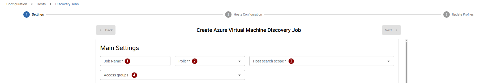

* **Job Name** <ImageCounter num={1} />: Choose a descriptive name for your discovery job
* **Poller** <ImageCounter num={2} />: Select the poller that will be used for this discovery.
  The poller is responsible for executing the discovery command and any created hosts from this discovery will land on the selected poller
* **Host search scope** <ImageCounter num={3} />: Select the host search scope that will be used for this discovery job.
  The host search scope determines, which pollers are used to search for already existing hosts.
  This setting is useful in case you have a multi-poller setup and distributed host management.
  It allows you to avoid creating duplicate hosts in different pollers.
  By default, the main poller is always selected as the host search scope, but you can select additional pollers if you want to search for existing hosts in those pollers as well.
* **Access groups** <ImageCounter num={4} />: Select access groups that will have access to this discovery job.
  While being logged in as an administrator, you can also omit this field which leaves the discovery job only accessible to administrators

After configuring the basic information for you job you can move to the next section of this step, which is the configuration of the discovery parameters.

### Configuration Parameters

In this section of the *Main Settings* step you need to configure anything regarding access, authentication and other information required by the discovery type.
This section is different for each discovery type. The below image shows an example of a discovery job related to *Azure*.
We use this example to explain the different fields and their meaning.

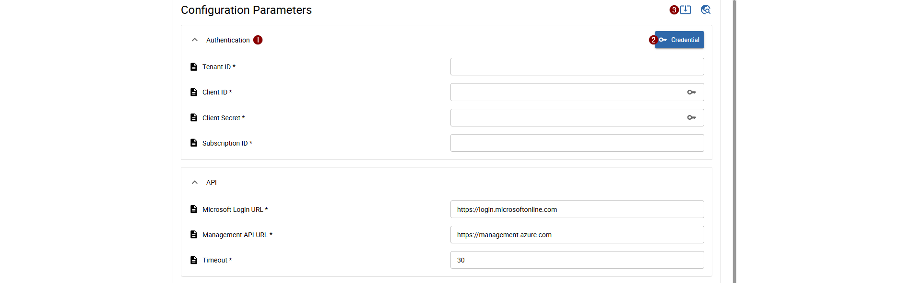

#### Authentication

Some fields of the <ImageCounter num={1} /> authentication section, marked by the key icon, are directly linked to credentials that you can create and manage in the *Credential Vault*.
Azure discoveries for example requires a Tenant ID, Client ID, Client Secret and a Subscription ID to authenticate and access the Azure API.
Whilst Tenant ID and Subscription ID are "normal" inputs, Client ID and Client Secret are linked to a credential, which you can create and manage in the *Credential Vault*.
To do so, click the <ImageCounter num={2} /> Credential button on the top right of the authentication section. From there you can either select already existing (in this case Azure) credentials or create a new one. 
After selecting a credential, any connected fields are populated with the credential values.

<h5 id="credential-vault">Credential Vault</h5>

When opening the *Credential Vault* you can see a <ImageCounter num={1} /> list of all existing credentials of a certain type, required by the current discovery job.

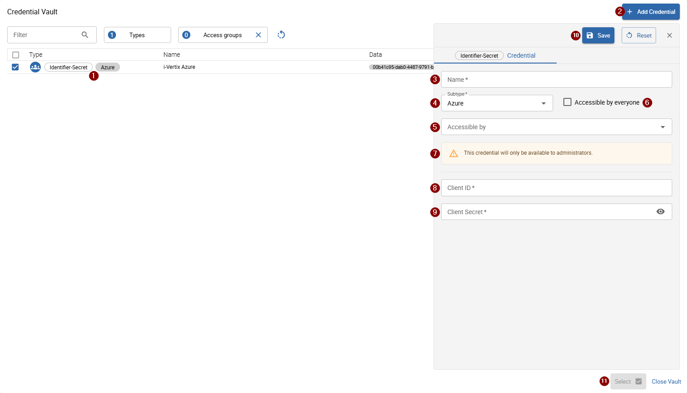

To create a new credential, click the `Add Credential` button on the top right of the dialog. On the right side of the dialog,
a form will open where you can enter the required information for your new credential: 

* <ImageCounter num={3} /> **Name**: Choose a descriptive name for the new credential
* <ImageCounter num={4} /> **Subtype**: The subtype is populated by default, based on the current discovery job type
* <ImageCounter num={5} /> **Accessible by**: Choose access groups, which will have access to the new credential.
  As an administrator, you can omit this field to grant acceess only to administrators
* <ImageCounter num={6} /> **Accessible by everyone**: This checkbox is only available while being logged in as an administrator. If you check this checkbox, 
  any previously selected access groups are omitted and the new credential will be accessible by everyone, regardless of access groups.
  Setting this checkbox is **not recommended** for credentials used by discoveries.
* <ImageCounter num={7} /> A notice will be displayed, in case the credential will be only available to administrators or everyone
* <ImageCounter num={8} /> & <ImageCounter num={9} /> The remaining fields depend on the credential type you are about to create.
  For the current example of an *Azure Credential*, a Client ID and Secret are required
* <ImageCounter num={10} /> **Save**: Saves the current credential if all required fields are filled.
  After saving, the new credential will be available in the list and is already selected
* <ImageCounter num={11} /> **Select**: Uses the currently selected credential for your discovery job and closes the dialog.
  Any connected fields in the authentication section are populated with the credential values

:::info <ImageCounter num={3} /> Import Job Configuration
It is possible to import configuration parameters from existing discovery jobs of the same vendor type.
To import parameters, click the <ImageCounter num={3} /> `Import Job Configuration` button on the top right of the configuration parameters section.
Please note that only parameters present in both source and current discovery job are imported.
Mostly this is the case for authentication and connection parameters, but not for all parameters because some may only be available in certain contexts.
:::

#### Other Configuration Parameters

Besides *Authentication* parameters, there may be other parameters to set for the discovery job, depending on the discovery type.
For example, in the case of an *Azure* discovery job, you can configure the API urls and the timeout used for the discovery command -
in case of *AWS* discovery jobs, you must choose the region to discover and the API url for the discovery command.

---

After you have filled all required configuration parameters you can move to the [next step](#host-configuration) of the wizard.

### Host Configuration

In this section, you can configure how hosts are generated from the discovery results.

#### Host Fields

Initially you will be able to configure following fields:

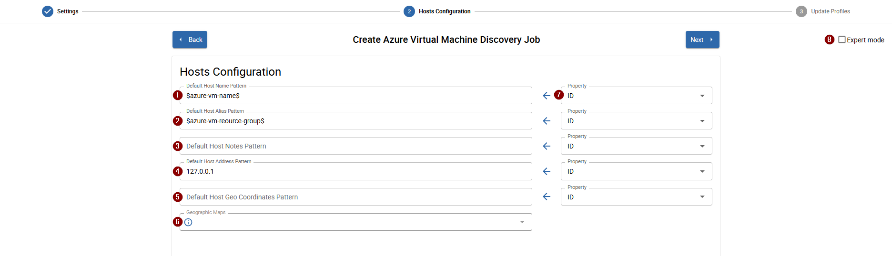

* <ImageCounter num={1} /> **Default Host Name Pattern**: Pattern used to generate the host name
* <ImageCounter num={2} /> **Default Host Alias Pattern**: Pattern used to generate the host alias
* <ImageCounter num={3} /> **Default Host Note Pattern**: Pattern used to generate the host notes
* <ImageCounter num={4} /> **Default Host Address Pattern**: Pattern used to generate the host address
* <ImageCounter num={5} /> **Default Host Geo Coordinates Pattern**: Pattern used to generate the host geographic coordinates

Some fields can already be filled with default presets. Please note that these presets are not mandatory and can be changed to any other pattern you want.
The default *Host Name Pattern* and *Host Address Pattern* are required, otherwise the discovery is not able to generate fully qualified hosts. Any other fields are optional.
It is also possible that some discovery types preset `127.0.0.1` for the *Host Address Pattern* because there is no realistic result address available.

:::info Pattern Properties
You can and should use result properties inside the pattern fields. You can identify a result property by the `$property$` syntax.
To insert properties inside a pattern field you can use the <ImageCounter num={7} /> dropdown on the right side of the field.
This dropdown contains all available result properties for the current discovery job.

There are two different type of properties available:

* <ImageCounter color="#88B922">R</ImageCounter> Discovery result properties marked by a green `R`
* <ImageCounter color="#2E68AA">R</ImageCounter> Job configuration parameters marked by a blue `P`

To append the selected property to the current pattern, click the `<-` button to the left of the dropdown.
The property will be inserted at the current cursor position in the pattern field.
:::

:::note
In case you want to return to the preset value of a pattern field, you can click the `Reset` button on the right side of any changed field.
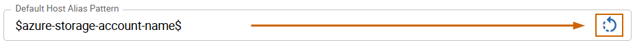
:::

#### Geographic Maps

It is possible to add hosts, which are discovered by the discovery job, automatically to geographic maps.
To do so, you need to set the *Default Host Geo Coordinates Pattern* field with a pattern that contains the latitude and longitude of the discovered devices.
The pattern must follow the format: `latitude,longitude` (for example: `46.49067,11.33982`).
You can use result properties in the pattern to dynamically set the coordinates based on the discovered device's properties.
Please note that not every discovery type returns the latitude and logitude coordinates.

#### Template Rules

By default, this section of the *Host Configuration* step is hidden.
To activate the section, you must enable the <ImageCounter num={8} /> `Expert mode` in the top right corner of the wizard.

:::warning
Please be aware, that you should only enable the `Expert mode` in case you need to modify how and which templates need to be assigned to discovery results!
A faulty configuration of template rules may result to broken mappings or results with no host templates assigned.
:::

In case you don't need or want to modify any template rules, move to the [next wizard step](#update-profiles), otherwise enable the *export mode*.

---

Once the mode is enabled, the *Template Rules* section will be available.

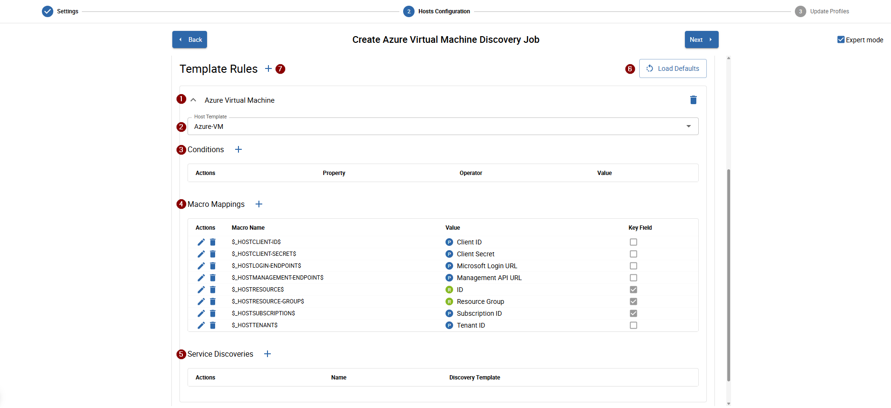

Most discovery types only have one default template rule, some may come with two preset rules. A *Template rule* consists of following information:

* <ImageCounter num={1} /> **Rule Name**
* <ImageCounter num={2} /> **Host Template**: the selected host template will be assigned to any result/host of the discovery,
  that satisfies the configured <ImageCounter num={3} /> conditions
* <ImageCounter num={3} /> **Conditions**: configured conditions are applied to every discovery result and decide,
  whether the template rule will applied to the result/host or not. **In case no condition is present, the template rule will be applied to every result automatically**
* <ImageCounter num={4} /> **Macro Mappings**: define, how and which *Host macros* are populated for every result/host.
  The value of a host macro can either be a <ImageCounter color="#88B922">R</ImageCounter> *result property*, 
  <ImageCounter color="#2E68AA">R</ImageCounter> *job configuration parameter* or a <ImageCounter color="#BDBDBD">C</ImageCounter> *custom value*
* <ImageCounter num={5} /> **Service Discoveries**: additional service discoveries which are executed for every result that applies the template rule

:::info
Each part of a template rule is editable, but as already mentioned, please be aware that wrong configurations can cause
host configuration problems or result in unusable discovery results.
:::

In case you modified a rule and want to revert back to it's original state you can click the `Rollback` button next to the delete button on the top right of a *Template rule*.

:::warning Snapshots
When creating a new job from scratch, the latest rule-presets will be used. Once you save your new job,
the rules are saved directly to the job and are no longer directly connected to the intial presets.
As a result, the job doesn't automatically get rule-updates in case the presets changed.

To align the job's template rule to the latest presets you must manually <ImageCounter num={6} /> load the
*latest template rule defaults* by clicking the button on the top right corner of the section.
:::

##### Create a custom Template Rule

You are free to create a custom *Template Rule* by clicking the <ImageCounter num={7} /> `+` button next to the section title.
A new dialogue will open, asking you to choose a *rule name* and a *host template* for your new rule.
Afterwards you can configure *conditions*, *host macro mappings* and *service discoveries*.

:::danger Prevent multiple rule applications
When adding new rules you need to be very careful when it comes down to the question, when and which template rule needs to be applied to a result.
The best practice should be to make sure (via conditions), that only one template rule gets applied to a result.

There are circumstances and special cases where you need to assign a custom macro to **every** result/host but without modifying the original template rule.
In such cases you can create a second custom template rule with the same exact *Host Template* and no conditions plus your desired *macro mapping*.
Both template rules will be applied, all macros written to the host but the common host template will only be assigned once.
:::

### Update Profiles

The last step of the wizard contains the *Update Profiles* for the discovery job.

Currently you can only modify the *Manual Configuration Update Profile*.
The idea behind these update profiles is that you can manage, which properties of
a host get updated when when you select results to update the monitoring configuration from.

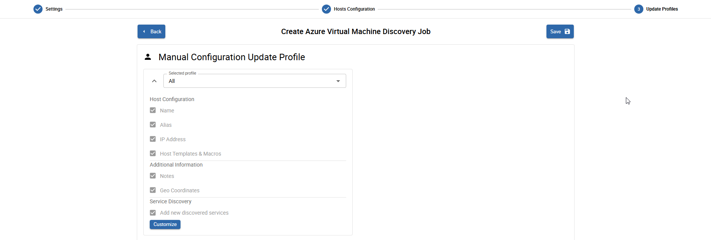

By default, following profile-presets are available:

* All
* None

:::info
Default presets can be configured in <Breadcrumb crumbs={["Administration", "Discovery", "Host Discovery"]} />.
:::

What you can do now is to select the default-selected preset. The selected profile will later be used as
the default profile during when updating the monitoring configuration on the results page.

:::tip Custom Profile
It is also possible to create a custom profile for a discovery job. To create the custom profile,
exand the profile and click `Customize` while having selected a preset, otherwise you can directly select the *Custom* profile from the dropdown.
All update-options should be avaialble to be selected/removed from the profile.
:::

---

Click `Save` to save and start the job. You will be directly redirected to the job's result page.

---

## Job Results

The job results page for discovery jobs is available from the <Breadcrumb crumbs={["Configuration", "Host", "Discovery Jobs"]} /> page by clicking the row of the job.

Here is an example of the job result page of an *Azure Storageaccount* job:

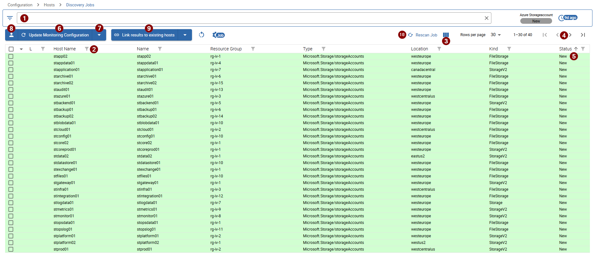

### Result List

The list shows the most relevant result information, including the generated *Host Name*, the <ImageCounter num={5} /> *Result Status*,
the *name* of the result as well as other result-related properties.

To filter for specifig results you can use the <ImageCounter num={1} /> filter bar at the very top of the page or directly fitler for columns
using the <ImageCounter num={2} /> filter icon next to a column title. 

Some discovery results may return a lot of different properties and by default, only the first 6 result properties are displayed.
You can choose, which columns are displayed by selecting the desired columns from the <ImageCounter num={3} /> column dropdown
next to the *Rows per page* setting above the list on the right.

In case you have a lot of results, use the <ImageCounter num={4} /> pagination above the list on the right to navigate to the next or previous result page.

### Result Status

Each result comes with a *Result Status*. This status indicates, whether a result is *already existing*, *new*, *a duplicate* or *not configured correctly*.
These are the possible states a device can have:

* *Existing*: the result is *already* monitored, *linked* to a host and can be used to update the linked host
* *New*: the result is *not yet* monitored but can be used to create a host
* *Conflict (existing name)*: the result is *not yet* monitored and *can't be used to create a host* because the generated *host name is already in use*
* *Conflict (out of scope)*: the result is *already* monitored and *linked* to a host but *can't be used to update the host* because the host is out of [scope](#host-search-scope)
* *Incomplete*: the result is missing mappings or host properties and must be re-evaluated manually
* *Duplicate*: the result is *already* monitored but *needs to be linked* to the existing host

### Create and update Hosts

You can easily create new and update existing hosts by clicking the <ImageCounter num={6} /> `Update Monitoring Configuration` button above the list.
By simply clicking the button, **all selected** results with status *new* will be used to create new hosts and all with status *existing* will be used to update each linked host.

In case you want to massively update the monitoring configuration you can select a massive-update action from the <ImageCounter num={7} /> dropdown.
The dropdown includes also an option to include only filtered results so you are more precise, which results you want to use.

#### Update hosts

When it comes to updating existing hosts it may be required to only update certain properties and keep the rest as-is.
To do so you can change or modify the [Configuration Update Profile](#update-profiles) which determines, what is getting updated.
Click the <ImageCounter num={8} /> *Profile* icon next to the `Update Monitoring Configuration` button.
Choose a suitable profile-preset or modify the custom profile to fit your needs.

:::tip
In case you are missing configuration changes of already existing hosts, verify the currently selected *Configuraiton Update Profile*.
:::

---

After updating the monitoring configuration a dialog opens and shows the results of the task.
It is also possible to show detailed results by enabling the *Detailed* checkbox in the top right corner of the dialog.

### Link duplicate hosts

Discovery results with the status `Duplicate` cannot be used directly to update the monitoring configuration.
Before an update can be performed, the result must be linked to an existing host configuration.

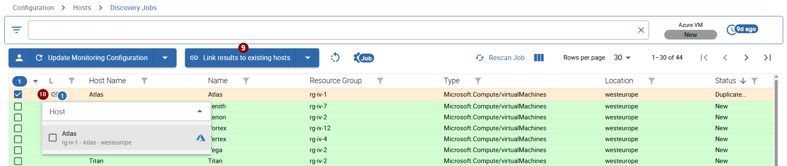

A duplicate result indicates that the discovered device already exists in the monitoring system.
To ensure that the correct host configuration is updated, the discovery process requires the user to explicitly assign the result to the corresponding host.

This can be achieved by linking a single duplicate result using the <ImageCounter num={10} /> `Link` button of the first column,
or by linking all, all using filters or all selected using the <ImageCounter num={9} /> `Link results to existing hosts` button above the list.

### Result Detail

Besides the information displayed in the list, each result can be displayed with more detailed information.
Click a row to open the sidepanel for the targeted result.

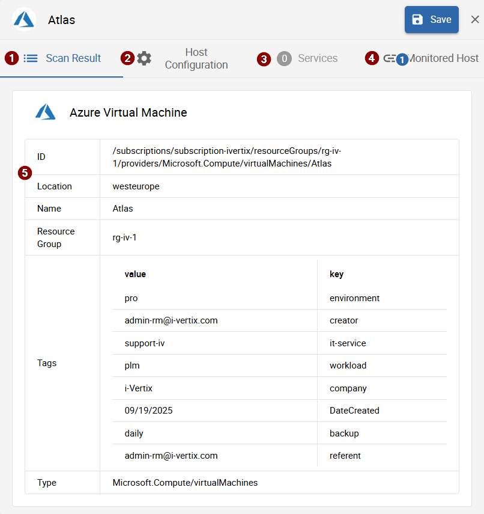

The sidepanel is divided into 4 tabs:

* <ImageCounter num={1} /> Scan results
* <ImageCounter num={2} /> Host Configuration
* <ImageCounter num={3} /> Services
* <ImageCounter num={4} /> Monitored Host

#### <ImageCounter num={1} /> Scan results

The first tab *Scan results* displays <ImageCounter num={5} /> all the information the discovery retrieved.
In case an additional discovery was also performed, the discovery results of the additional discovery will also be displayed in this tab.

#### <ImageCounter num={2} /> Host Configuration

The second tab *Host Configuration* displays the values for the monitoring host.
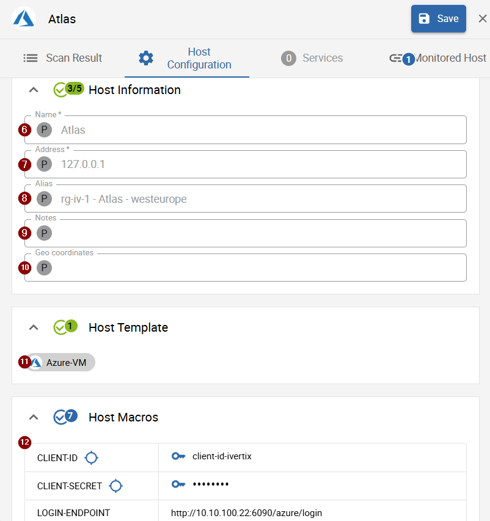

The first section in this tab covers the generatetd main host information, such as:

* <ImageCounter num={6} /> Host name
* <ImageCounter num={7} /> Host address
* <ImageCounter num={8} /> Host alias
* <ImageCounter num={9} /> Host notes
* <ImageCounter num={10} /> Host geo coordinates

Please note the <ImageCounter color="#999999">P</ImageCounter> or <ImageCounter color="#FD9F27">C</ImageCounter> at the beginning of every field.
The <ImageCounter color="#999999">P</ImageCounter> indicates, that the field is currently managed by the pattern defined in the
[host configuration section of the wizard](#host-configuration) whilst a <ImageCounter color="#FD9F27">C</ImageCounter> marks,
that the current set value was overwritten/customized.

:::tip Customize fields
Fields managed by <ImageCounter color="#999999">P</ImageCounter> pattern are disabled. To enable editing/customizing the field, 
click the <ImageCounter color="#999999">P</ImageCounter> icon.
In case you want to reset a customized field, click the <ImageCounter color="#FD9F27">C</ImageCounter> icon to return to the pattern value.
:::

To save any customizations, click the `Save` button at the right top of the sidepanel.

Below the fields the <ImageCounter num={11} /> host templates are displayed, which will be added/set on the host when updating the monitoring configruation.

:::warning No host template present
In case no host template is present, this usually means that no [Template rule](#template-rules) matched for this result.
Please check the dedicated job configuration section to find the issue.
:::

At the bottom of the tab you find <ImageCounter num={12} /> all host macros that will be added/set on the host when updating the monitoring configuration.
The `key` icon after a macro value indicates, that the macro value is populated from the credential selected in the [authentication section](#authentication) 
of the job configuration parameters.
The `target` icon after a macro name indicates, that the macro is used as an identifier to prevent the creation of duplicate hosts.

#### <ImageCounter num={3} /> Services

This tab is only enabled in case an addititonal service discovery was performed for this result.
These can be configured in the [Template rules](#template-rules) section of the job wizard.

In case no service discovery was performed the tab is disabled as in the above picture.

In case there are additional discovered services, the list of found services is displayed, grouped by the *service discovery template*:

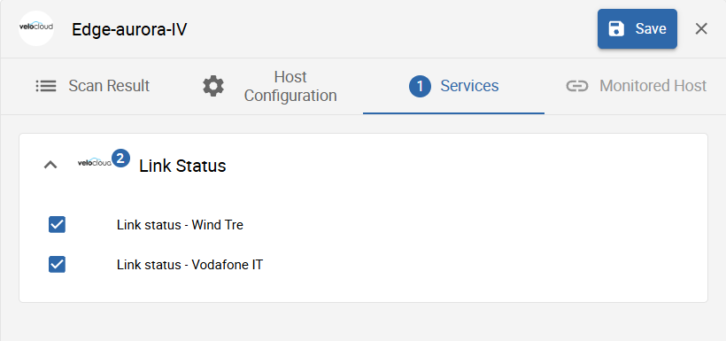

All selected services will be created when [updating the monitoring configuration](#create-and-update-hosts).
It is also possible to uncheck services, resulting to skip such services when updating the monitoring configuration.
To save the changed selection of services, click the `Save` button at the top right of the sidepanel.

#### <ImageCounter num={4} /> Monitored Host

This tab is only enabled in case a monitored host is already linked to this credential or there are host candidates available to link.
It is also possible to change the currently linked host in case the current linked host is wrong.

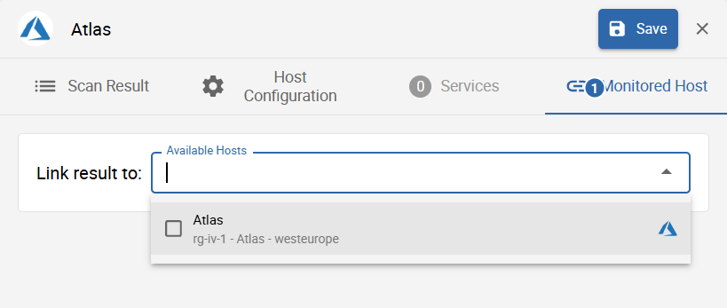

In case a host is already linked, some relevant host information is displayed for the linked host:

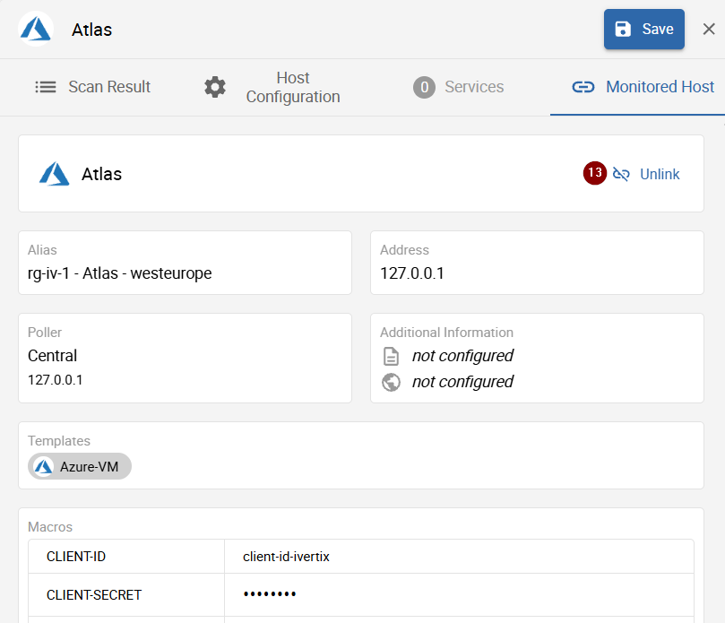

To remove or change the currently linked host, click the <ImageCounter num={13} /> `Unlink` button next to the host name.
After removing or changing the linked host you must save the changes using the `Save` button at the top right of the sidepanel.

---

:::info
All customized and **saved** changes in the result detail will be taken into account when updating the monitoring configuration.
:::

## Discovery Prerequisites

### AWS

To use AWS discovery features and later also AWS monitoring, you need to prepare a dedicated AWS user, which has the following permissions, 
depending on what you want to discover/monitor:

<h4 id="aws-api-gateway">API Gateway</h4>

| Privilege                      | Description                                          |
|--------------------------------|------------------------------------------------------|
| apigateway:GetRestApis         | Display API Gateway REST APIs details                |
| cloudwatch:GetMetricStatistics | Get metrics from the S3 namespace on Cloudwatch      |

<h4 id="aws-ebs">EBS</h4>

| Privilege                      | Description                                          |
|--------------------------------|------------------------------------------------------|
| ec2:DescribeVolumes            | Display EBS volumes details                          |
| cloudwatch:GetMetricStatistics | Get metrics from the EBS namespace on Cloudwatch     |

<h4 id="aws-ec2">EC2</h4>

| Privilege                      | Description                                          |
|--------------------------------|------------------------------------------------------|
| ec2:DescribeInstances          | Display EC2 instances & ASG details                  |
| ec2:DescribeSpotFleetRequests  | Display EC2 Spot Fleet Requests details              |
| cloudwatch:GetMetricStatistics | Get metrics from the EC2 namespace on Cloudwatch     |

<h4 id="aws-elasticache">ElastiCache</h4>

| Privilege                      | Description                                              |
|--------------------------------|----------------------------------------------------------|
| ec2:DescribeCacheClusters      | Display ElastiCache clusters details                     |
| cloudwatch:GetMetricStatistics | Get metrics from the ElastiCache namespace on Cloudwatch |

<h4 id="aws-elb">ELB (Load Balancer)</h4>

| Privilege                      | Description                                              |
|--------------------------------|----------------------------------------------------------|
| elb:DescribeLoadBalancers      | Display ELB details                                      |
| cloudwatch:GetMetricStatistics | Get metrics from the ELB namespace on Cloudwatch         |

<h4 id="aws-lambda">Lambda</h4>

| Privilege                      | Description                                              |
|--------------------------------|----------------------------------------------------------|
| lambda:ListFunctions           | Display Lambda functions details                         |
| cloudwatch:GetMetricStatistics | Get metrics from the Lambda namespace on Cloudwatch      |

<h4 id="aws-rds">RDS (Relational Databases)</h4>

| Privilege                      | Description                                              |
|--------------------------------|----------------------------------------------------------|
| rds:DescribeDBInstances        | Display RDS instances & cluster details                  |
| cloudwatch:GetMetricStatistics | Get metrics from the RDS namespace on Cloudwatch         |

<h4 id="aws-s3">S3</h4>

| Privilege                      | Description                                          |
|--------------------------------|------------------------------------------------------|
| s3api:ListBuckets              | Display S3 buckets details                           |
| cloudwatch:GetMetricStatistics | Get metrics from the S3 namespace on Cloudwatch      |

<h4 id="aws-sqs">SQS</h4>

| Privilege                      | Description                                          |
|--------------------------------|------------------------------------------------------|
| sqs:ListQueues                 | Display Messaging Queue Services                     |
| cloudwatch:GetMetricStatistics | Get metrics statistics from the SQS on Cloudwatch    |
| cloudwatch:listMetrics         | List metrics from the SQS on Cloudwatch              |

Once you created the user with the required permissions, you can move to the discovery wizard
and [create the new *AWS credential*](#configuration-parameters).

---

### Azure

To use Azure discovery features and later also the Azure monitoring, you must prepare a new *Application* in Azure
to obtain following following credentials:

* Subscription ID
* Tenant ID
* Client ID
* Client Secret

The below walkthrough helps you preparing the Azure application and roles, required for the monitoring and discovery:

1. Log in to the Azure Portal
2. Switch to **Azure Active Directory**
3. Navigate to **App registrations** using the left sidebar
4. Click `+ New registration` and choose a name for the application (e.g. *i-Vertix Monitoring*)
5. Return to the main page of the Azure Portal
6. Switch to **Resource groups**
7. Choose or create a resource group containing the resoruces you want to monitor/discover
8. Click on `Access Control (IAM)` and `+ Add`, `Add role assignment`
9. Select the built-in **Monitoring Reader** role and click `Next`
10. Select the new application you previously created as a member for this resource group by clicking `+ Select members`
11. Review and assign the changes

Now you need to obtain the above mentioned credential information, needed for the *Azure monitoring credential* in i-Veritx:

12. Retrieve the *Subscription ID*
  * Switch to **Subscriptions** in the Azure Portal
  * Copy the *Subscription ID* next to the name of your subscription
13. Retrieve the *Tenant ID*
  * Switch to **Azure Active Directory**
  * Naviate to **Overview** and copy the *Tenant ID*
14. Retrieve the *Client ID*
  * Switch to **Azure Active Directory**
  * Navigate to **App registrations** using the left sidebar
  * Select **Overview** and copy the *Application ID* (*Client ID*)
15. Retrieve the *Client ID*
  * Switch to **Azure Active Directory**
  * Navigate to **App registrations** using the left sidebar
  * Select **Certificates & Secrets**
  * Click on `+ New client secret` and choose a description and expiration date for the new secret
  * Add the new secret and copy and temporarily store the generated *Client Secret* (only shown once)

With roles assigned and credential information retrieved, you can proceed to the discovery wizard
and [create the new *Azure credential*](#configuration-parameters).

---

### Cisco Webex

#### Retrieve credentials and tokens

To discover and monitor **Cisco Webex**, you must first create a new **Service App** in the **Webex Developer Portal**.

Please refer to the [Cisco Developer Documentation](https://developer.webex.com/admin/docs/service-apps) for a 
step-by-step guide on how to create the Service App and retrieve the required information:

* Client ID
* Client Secret
* Access Token
* Refresh Token

These credentials are required to authenticate against the Cisco Webex API and allow the monitoring system to
access Webex-related information.

#### Create Webex API Cache Host

In addition, you must configure a dedicated monitoring host that is responsible for maintaining the **Webex API Cache**.

The public Cisco Webex API enforces request rate limits. To avoid exceeding these limits,
the monitoring system continuously retrieves all required Webex information through a centralized cache mechanism.
The collected data is stored locally and reused by discovery and monitoring processes.

This approach provides several advantages:

- Significantly reduces the number of API requests sent to Cisco Webex.
- Prevents rate-limit issues in larger environments.
- Improves monitoring performance and response times.
- Allows you to monitor and discover an unlimited number of Webex-related hosts and services without
  generating additional API requests for each individual object.

You can find more information about the API rate limit on the [Webex Developer Docs](https://developer.webex.com/meeting/docs/basics#rate-limiting).

:::warning
You need to create a dedicated cache host on every poller on which you want to perform *Webex* monitoring/discovery.
:::

Please use the following configuration-preset to create the required Host:

* **Host Name**: `Cisco-Webex-Cache-{Poller Name}`
* **Host Alias**: `Cisco Webex Cache {Poller Name}`
* **Host Address**: `127.0.0.1`
* **Host Template**: `Webex-API-cache`
* Make sure that you select *Create Services linked to the Template too* when creating the host

---

After you have retrieved the credential information and created the cache host, you can proceed to the discovery wizard
and [create the new *Cisco Webex credential*](#configuration-parameters).

### Proxmox Virtual Environment

To monitor and discovery any resources from *Proxmox VE (Virtual Environment)* you must prepare a user with the following permissions:

* VM Monitor
* VM Audit
* Datastore Audit
* Sys Audit
* Sys Syslog

To assign the above permissions to the requested user, create a new role with these permissions and assign the role to the user.

After you created the user with the new role, you can proceed to the discovery wizard and 
[create the new *Proxmix VE credential*](#configuration-parameters) using the new user credentials.
