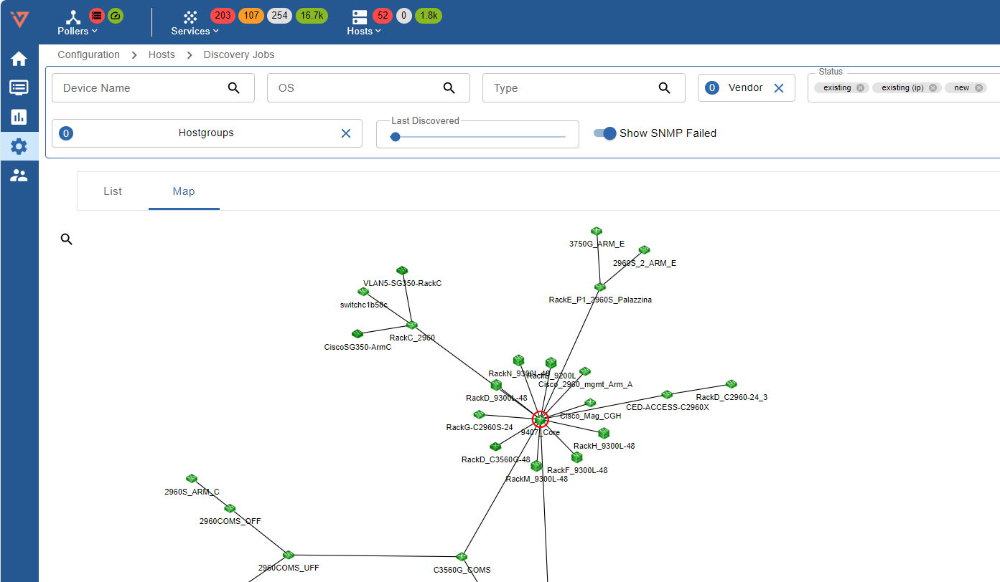
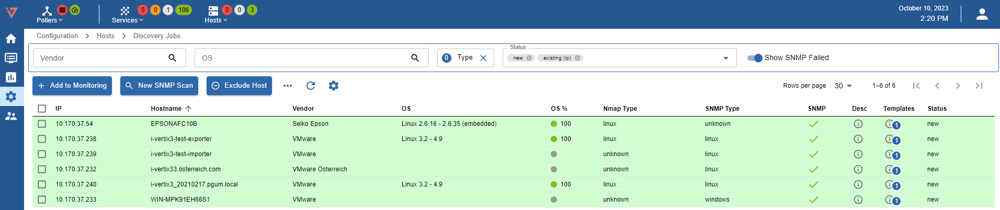
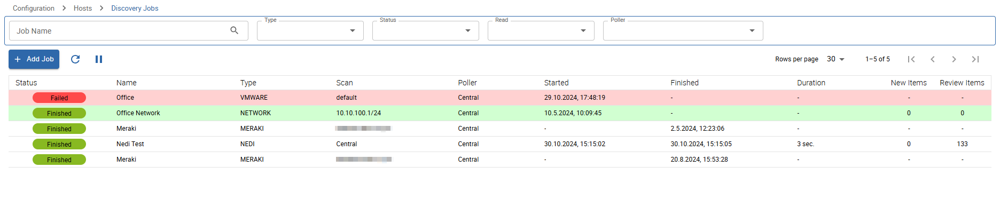
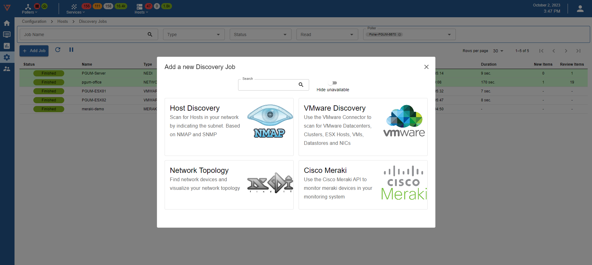
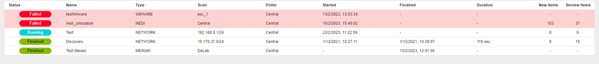

## Overview and fast onboarding

Different types of granular discoveries let the user easily filter/select services and hosts that are to be discovered and monitored.

* **Network Topology Discovery**: Layer 2/3 discovery that creates comprehensive network topology maps.

* **Host/Device Discovery**: scans any network, subnet, or IP address.

* **VMware Discovery**: scans VMware environment (Datacenter, Clusters, Hosts, Datastores, VMs, NICs).

* **Cisco Meraki**: discovers cloud Cisco Meraki infrastructures (APs and Switches)

Discovery results are matched with preconfigured monitoring templates to automate monitoring configuration.

## Quick start configuration

### New Discovery Job

To add a new Discovery Job:

1. Go to **Configuration -> Hosts -> Discovery Jobs**
2. Click on `+ ADD JOB`
3. Select the desired discovery type:

    * **Host Discovery**
    * **Network Topology Discovery**
    * **VMware Discovery**
    * **Meraki Job Wizard**

:::note

It may occurr that the *Host Discovery*, *VMware Discovery* and/or *Cisco Meraki* are grayed out.
Please verify following prerequisites are available for the individual discoveries:

* **Host Discovery:** install the **Linux SNMP** plugin pack from Plugin Store
* **VMware Discovery:** install the **VMware vCenter** and **vSAN** (optional) plugin packs from Plugin Store
* **Cisco Meraki:** download the **Cisco Meraki Cloud Controller** plugin pack from Plugin Store

:::

### Job status

A discovery job is assigned a job status. Following job statuses are available:

* <strong>New</strong>: new discovery job.

* <strong>Running</strong>: the job execution is in progress, and the job can't be modified until it completes.

* <strong>Failed</strong>: job didn't complete correctly.
    To see the reason why it failed, hover the mouse over the <strong>F</strong> button.

* <strong>Finished</strong>: the job completed successfully and its results can be viewed.

