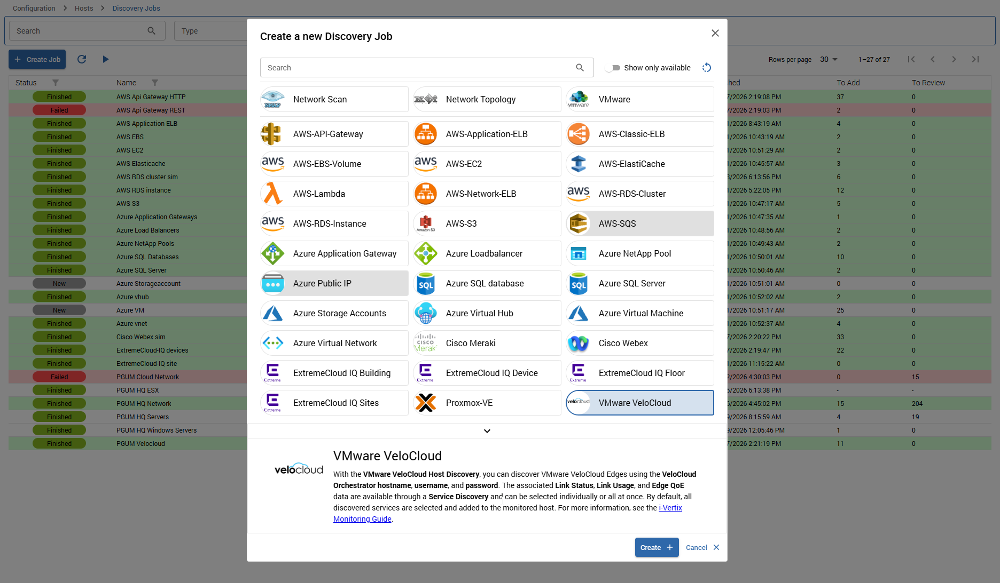
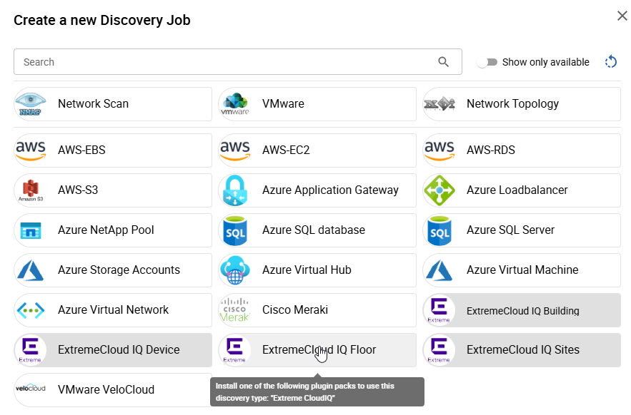
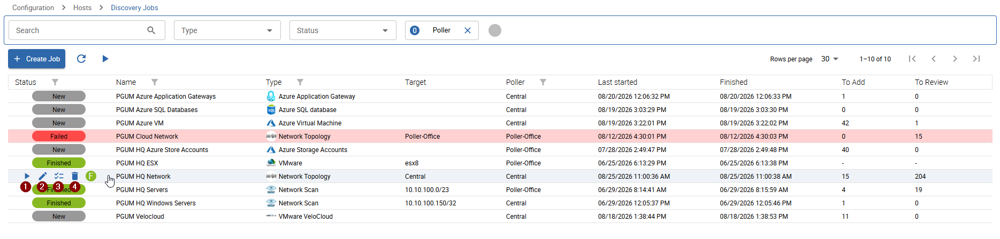

import Breadcrumb from "../../../../src/components/Breadcrumb";
import ImageCounter from "../../../../src/components/ImageCounter";

We offer several discovery types to speed up the process of monitoring new hosts, as well as keeping sure that existing monitored hosts and services are up to date.

Generally speaking, we divide into two main discovery types: [Host Discovery](#host-discovery) & [Service Discovery](#service-discovery)

## Host Discovery

When starting from a new system, this will be one of your first stops when it comes down to onboarding your infrastructure into the monitoring system.
Our host discovery is based on *jobs*, which you are free to create, modify and run at any given time. A *Host discovery job* holds the information, 
what is to be discovered, and how to discover it. Once a job is created, it can be run at any time, and the results will be stored for later review.

At the moment, we support the following discovery types:

#### Network

- **[Network Topology](./nedi.mdx)**: layer 2 & 3 device discovery that creates comprehensive network topology maps
- **[Network Scan](./host-discovery.md)**: scans any network, subnet or IP address for reachable hosts and retrieves basic information such as hostname, open ports and operating system
- **[Cisco Meraki](./meraki-discovery.mdx)**: finds cisco meraki devices of your organization

#### Virtualization

- **[VMware](./vmware-discovery.mdx)**: scans VMware environments for datacenters, clusters, ESX hosts, datastores, VM's and NIC's
    - **[Extended operating system discovery](./vmware-os-discovery.md)**: map operating system related templates to discovered VM's

#### Cloud

- **[AWS](./common-discovery.mdx)**
- **[Azure](./common-discovery.mdx)**
- **[Velocloud](./common-discovery.mdx)**
- **[Extremecloud IQ](./common-discovery.mdx)**

The list of supported discoveries is constantly growing, and we are always looking for new ways to make your life easier.
If you have a discovery type in mind that you would like to see implemented, feel free to reach out to us by submitting a feature request on our helpdesk.

-----

### How it works

Each discovery type has its own configuration options, but the general idea is the same for all of them. You create a discovery job, 
configure it to your needs and run it. The discovery retrieves the results and stores them for later review.

Another common aspect of all discovery types is that every discovery result is matched with preconfigured monitoring templates, 
enabling a consistent and automated monitoring configuration for all discovered hosts.

:::note
In case a template mapping is missing, make sure you have installed the desired plugin packs from the [Plugin Store](../plugin-packs.mdx), 
as they contain not only the monitoring templates, but also the discovery mappings for all discovery types.
:::

Discoveries won't create any new host configuration automatically - you still need to review the results and select which hosts you want to monitor.
This mechanism is in place to avoid monitoring of unnecessary hosts.

### Create discovery jobs

Creating discovery jobs should be easy and straightforward. To create a new job, navigate to <Breadcrumb crumbs={["Configuration", "Hosts", "Discovery Jobs"]} />.
You will find a list of all existing discovery jobs, and you can create a new one by clicking on the `+ Create Job` button.

The opened popup gives you a list of all available discovery types. Select any type you want to create by clicking on the list item.
Selecting an item reveals a brief information about the discovery and its purpose.
You may also find a link to a prerequisite-guideline for the selected discovery type.

To finally create a job, click on the bottom button `Create +` or double-click the list item.
You will be redirected to the dedicated job wizard for the selected discovery type.
To find out more on how to configure each type of discovery job, please refer to the individual [discovery type documentation](#network).

Unavailable discovery types

Any items grayed out are not yet available, due to missing prerequisites.
By hovering over a non available type, the tooltip will give information, which plugin pack needs to be installed to enable the discovery type.

After successfully [installing the required plugin pack](../plugin-packs.mdx), refresh the list using the refresh icon at the top right corner of the popup.
The discovery should now be available for selection.

### Managing discovery jobs

To manage or execute existing discovery jobs, navigate to <Breadcrumb crumbs={["Configuration", "Hosts", "Discovery Jobs"]} />.
You will find a list of all existing discovery jobs, and you can manage each job individually using the action buttons, revelead by hovering over a list row.

- <ImageCounter num={1} /> By clicking the play icon icon you can start a discovery job. Some job types may request additional information when starting a job.
- <ImageCounter num={2} /> By clicking the edit icon you can edit a discovery job. Some job types may not allow modifications while a job is running.
- <ImageCounter num={3} /> By clicking the view icon you can view the results of a discovery job. This is also the default behavior when simply clicking a list row. Some job types may not allow viewing results while a job is running.
- <ImageCounter num={4} /> By clicking the delete icon you can delete a discovery job

Each discovery job has a status, which is displayed in the list. The status indicates whether a job is new, running, finished or failed.
In case a job has failed, you can hover over the status icon to get more information about the error. In case you need further assistance, please contact our support team by submitting a new ticket on our [helpdesk](https://helpdesk.i-vertix.cloud/).

## Service Discovery

We do also have a separate service discovery feature, which allows you to discovery additional services for any existing host.
This feature is especially useful to find and monitor services, which are not created automatically out-of-the-box by the host's monitoring template.

We have a dedicated section in our documentation for the [Service Discovery](./service-discovery.mdx) feature, which explains how to use it and what to expect from it. 
