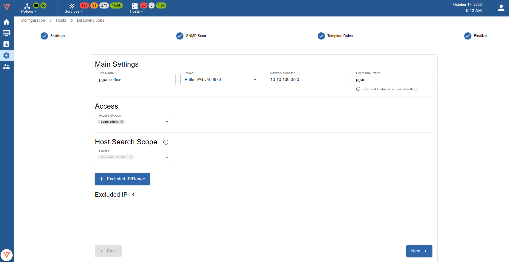
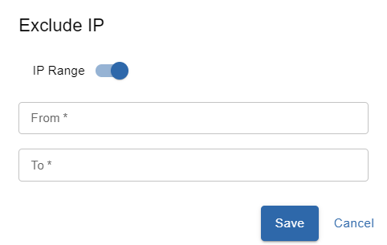
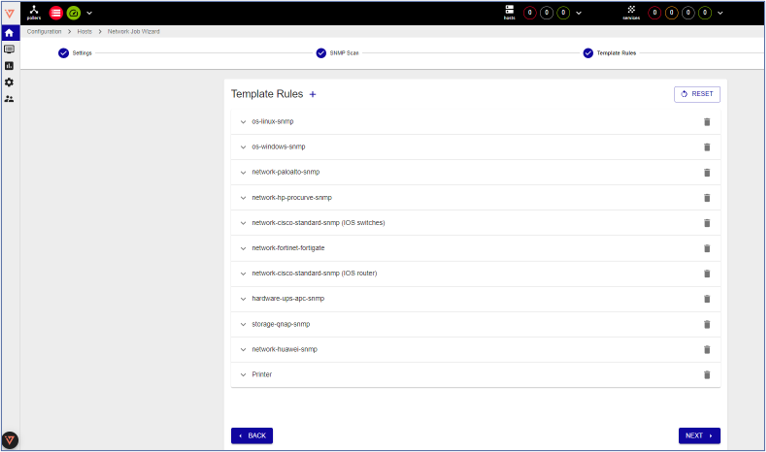
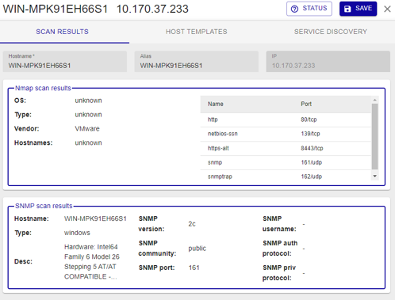
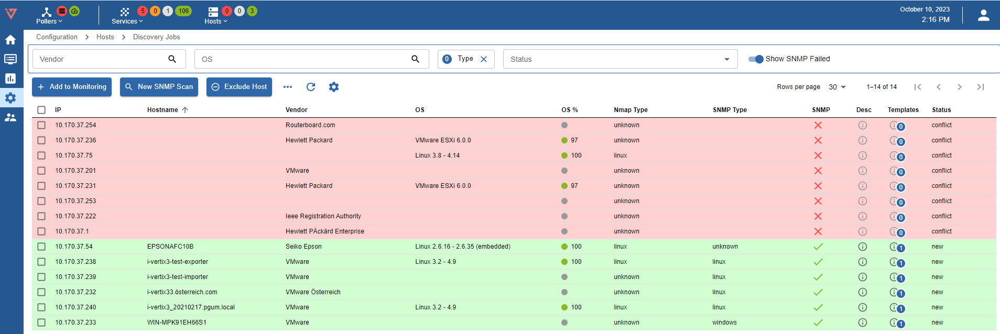

## Job settings

### Main Settings

* Job Name: discovery job name (use a meaningful name)
* Poller: select the Smart Poller that will perform the scan
* Network Subnet: network that has to be scanned/discovered
* Hostname Prefix: (optional prefix, it can be used for example to “tag” discovered hosts)

### Access

**Access Groups**: user group that can view and modify this job and all the hosts it will discover 

To exclude IP addresses from the discovery, select **+ EXCLUDED IP/RANGE** and enter the IP address or IP address range that are not to be scanned, then click **SAVE**

Click **Next** to go to next step.

### SNMP Scan

* Enter the **SNMP communities** that will be used to query the Hosts
* **Supported versions** are: SNMPv1, SNMPv2c, SNMPv3
* The job will use all of the configured communities until it finds a match

### Template Rules

Mapping rules are preconfigured by i-Vertix

**Note**: It can happen that some Template Rules are missing. In such a case:

* **Download the relevant plugin** from the Plugin Store and install it
* Click on **RESET** to add Template Rules included in the plugin you have just installed to the Template Rules list
* Contact <u>support@i-vertix.com</u> if the template rule is still not available

### Finalize
* Save the Job and run the scan (immediately or at a later time)

## Viewing the results of a discovery job

Normally, a /24 subnet is scanned in 120 seconds or less. Once the scan completes, the results are shown. They depend on hosts reachability, template rules mapping, SNMP reachability and status filters that have been applied (Note: “new” and “existing (ip)” are applied by default).

Available filters are: **Vendor**, **OS**, **Type** and **Status**.

If Show **SNMP Failed is selected, the system will show all the devices on which SNMP requests have failed.

**Status** filters are:

* **new**: hosts are highlighted in green. SNMP connection was established and the proper templates were assigned to the hosts. To start monitoring new hosts, select them and click on **ADD TO MONITORING**.
* **existing (ip)**: an host with the **same IP address** had already been detected. The host is likely already being monitored.
* **existing**: an host with the **same IP address and hostname** had already been detected. The host is likely already being monitored.
* **conflict**: an host with the **same hostname** had already been detected, or **the host doesn’t have any hostname**. To resolve the conflict, hostname has to be entered or modified.
excluded: the host was excluded from the discovery (**EXCLUDED HOST**).
* **no template assigned**: the host didn’t match any templates. Amend the discovery job and assign a new template rule, or add the host manually.

Depending on host type, the discovery scan can provide different information:

* **IP**: Host IP Address
* **Hostname**: Host name
* **Vendor**: Host brand/manufacturer
* **OS**: Host Operating System
* **OS%**: Percentage match between detected OS and template rules
* **Nmap Type**: device type assigned to the host by Nmap
* **SNMP type**: Device SNMP Type
* **SNMP**: 
     * X SNMP request failed, 
     * ✓ SNMP request succeeded
* **Desc**: Host description
* **Templates**: Template assigned to the Host
* **Status**: Host status

To see host details, click on it:

**Scan results**: this section reports information coming from Nmap and SNMP scans. If the host is not yet being monitored, the Hostname field can be amended.

**Host templates**: Host template associated with the host as per Template Rules match. To replace it or add another/others, click on **+ HOST TEMPLATE**.

**Service discovery**: this section is available if job discovery template rules are configured so that to detect additional services (in addition to the default ones). For example, when the system discovers a Windows host, it automatically starts monitoring Disk “C:”. This tab shows additional Disks that were detected so you can select the ones you want to monitor.

To save changes, click on Save

## How to monitor Hosts

Select the Hosts you want to monitor and click on + ADD TO MONITORING.

:::note

As previously stated, any changes will take effect only once they are **exported to the Smart Poller(s)**.

:::

