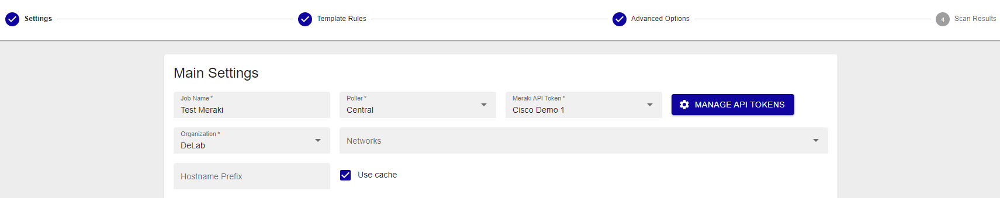
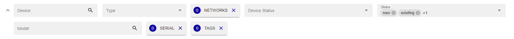
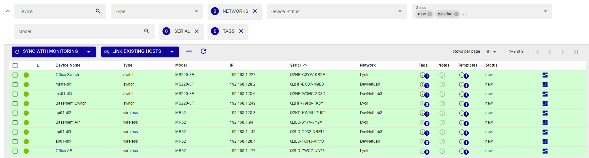
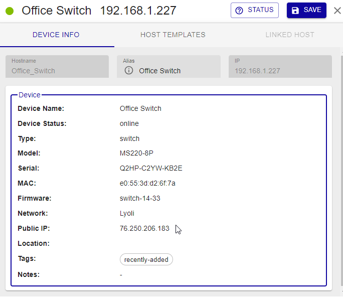
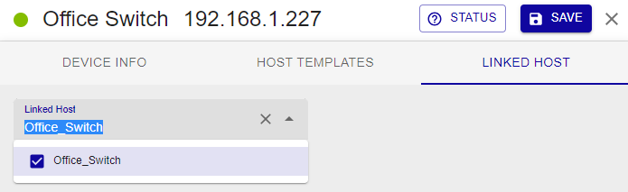
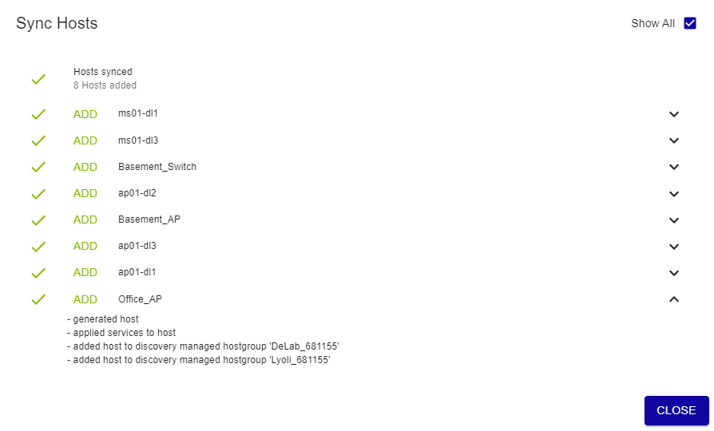

import ImageCounter from "../../../../src/components/ImageCounter";
import Breadcrumb from "../../../../src/components/Breadcrumb";

Install the Cisco Meraki Cloud Controller plugin from the Plugin Store : <Breadcrumb crumbs={["Administration", "Stores", "Plugin Store"]} />

### Main settings

Add new job and select Cisco Meraki from this path: <Breadcrumb crumbs={["Configuration", "Hosts", "Discovery Jobs"]} />

* **Job Name**: use a meaningful name
* **Poller**: select the Smart Poller that will run the scan
* **Meraki API Token**: add Meraki Token API
  * Several tokens can be stored
  * The authentication token is provided directly by the Meraki console

    

* **Organization**: Select the Organization
* **Networks**: Select the Network (optional)
* **Hostname Prefix**: string of characters that provides information about the device (optional)
* Select **Use cache** if you have a large number of devices and API requests are high (optional)

### Access

**Access Groups**: user group that can view and modify this job and all the hosts it will discover

### Excluded Object

List of hosts excluded from the discovery  

Click on **Next** to move to the next configuration settings page

### Template Rules

Mapping rules are preconfigured by i-Vertix

:::note

It can happen that some **Template Rules** are missing. In such a case:

* **Download the relevant plugin** from the Plugin Store and install it
* Click on **RESET** to add Template Rules included in the plugin you have just installed to the Template Rules list
* Contact support@i-vertix.com if the template rule is still not available

:::

### Advanced Options

* Devices with coordinates can be placed on i-Vertix Maps, create a [geo map](../../i-vertix-maps/map-types.md) before running the discovery
* Devices can be assigned to custom hostgroups, Network or Organization hostgroups

### Scan Results

Once the scan completes, its **results are displayed**.

They depend on hosts reachability, template rules mapping, API reachability and status filters that have been applied (Note: “new” and “existing (ip)” are applied by default).

Different filters are available: **Device, Type, Networks, Device Status, Status, Model, Serial, Tags**.

**Device status** filters are:

* Online
* Offline
* Alerting
* Dormant

**Status** filters are:

* **new**: hosts are highlighted in green. Connection was established and the proper templates were assigned to the hosts. To start monitoring new hosts, select them and click on **ADD TO MONITORING**.
* **existing (ip)**: an host with the **same IP address** had already been detected. The host is likely already being monitored.
* **existing**: an host with the **same IP address and hostname** had already been detected. The host is likely already being monitored.
* **conflict**: an host with the **same hostname** had already been detected, or **the host doesn't have any hostname**. To resolve the conflict, hostname has to be entered or modified.
* **excluded**: the host was excluded from the discovery (**EXCLUDED HOST**).
* **no template assigned**: the host didn’t match any templates. Amend the discovery job and assign a new template rule, or add the host manually.

The result tab displays the hosts that were detected by the discovery, along with the following information:

* **Device name**
* **Type**: Host/device type
* **Model**: Host/device model
* **IP**: Host IP Address
* **Serial**: serial number
* **Network**: the network on which the host is located
* **Templates**: Template(s) assigned to the Host  
* **Status**: Host status

To see Host details, click on it

### Device info

* Hostname: it can be changed if the host is not yet being  monitored
* Alias: optional description, it can always be changed
* IP: Host IP Address

### Device

* Device Name
* Device Status: status can be online, offline, alerting, dormant
* Type: Device type
* Model: Device model
* Serial: Device serial number
* MAC: Host mac address
* Firmware: Firmware version
* Network: the network on which the host is located
* Public IP
* Location: device location
* Tags
* Notes: description field

### host templates

* **Templates from rules**

Host template associated with the host as per Template Rules match. To replace it or add another/others, click on **+ HOST TEMPLATE**

### Linked host

Link to Host is only available for device in state existing or existing ip.

## How to monitor Hosts

Select the hosts you want to monitor and click on **SYNC WITH MONITORING**.

:::note

As previously stated, any changes will take effect only once they are exported to the **Smart Poller(s)**.

:::

## Meraki Dashboard

Once the Discovery process is complete, you can view detailed information about the wireless devices through
the [Cisco Meraki Dashboard](../../i-vertix-reporting/dashboard-meraki.md).
