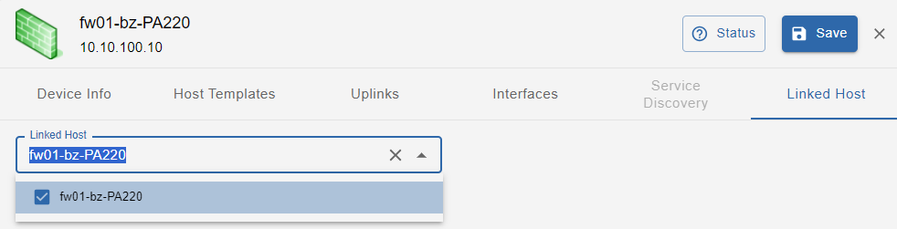

import ImageCounter from "../../../../src/components/ImageCounter";
import Breadcrumb from "../../../../src/components/Breadcrumb";

## Concepts and prerequisites

i-Vertix Network Topology Discovery can collect and interpret information produced by layer 2 network protocols such as LLDP
(Link Layer Discovery Protocol), CDP (Cisco Discovery Protocol) and other standard and proprietary ones,
to automatically detect which devices are in the network and how they are interconnected to each other
(port-to-port connectivity among devices and their neighbors).

As a result, i-Vertix IT Monitoring can automatically configure monitoring dependencies and draw accurate network topology maps.

In order to run such discoveries, devices have to be properly configured in terms of L2 network discovery protocols
(and SNMP, as i-Vertix uses it to collect network topology information).

If these prerequisites are not satisfied, the i-Vertix Network Topology Discovery will still detect network devices,
but port-to-port connectivity information won't be detected and therefore the network map won't be much expressive.

## Job settings

### Main settings

* **Job Name**: use a meaningful name
* **Hostname Prefix**: optional hostname prefix for hosts created by the discovery (it can be used for example to “tag” discovered hosts)
* **Nedi Configuration**: select an already existing configuration from the dropdown menu; to create a new configuration, click on the `Add Configuration` button 

### Add a new Nedi Configuration

A *Nedi Configuration* holds the configuration to run the network device discovery.

Select the Poller, from which the discovery should be executed.

#### SNMP Infos

Select or create all necessary SNMP credentials which can be used to access the devices in your network.

#### Filters

You can filter network devices by IP adresses and names. You can also specify, when the discovery should stop.

##### Net Filter

Click `Add Net Filter` to add a new *regular expression*. All separate entries are combined with *OR*.

> **Example**:
> `^(?!192\.168\.1\.).*$`
>
> discover anything except devices with ip addresses of this network: 192.168.1.x

##### Name Filter

Click `Add Name Filter` to enter a new *regular expression*. All separate entries are combined with *OR*.

##### Border

Click `Add Border` to enter a new *regular expression*. All separate entries are combined with *OR*.

Specify patterns to match names of devices where the discovery should stop.
When a device name matches the provided border patterns, the discovery does not proceed with the device's neighbours.

##### Cron Jobs

Click `Add Cron Job` to add a new cron job, which starts the discovery on the provided cron interval with provided command options.
You can also modify, enable or disable already defined cron jobs.

The default scan interval for a network discovery is is every 4 hours.

##### Advanced

You can specify, after how many days:

* no longer discovered nodes are deleted
* inactive links are deleted
* arp entries are deleted

---

After you have entered all information, you can `Save` the new *Nedi Configuration*.

### Access

**Access Groups**: user group that can view and modify this job and all the hosts it will discover

### Excluded Object

List of hosts excluded from the discovery  

Click on **Next** to move to the next configuration settings page

### Template Rules

Template rules are used to map found network devices to monitoring hosts.
A template rule consists of conditions which are checked against a found device.
When all conditions of a rule match a device, the template rule with it's host template,
interface mapping and service discovery configuration will be assigned to the device.

Some template rules are already preconfigured and maintained by the i-Vertix team.
They come along with the plugins installed from the [Plugin Store](../../monitoring-resources/plugin-packs).

:::note

It can happen that some **Template Rules** are missing. In such a case:

1. **Download the relevant plugin** from the [Plugin Store](../../monitoring-resources/plugin-packs) and install it
2. Click on <ImageCounter num={1} /> **Load Defaults** to add Template Rules included in the plugin you have just installed to the Template Rule list

Should the desired template rule still not be available, contact support@i-vertix.com.

:::

To synchronize the default job's template rules with the latest available version click on <ImageCounter num={1} disableMargin /> **Load Defaults**.

It is also possible to <ImageCounter num={2} disableMargin /> create new custom template rules, <ImageCounter num={4} disableMargin /> delete or to <ImageCounter num={5} disableMargin /> modify existing ones.
When a default tempalte rule is modified it will not be reset when <ImageCounter num={1} disableMargin /> reloading the default rules.
To reset a modified default template rule to match it's default configuration again, click the <ImageCounter num={3} disableMargin /> individual reset button.

### Entry Points

Configure IP addresses, IP ranges or whole subnets (CIDR notation), from which the discovery will start.

You can <ImageCounter num={1} /> add them manually, or you can <ImageCounter num={2} /> import them from an Excel or CSV file.
When opening the button menu, you can <ImageCounter num={3} /> download a template-sheet.

### Finalize

Configure the default *Sync Profiles*, which are used on a manual and automatic synchronization of discovered devices.

*Sync Profiles* define, which information is written or updated on monitored hosts.

:::info Define Default Profiles

As an admin, you can define the default *Sync Profiles* in <Breadcrumb crumbs={["Administration", "Discovery", "Host Discovery"]} /> on the `Nedi` tab.

:::

#### Manual Sync

You can always temporarily modify the current *Sync Profile* when manually syncing discovery results on the result page.
The selected profile *Manual-Sync Profile* is pre-selected by default when syncing manually. 

#### Automatic Sync

The discovery automatically syncs all results **after every scan** with the selected *Automatic-Sync Profile*.

#### Customize Profiles

You can customize both manual and automatic *Sync Profiles* if the default profiles do not satisfy your requirements.

#### Start the job directly after saving

You can enable the discovery to start directly after saving the job configuration. First you need to select an *Entry Point* which was configured on the previous tab and the *Scan Mode*.

:::info Define Scan Modes

As an admin, you can define the default *Scan Modes* in <Breadcrumb crumbs={["Administration", "Discovery", "Host Discovery"]} /> on the `Nedi` tab.

:::

Following modes are defined by default:

- **Fast**: only discover network devices (skips nodes)
- **Deep**: complete discovery including nodes

---

Click on `Save` to save the discovery job.

## Viewing the results of a discovery job

After the discovery job completes, you can open the job results from the job list by clicking on the job.

### Discovered Devices

#### Page navigation

The result page is divided into following tabs:

* <ImageCounter num={1} /> List (discovered devices)
* <ImageCounter num={2} /> Map (network topology)
* <ImageCounter num={3} /> Nodes (discovered nodes)
* <ImageCounter num={4} /> Summary

#### <ImageCounter num={5} /> Device filters 

You can filter discovered devices by:

* Device Name
* OS
* Type
* Vendor
* Status (discovery status)
* Hostgroups
* Last Discovered (useful to hide outdated devices which are no longer found by the discovery)
* SNMP status (when selected, devices *without* SNMP access are also displayed)

##### Status (discovery status)

Every discovered device is assigned to a discovery status. The status indicates the compatibility with the current monitoring configuration.

Possible statuses:

* **new**: highlighted in green - SNMP connection established, host templates assigned, probably not already existing in the current monitoring configuration
* **existing (ip)**: highlighted in red - a host in the current monitoring configuration was found with the **same IP address**, the host is likely already being monitored
* **existing**: highlighted in green - the device is already linked to a host and thus is already being monitored
* **conflict**: highlighted in red - a host with the **same hostname** already exists in the current monitoring configruation or the device does not have any hostname, resolve by modify the device's hostname
* **excluded**: the device was excluded manually, if you want to add the device to the monitoring you have to include it manually
* **no template assigned**: highlighted in red - the device did not receive any host templates by the rule engine, check and modify the job's template rules if needed

The highligt color indicates whether a device can be synced to the monitoring configuration or not.

#### Actions

* <ImageCounter num={7} /> <strong>Sync with Monitoring</strong>: sync all or sync selected devices to the monitoring configuration
  
  for devices with status *new*, a new host will be created - for devices with status *existing*, the linked host will be updated accordingly 

  *to sync all devices, expand the button options by clicking on the <ImageCounter num={8} /> arrow*

  *to switch or view the currently selected Sync Profile, click on the <ImageCounter num={6} /> profile icon*
  

  *You can also temporarily customize the **Custom** Profile for the current session:*
  

* <ImageCounter num={9} /> <strong>Link existing Hosts</strong>: link all or link selected devices with already existing hosts

  only effective for devices with status *existing (ip)* and/or status *conflict (name)*

  *to link all devices, expand the button options by clicking on the <ImageCounter num={10} /> arrow*

* <ImageCounter num={11} /> <strong>Other actions</strong>

  * **Exclude devices**: exclude selected devices
  * **Include devices**: include selected devices
  * **Set Relation Root**: marks selected devices as "Relation Root"
  * **Remove Relation Root**: removes "Relation Root" from selected devices
  * **Delete Proposals**: useful, when a device is outdated or not in sync with the current job configuration (template rules etc.)

* <ImageCounter num={12} /> <strong>Refresh</strong>: manually refresh the device list

* <ImageCounter num={13} /> <strong>Configuration Links</strong>: open the job or nedi configuration page

* <ImageCounter num={14} /> <strong>Regenerate Proposals</strong>: re-applies template rules to all devices, useful after changing template rules or including devices

#### <ImageCounter num={16} /> Device List

The discovered devices are filtered by the above filters and displayed in the table with following information:

* **Link**: displays host candidates, which can be linked to the device
* **Device**: discovered device name
* **Stack**: determines if the device is part of a device stack (when the stack consists of +2 devices, the number is displayed)
* **IP**: device ip address
* **Vendor**: device brand/manufacturer
* **OS**: device operating system
* **Type**: device model/type
* **First Discovered**: first time the device was discovered
* **Last Discovered**: last time the device was discovered
* **SNMP**: determines if the discovery was able to access the device using SNMP
* **Templates**: clickable - shows the assigned host templates
* **Root**: determines if the device was flagged as "Relation Root", thus as a starting point from which the parent/child relations are calculated from  
* **Status**: [discovery status](./nedi#status-discovery-status)

#### Monitor Devices

Select the devices you want to monitor and click on **Sync with Monitoring**.
The devices should now be present as dedicated host's in your monitoring configuration.

:::note

Don't forget to export the poller's configuration after you have synced the devices.

:::

### Device Detail

To view detailed device information, click on the device in the list.

#### Device info

**Host information**:

* **Hostname**: can be changed as long as the host is not yet existing
* **Alias**: additional host name, can always be changed
* **IP**: host ip address, can not be changed

**Discovered device information**:

* Device Name
* Type (device model)
* Vendor (device brand/manufacturer)
* Serial (device serial number)
* OS (installed operating system)
* Image (installed firmware version)
* Stack (x or ✓, indicates if the device is part of a stack or not)
* Location (device location, information was gathered using SNMP)
* First Discovery (first time the device was discovered)
* Last Discovery (last time the device was discovered)
* Sysobject (used by the discovery to gather the device information by SNMP, can be copied by clicking on it)
* Description (additional device description)

**SNMP information**:

* SNMP version
* SNMP community *(only for SNMP v1 & v2)*
* SNMP username *(only for SNMP v3)*
* SNMP auth protocol *(only for SNMP v3)*
* SNMP priv protocol *(only for SNMP v3)*

#### Host Templates

On this tab you can see all templates which will be assigned to the host.
The shown templates were assigned by the rule engine because a [template rule](./nedi.mdx#template-rules) matched with the device's information.

:::note

**When the device is not monitored yet** *(status new)* **you can**:

* manually assign a host template to the device , which will also be added to the created host
* edit the template macros

**When the device is already monitored** *(status existing)* **you can**:

* view the already assigned host templates under **Templates on linked host**

:::

#### Uplinks

This tab shows device uplinks, that are device Interfaces linked/connected to neighbour network devices

In this section the available filters are: Name, Type, Neighbour. All the **uplinks** with status = **new** are selected by default.

Uplinks can be:

* **new**: newly discovered uplink
* **del**: uplink deselected (and therefore not being monitored)
* **m**: manually modified by the user

Uplinks have the following attributes:

* **Name**: uplink interface name
* **Type**: protocol used to identify host connectivity and to  map it
* **Neighbours**: devices directly connected to the host, and their connecting interface  

#### Interfaces

**<u>This tab shows all device Interfaces: both uplinks and interfaces not linked/connected to neighbour network devices</u>**

In this section available filters are: **Name & Alias, Type, Duplex, Status**. Interface status is represented by a colored dot and can be **Active, Inactive, Disabled and Unknow**.
All the interfaces that are uplinks and have status = **new** are selected by default, unless they were deselected in the UPLINKS tab. Interfaces can be:

* **new**: newly discovered interface
* **del**: interface deselected (and therefore not monitored)
* **m**: manually modified by the user

**Interfaces** have the following attributes:

* **Name**: interface name
* **Alias**: host alias (Note: this is not the Interface alias)
* **Desc**: interface description
* **PVID**: port VLAN ID
* **Speed**: interface speed
* **Duplex**: FD, HD or Unknow
* **Type**: Ethernet, Virtual Interface, Other
* **Status**: represented by the color-coded dot

#### Nodes

On this tab you can see all discovered nodes that are connected to the device.

Following information is displayed:

* **Icon**: Manufacturer Icon
* **MAC**: Node MAC address
* **Vendor**: Manufacturer
* **IP**: discovered ip address - can be set manually if not discovered
* **Discovered**: timestamps when the node was first and last discovered
* **Interface**: device's interface & vlan to which the node is connected to, the timestamp represents the last time the interface was changed
* **Shadow IT status**: current shadow IT status for this node - can be changed from the [Nodes tab](./nedi#nodes)
* **ARP**: clickable - displays discovered ARP information such as ip address, name, the device from which the node was routed and more 

The list can also be filtered using the above filters: **MAC or Name**, **Vendor** and **IP**-address.

Following actions can be performed on this list:

* set an ip address for a node, where the address was not resolved
* link nodes to already monitored hosts by clicking on the link icon on the node row
* link multiple nodes to already monitored hosts by selecting the desired nodes in the list and click the *Link to host* button near the filters

:::note

The ip address and the designated poller is used to find possible host candidates to link a node to.

:::

#### Service discovery

Template Rules are used to associate templates with hosts. They can also associate additional services, detected during the scan/discovery, with the Hosts. New services are shown with status = **new**. Manual changes are applicable.

**Note**: SERVICE DISCOVERY tab is available if job discovery template rules are configured so that to detect additional services (in addition to the default ones).

#### Linked host

This section is enabled only when the network device  discovered by “Network Discovery“ is synchronized with “IT Monitoring” so that the device itself becomes a monitored Host.

### Network Topology Map

The network topology map is designed to give you a graphical overview of your network devices and how the devices are connected to each other.

The <ImageCounter num={2} /> items on the map are filtered by the <ImageCounter num={1} /> [device list filters](./nedi#-device-filters). 

Possible actions on the map:

* <ImageCounter num={3} /> <strong>Search devices and nodes</strong>
* <ImageCounter num={4} /> <strong>Hide/Show nodes</strong>
* <ImageCounter num={5} /> <strong>Refresh the map content</strong>
* View the detail of a map item by clicking on it

#### Detail and the Relation Root status

Using the map you get a better understanding of who the core devices in your network are.

If you want to apply these relations also to your monitoring configuration, it is necessary to assign a device the status *Relation Root*.
To assign such status, you need to open the map detail of the device by clicking on <ImageCounter num={1} /> the device's icon.

The device information is displayed in the top right corner of the map, as well as the possibility to <ImageCounter num={2} /> open the sidebar to edit the
device, <ImageCounter num={3} /> set/remove the **Relation Root** status and <ImageCounter num={4} /> highlight the first device node.

:::info

The *Relation Root* status of a device is telling the discovery,
which device is used as a starting point to calculate the parent/child
relations for all other connected devices.

:::

Knowing that, and from the monitoring point of view, it is best practice to assign **Relation Root** to the network device,
which connects the relevant i-Vertix Poller to the rest of the network.
By doing so, the parent/child relations will be calculated starting from this device as the main parent of the network.
Obviously from a logical point of view, this seems wrong, normally the core/main switch/router should be the root of all relations.
But as already mentioned, from the monitoring point of view it is recommended, that the nearest network device gets the **Relation Root** status.
You can also assign the status to two different network devices.

:::tip

Assign the **Relation Root** status to the network devices, which directly connect the i-Vertix Poller to the rest of the network.

It is also possible to assign the **Relation root** status to more than one device.

:::

After a device is assigned the relation root status, the device will be circled red on the map.

You can verify the **Relation Root** status also from the [network device list](./nedi#-device-list).

### Discovered Nodes & Shadow IT

#### <ImageCounter num={1} /> Node filters 

You can filter discovered nodes by:

* Node Name & MAC address
* IP address
* Vendor
* Last Discovered (useful to hide outdated devices which are no longer found by the discovery)
* IP changes (how often the IP was changed, useful to detect flapping devices/devices using DHCP)
* [Shadow IT Status](#shadow-it)
* Only where IP available (when selected, nodes *without* an ip address are not displayed)

#### Actions

* <ImageCounter num={2} /> <strong>Link existing Hosts</strong>: link all or link selected nodes to already monitored hosts
  
  linkable host candidates are searched by the current job search scope (poller) and the node ip address, 
  if more than one candidate is available the node will not be linked automatically and requires manual intervention

* <ImageCounter num={3} /> <strong>Change Shadow IT Status</strong>: change the [shadow IT status](#shadow-it) of selected nodes
* <ImageCounter num={4} /> show/hide additional columns

#### <ImageCounter num={5} /> Node List

The discovered nodes are filtered by the above filters and displayed in the table with following information:

* **Link**: displays host candidates, which can be linked to the node
* **Vendor**: hardware brand/manufacturer
* **Hostname**: discovered node name
* **IP**: node ip address
* **Connected to**: the network device, to which the node is connected to
* **MAC**: mac address
* **First Discovered**: first time the node was discovered
* **Last Discovered**: last time the node was discovered
* **M**: direct link to the network topology map

Following additional columns can be displayed on the list:

* **IP changes**: determines, how often the ip of the node was changed
* **IP last update**: last time the ip was changed
* **Routed by**: the network device/router, which routes the node
* **Note**: custom note, set by the user
* **Shadow IT**: shadow IT status, set by the user, can be directly modified when hovering over the status

#### Shadow IT

By default, every node is assigned a *Shadow IT Status*.
This status helps you to categorize any device in your network. You can also assign a custom *Note* to any device found.
Using the provided tools, you can achieve:

- better transparency of your network
- early detection of potential security risks
- a more effective vulnerability management
- a more efficient resource allocation
- increased agility to changes or new requirements of your network

:::tip

You can change the status of a node manually by
hovering over the node's status and click on the edit icon or change it by selecting the node fomr the list
and click the *Change Shadow IT Status* button at the top.

:::

By default, 4 different shadow IT statuses are configured:

* to verify (default)
* approved
* potential risk
* dangerous

:::info

To change the pre-configured statuses or add new ones, visit the *Nedi Administration* page under <Breadcrumb crumbs={["Administration", "Discovery", "Nedi"]} />.

:::

### Discoverey Summary

When accessing the Summary tab, you get a summarized overview of your discovered network.

Following information is available:

#### Regarding devices:

* **Devices found**
* **New devices found** in the last 24 hours
* **Found devices by status**
* **Most present device vendors**
* **Most present device types**
* **Most assigned host templates**
* **Devices with most connected nodes**
* **Devices with most uplinks**

#### Regarding nodes:

* **Nodes found**
* **New nodes found** in the last 24 hours
* **Found nodes with ip addresses**
* **Monitored nodes**
* **Categorized nodes** (Shadow IT Status)
* **Most present node vendors**

It is possible to show more items by changing the <ImageCounter num={1} /> slider value.
