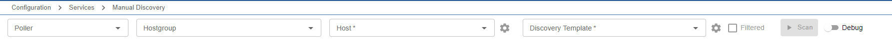
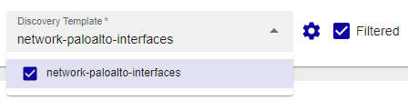
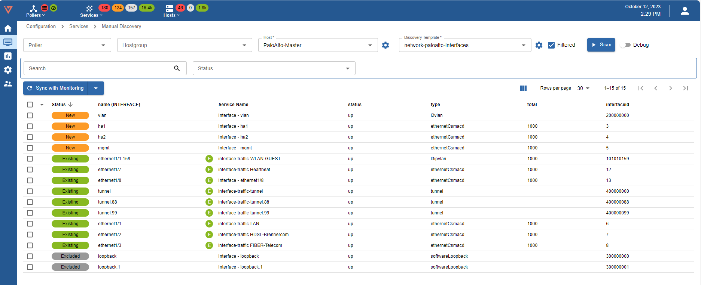
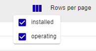
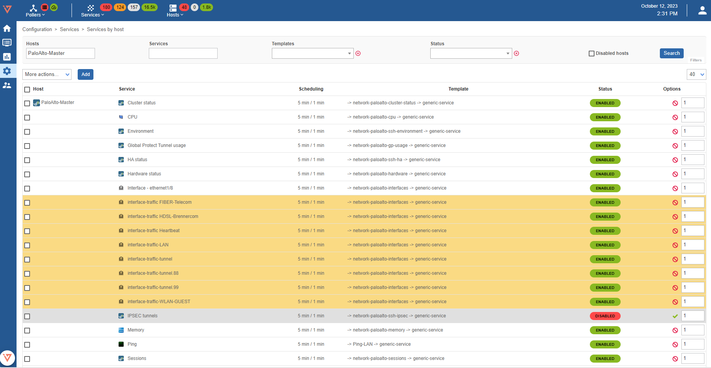
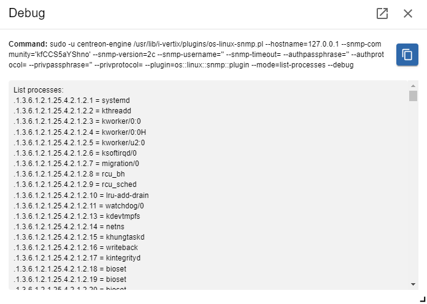
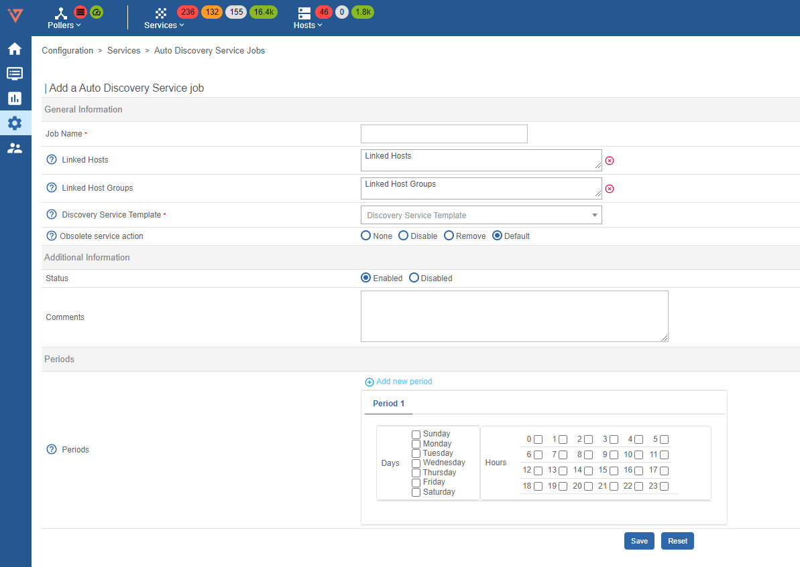
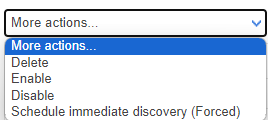

## Manual Discovery

From the sidemenu, select **Configuration > Services > Manual Discovery** to enter the manual discovery dedicated page.

To simply start a service discovery scan, select a host and a discovery template (which are installed by our [Plugin Store](../../quick-start-guide/how-to-configure-central-and-poller/plugin-update-installation.md)). You can pre-filter hosts by selecting a poller and/or a hostgroup.

By enabling the **Filtered** flag next to the discovery template lookup, only relevant discovery templates depending on your selected host are available to select. Otherwise all installed discovery templates are selectable.

Filtered **checked**:

Filtered **not checked**:

### Discovered services

After hitting **Scan**, the scan results are shown below.

:::note

During scanning, the SCAN button is replaced by the ABORT button, which can be pressed to cancel the scan.

:::

A scan result (service) always has a status, which indicates it's current monitoring configuration situation (*1st* column), a key value (*2nd* column), a generated service name (*3rd* column, defined by the discovery template) and other values reported by the scan.

#### Status

The status of a result indicates it's current monitoring situation:

- **new**: indicates that the service is not yet monitored and is ready to be synced (created)
- **excluded**: indicates that the service was excluded by the discovery template. This is most likely a default configuration set by our team to prevent syncing of unnecessary services.
- **existing**: indicates that the service is already present in your monitoring configuration for the given host

#### Filters

Results (services) can be filtered using the **Search** and the **Status** filters.

- **Search**: filters results by service name and all other available values given by the scan
- **Status**: filters results by their monitoring-based status

#### Toggle columns

You can show and hide all non-relevant columns using following control:

### Syncing services

#### Sync selected

Check any services you want to add to your monitoring configuration and hit **Sync with Monitoring**. All checked services are created shortly after. If you encounter a problem with any service you can expand the sync-results and identify the problem.

#### Sync all

By clicking on the expand button on the right of **Sync with Monitoring** you can choose between **Sync selected services** or **Sync all services**. The first one is the default option and equal to clicking the **Sync with Monitoring** button.
By choosing **Sync all services**, ***all*** services are created (also services with status *excluded*). Again in any case of failure, you can analyze the problem of a given service by expanding the sync-results.

To see created services, head over to **Configuration -> Services -> Services by host** using the sidemenu.

To find your services you just created it's best practice to use the page's **filters**.
Insert the **hostname** in the **Hosts** filter and choose the **service template** using the **Template** lookup.

### Troubleshooting

It is possible to easily activate the **debug** mode of our service discovery by enabling the **debug switch** right next to the **scan button**.

After enabling debug click again on scan. A moveable popup will open which displays the executed command as well as the command result.

Using the debug information you can **analyze** and **identify problems** of a failed scan.

By clicking the button next to close in the top right corner of the debug popup, the inbuilt popup will close and a new browser window will open with the debug information. This may be useful for your workflow if you need to deeper analyze various scans and different scan-configurations.

## Auto Discovery Service Job

### Overview

An auto discovery service job allows to automatically identify possible services and add them to your monitoring configuration in a flexible way.

To create such jobs, go to **Configuration > Services > Auto Discovery Service Jobs** using the sidemenu and click on the **Add** button.

### Create Job

#### General information

- **Job name**: descriptive name to identify job
- **Linked Hosts**: target hosts on which the discovery should be performed
- **Linked Host Groups**: target host groups on whose contained hosts the discovery should be performed
- **Discovery Service Template**: the discovery template (discovery configuration) used for the scan. In general, it defines the command which is executed, the service name and relevant service macros
- **Obsolete service action**: defines the action to be carried out when a configured service is no longer available in the scan results. Choosing *Default* uses the global discovery settings.

#### Additional information

- **Status**: enable or disable job
- **Comments**: notes to further describe job

#### Periods

- **Periods**: set days and hours for the Auto Discovery. Leave days and hour empty to use Auto Discovery Defaults. Press Add new period to schedule the execution of jobs over several time periods.

> Click **Save** to add the job

### Job Execution

Jobs run automatically, depending on their configured schedule.

It is also possible to force an immediate job execution by selecting one or more the desired jobs and choosing **Schedule immediate discovery (Forced)** from the **More Actions** drop down of the **Auto Discovery Service Jobs List**
