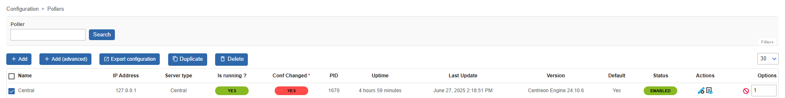
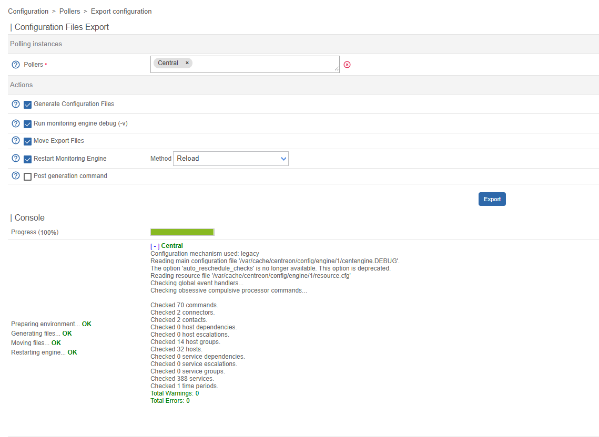
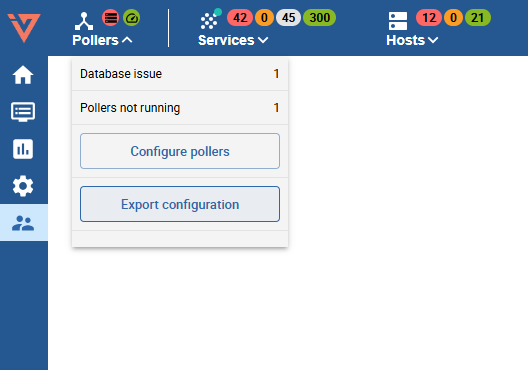

import Breadcrumb from "../../../src/components/Breadcrumb";

This step is essential to apply the configuration and therefore to monitor Hosts and Services. It has to be performed after the Discovery jobs/scans (Host Discovery, Network Topology Discovery, VMware Discovery, Cisco Meraki Discovery).

To export a poller's configuration, navigate to <Breadcrumb crumbs={["Configuration", "Pollers"]} />.

This list shows all accessible configured pollers, and for our case most noticeable the `Conf Changed` indicator.
When showing `Yes` it means that some monitoring configuration (regarding hosts or services) listed on this poller was changed and the changes are not yet effective.

To export one or more configurations, follow these easy steps:

1. Select the *Poller* of which you want to export the configuration
2. Click the `Export configuration` button above the list
2. Check following *Actions*:
    
    - `Generate Configuration Files` - creates the monitoring engine configuration files locally
    - `Run monitoring engine debug (-v)` - shows detailed information what is happening during export
    - `Move Export Files` - moves the local monitoring engine configuration files to the designated poller
    - `Restart Monitoring Engine` with Method `Reload` - this reloads the engine to consume the new configuration files

4. Click on `Export`

The below progress indicator and result notifies you on any possible problem which occurred during the export. If no problems are present and all steps are considered *OK*,
the monitoring configuration is now active for the selected pollers.

---

There is also a shorthand approach to export the monitoring configuration on all accessible pollers.
Administrators and users with the [appropriate rights](#activate-quick-export) can activate a quick export button located in the page header,
that allows them to export the configurations of *ALL* pollers at once.

:::warning

Do *NOT* use this feature if you have a large number of *Pollers*.

This feature is also not suitable for MSP systems while being logged in as an administrator.

:::

#### Activate Quick-Export

To make this feature available to a **non-administrator** user, make sure they have the [**Deploy Configuration**](../managing-users-contacts/acl.md#poller-configuration-actions--poller-management) permission and the [**Display Top Counter Pollers Statistics**](../managing-users-contacts/acl.md#global-functionalities-access) permission.
