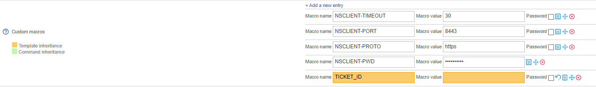
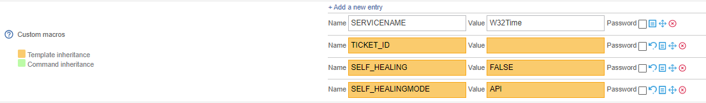

A macro is a variable that is used to retrieve specific values.

A macro always starts and ends with the ```"$"``` character.

## Standard macros

Standard macros are macros that are predefined in the source code of the monitoring engines.

These various macros allow us to retrieve the value of various objects from commands.

E.g.:

* The macro ``$HOSTADDRESS$`` allows us to retrieve the IP address of a host.
* The macro ``$CONTACTEMAIL$`` allows us to retrieve the contact's email address.

:::tip

**A complete list of macros is available at the following *[address](https://assets.nagios.com/downloads/nagioscore/docs/nagioscore/3/en/macrolist.html)*.**

:::

## Custom macros

### Definition

Custom macros are macros defined by the user when creating a host or service. They are used in check
commands.

Customised macros start with ``$_HOST`` for host customised macros and with ``$_SERVICE`` for service customised macros or services.

There are several advantages to using custom macros instead of arguments:

* The function of the macro is defined in its name. The macro ```$_HOSTMOTDEPASSEINTRANET$``` is easier to read than ```$ARG1$```.
* The macros inherit models from hosts and services, so it is possible to modify a single macro for a host or service.
On the other hand, all arguments must be redefined if a single argument is changed
* The number of arguments is limited to 32, unlike custom macros which are unlimited.

A macro of a host is used to define a variable that is specific to the host and that is not queried by the service.
whichever service is queried:
1. a host connection identifier
2. a connection port to a specific service
3. SNMP community
4. etc.

A service macro is used to define settings specific to a service:
* WARNING / CRITICAL threshold
* a partition to be queried
* etc.

### Example

The following macros are created when a host is defined:



To retrieve these macros in a check command, you must call it using the following variables:
```
$_HOSTNSCLIENT-TIMEOUT$
```
```
$_HOSTHOSTNSCLIENT-PORT$
```
```
$_HOSTHOSTNSCLIENT-PROTO$
```
```
$_HOSTHOSTNSCLIENT-PWD$
```

When a service is defined, the following macros are created:



To retrieve these macros in a check command, you must call them using the following variable:

```
$_SERVICENAME$
```

### A special case

The **Community SNMP & Version** fields in a host form automatically generate the following customised macros:
```$_HOSTSNMPCOMMUNITY$``` and ```$_HOSTSNMPVERSION$```.

## Resource macros

Resource macros are global macros used by the monitoring engine.

These macros can be invoked by any type of command.

They have the form: ```$USERn$``` where 'n' is between 1 and 256.

In general, these macros are used to refer to paths containing monitoring probes.

By default, the ```$USER1$``` macro is created and its value is as follows ```/usr/lib/nagios/plugins```.

To add a resource macro

* Go to the **Configuration > Pollers > Resources** menu
* Click on **Add**.


* The **Resource Name** field defines the name of the resource macro (e.g.: ```$USER3$```).
* The **MACRO Expression** field defines the value of the macro.
* The **Linked Instances** list allows us to define which monitoring pollers will be able to access this macro.
* The **Status** and **Comment** fields are used to enable/disable the macro and to comment on it.

## Environment macros

Environment macros (also called “to the demand” or “on demand” in English) allow us to retrieve information from all
the objects obtained from the supervision. They are used to retrieve, at given moment, the value of an object.

:::tip

They complement the standard macros, for example:
* The standard macro ```$CONTACTEMAIL$``` refers to the e-mail address of the contact that the
  notification
* The environment macro ```$CONTACTEMAIL:mailuser$``` returns the e-mail address of the user: "mailuser

The complete documentation of the macros "on demand" is available at this *[address](https://assets.nagios.com/downloads/nagioscore/docs/nagioscore/3/en/macros.html)*.

:::

:::info

The use of these macros is not recommended because the search for a value of a setting of an object from another object is a consumer in terms of resources.

Enabling the **Use large installation tweaks** setting makes it impossible to use environment macros.

:::