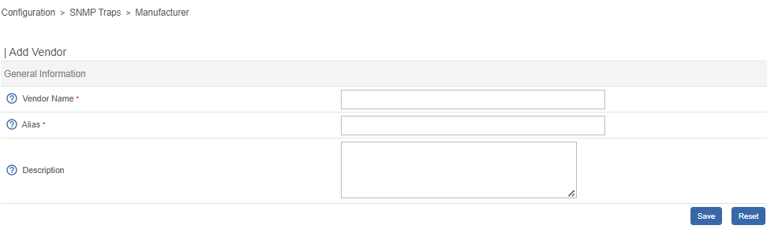
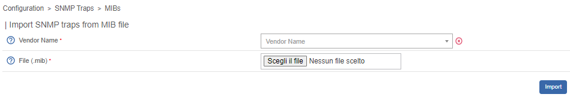
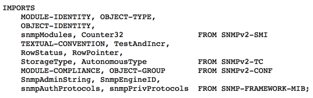
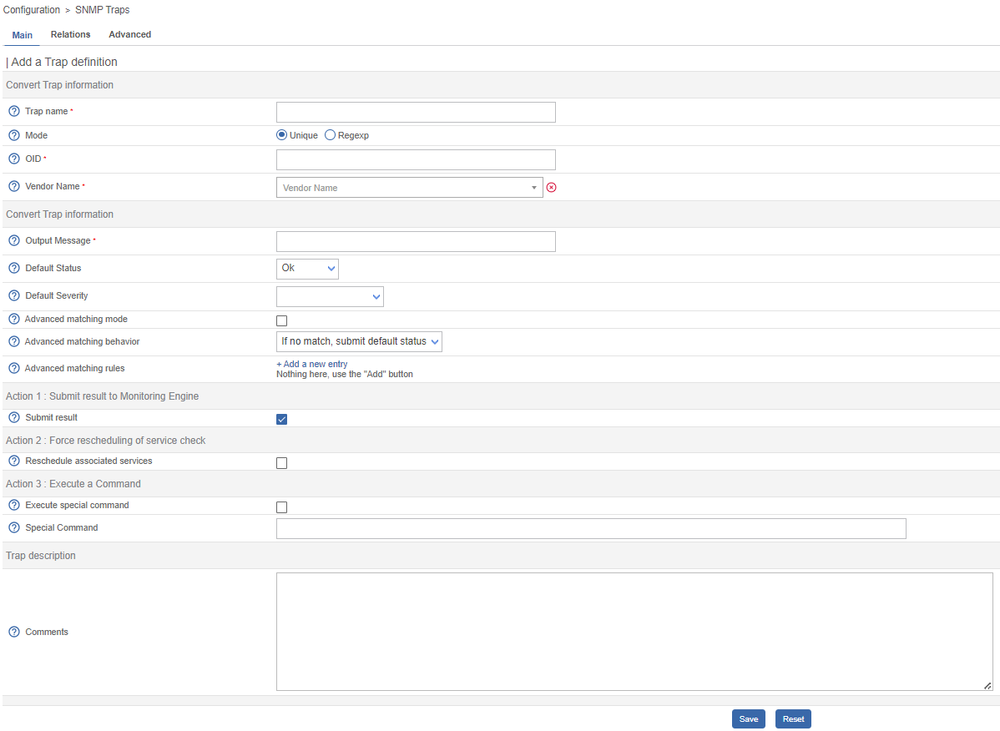
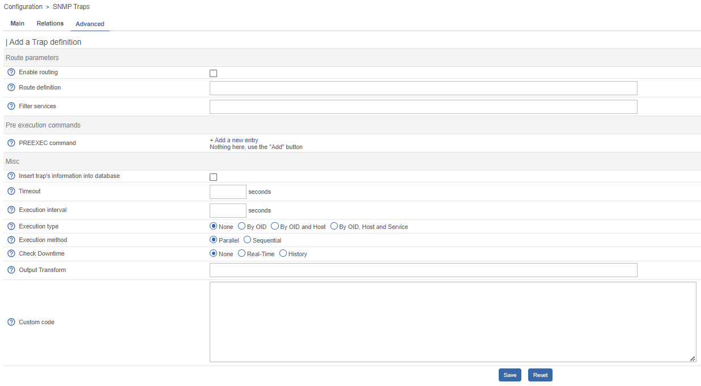

## Add a manufacturer

Within i-vertix, manufacturers file the root OIDs of the SNMP traps. To add a manufacturer, follow these steps:

Go into the **Configuration > SNMP traps > Manufacturer** menu and click on **Add**



* The fields for **Name** and **Alias** define the manufacturer's name and alternate name.
* The **Description** field provides information about the manufacturer.

## Import SNMP traps from a MIB file

Go into the **Configuration > SNMP traps > MIBs** menu



* The **Manufacturer** list allows you to select the manufacturer associated with the MIB that you are importing.
* Use the **File (.mib)** field to load the MIB.

Before importing a MiB file, it may require meeting various dependencies. To find these dependencies, open the MiB file with a standard text editor and:

* Locate the line that begins with **IMPORTS**.
* Verify all necessary dependencies for importing your MIB file after the keyword **FROM**.



In the displayed MIB file, four dependencies are necessary for importing the MIB:

* SNMPv2-SMI
* SNMPv2-TC
* SNMPv2-CONF
* SNMP-FRAMEWORK-MIB

:::info

The imported MIBS' dependencies must exist in the **/usr/share/snmp/mibs** directory. After completing the import, remove the previously copied dependencies.

:::

## Manual configuration of traps

### Basic configuration

It is possible to manually create definitions for SNMP traps:

Go into the **Configuration > SNMP traps > SNMP traps** menu and click on **Add**



* The **Trap Name** field specifies the name of the trap
* The **Mode** field specifies how to validate the received trap OID
* The **OID** field defines the root OID that must be received for this trap to be considered received
* The **Vendor name** field specifies the manufacturer name for selecting the trap in the drop-down menu. belongs
* The **Output message** field contains the message to be displayed upon receiving a trap. OID.

:::note

By default, the MIB contains the definition of this variable (E.g.: "Link up on interface `$2`. State: `$4`.", here `$2` will be replaced by the 2nd argument received in the event.). In the opposite situation, the variable `$` can be used to display all the arguments contained in the trap.
It is possible to construct the output message yourself. For this, use the MIB to know the arguments that will be present in the body of the event and retrieve the arguments with the variables `$n`.
As each argument is identified by a OID, it is possible to use this OID directly to place it in the output message without knowing its position via the variable `@{OID}`.

:::

* The **Default status** field defines the **monitoring** status of the service in case of reception of the trap.
* If the **Submit result** box is checked the result is submitted to the Network supervisor engine.
* The **Comments** field (last field) contains by default the comment by the manufacturer of the SNMP trap. Most of the
  time, this comment indicates the list of variables contained in the SNMP trap (see the next chapter on advanced configuration).

### Advanced configuration of the traps

It is possible to determine service status by analyzing SNMP trap settings instead of the Root OID.
In the past, manufacturers defined SNMP traps (Root OID) based on the type of event to be sent (linkUp / linkDown).
Nowadays, Root OID is defined by event category with specific event configurations.

To do this, it is possible of define **Advanced Matching mode** by clicking on **Add a new entry** and creating as many rules as necessary.
For each rule, define the settings:

* **String** defines the element on which the search will be applied (@OUTPUT@ defined all the **Output messages**
  translated).
* **Regexp** defined the REGEXP type search to be applied.
* **Status** defines the status of the service in the event of concordance.

:::note

The order is important in the rules of correspondence because the process will stop at the first rule of which the correspondence is assured.

:::

* The **Disable submit result if no matched rules** feature prevents the transmission of information to the scheduling engine unless a matching rule has been confirmed
* If the **Reschedule associated services** checkbox is selected, promptly reprogram the next check on the "active" service after receiving the trap
* If the **Execute special command** box is checked, the command defined in **Special command** is executed.

### Advanced tab

The **Advanced** tab configures how SNMP traps are handled upon reception.



* **Enable routing** enable the routing of information
* **Route definition** define the command to be used for routing.

Before processing the event (translating the **Output message**), it's possible to execute the PREEXEC command.
Define the **PREEXEC command (SNMPTT type)** by selecting **Add a new entry** and creating as many rules as needed.

* **PREEXEC command** defines the command to be executed.

Here is an example of use with the linkUP trap:

For a Cisco equipment, ```$2 == ifDescr``` contains the port number of the interface (GigabitEthernet0/1 for instance).
The best description of the interface is in the SNMP if Alias field.

The following command can be used to retrieve this value:

``` shell
snmpget -v 2c -Ovq -c <community> <cisco switch> ifAlias.$1
```

To use the result of the PREEXEC command in the **Output message**, it is necessary to use the variable `$p{n}` where `n`
corresponds to the order of definition of the command.

Example:

``` shell
"Interface $2 ( $p1 ) linkUP. State: $4." "$CA"
```

The result will have the form:  **Interface GigabitEthernet0/1 ( NAS Server ) linkUP. State: up**

* If the **Insert trap's information into database** box is checked, the SNMP trap information will be recorded in the database field. This can be used to determine whether or not to classify the traps by day in the database
* The **Timeout field** expressed in seconds, specifies the maximum processing time of the event, including pre-processing commands (PREEXEC) and post-processing commands (special command)
* The **Execution Interval** field, measured in seconds, defines the maximum wait time between two processing operations for an event
* The **Execution Type** field enables the Execution interval by defining conditions using the Root OID, the Root OID and host combination or, to disable this restriction, None.
* The **Execution Method** field determines whether multiple identical events (Root OID) are processed mode can be **Sequential** or **Parallel**.

### Custom code

The field **custom code** allows custom Perl processing.

To enable this feature, you must set **secure_mode** to 0 in **/etc/centreon/centreontrapd.pm** file as:

```perl
our %centreontrapd_config = (
    ...
    secure_mode => 0,
    ....
);

1;
```

For example, to decode the 4 hexadecimal arguments, the custom code would be:

```perl
if ($self->{trap_data}->{entvar}->[3] =~ /[[:xdigit:]]+/) {
    my $hexa_value = $self->{trap_data}->{entvar}->[3];
    $hexa_value =~ s/ //g;
    $self->{trap_data}->{entvar}->[3] = pack('H*', $hexa_value);
}
```

:::warning

Beware the argument table starts at 0 for argument 1 of the SNMP trap.

:::

### Variables

When adding a rule of correspondence or executing a special command it is possible to transmit arguments to the **String**
or **Special command** fields. These arguments are listed in the table below:

| Macro name               | Description                                                                                                               |
|--------------------------|---------------------------------------------------------------------------------------------------------------------------|
| `@{NUMERIC_OID}`           | Retrieval of the value of an argument via its OID, e.g.: `@{.1.3.6.1.4.1.9.9.43.1.1.1}`                                     |
| `$1, $2...`                | Retrieval of the value of an argument via its order of appearance                                                         |
| `$p1, $p2,...`             | Value of the command: PREEXEC (`$p1` = at the first command, `$p2` at the second, ...)                                        |
| `$*`                       | All the arguments separated by a space                                                                                    |
| `@HOSTNAME@`               | Host name (in i-vertix) to which the service is attached                                                                  |
| `@HOSTADDRESS@`            | IP address of the host sending the trap                                                                                   |
| `@HOSTADDRESS2@`           | DNS name of the host sending the trap (if the server fails to effect a reverse DNS resolution we retrieve the IP address) |
| `@SERVICEDESC@`            | Service name                                                                                                              |
| `@TRAPOUTPUT@ ou @OUTPUT@` | Output of the traps                                                                                                       |
| `@STATUS@`                 | Service state                                                                                                             |
| `@SEVERITYNAME@`           | Criticality name                                                                                                          |
| `@SEVERITYLEVEL@`          | Criticality level                                                                                                         |
| `@TIME@`                   | Trap reception timestamp                                                                                                  |
| `@POLLERID@`               | ID of the poller having received the trap                                                                                 |
| `@POLLERADDRESS@`          | IP address of the poller having received the trap                                                                         |
| `@CMDFILE@`                | Path to the command file of central or of centreon Engine (collector)                                          |

In addition, there are special variables that can be used in the **Routing settings** section at the level of the
**Routing command** if the option Enable routing is selected:

| Macro name          | Description                                                                                       |
|---------------------|---------------------------------------------------------------------------------------------------|
| `@GETHOSTBYADDR($1)@` | Reverse DNS resolution used to find the DNS name DNS from the IP address (127.0.0.1 -> localhost) |
| `@GETHOSTBYNAME($1)@` | DNS resolution used to find the IP address from the DNS name (localhost -> 127.0.0.1)             |
