import Breadcrumb from "../../../src/components/Breadcrumb";
import ImageCounter from "../../../src/components/ImageCounter";

## What is a Plugin Pack? {#plugin-pack}

A Plugin Pack is a downloadable package that contains a set of configuration templates that make monitoring your IT infrastructure fast and easy.

Following monitoring configuration items are included in a plugin pack:

- Host Templates
- Service Templates
- Commands
- Discovery rules

Each template or rule is ready-to-use and for most use-cases no custom configuration is required.
The core of each plugin pack are the included host templates, which combine commands and service templates together.
Once applied to a host, all technology-common services and checks are automatically added to a host.

The *Discovery rules*, as the name already mentions, are used by the different integrated *host and service discoveries*.

:::tip

In case you did not follow the Quick Start Guide, you must configure the *Plugin Store* credentials before accessing the store itself,
as explained in the [Plugin Store Configuration Guide](../quick-start-guide/plugin-store-configuration).

In case you did not already receive your personal credentials, contact the [i-Vertix support](mailto:support@i-vertix.com).

:::

## Browsing Plugin Packs

To install a new Plugin Pack, visit the Plugin Store page at <Breadcrumb crumbs={["Administration", "Stores", "Plugin Store"]} />.

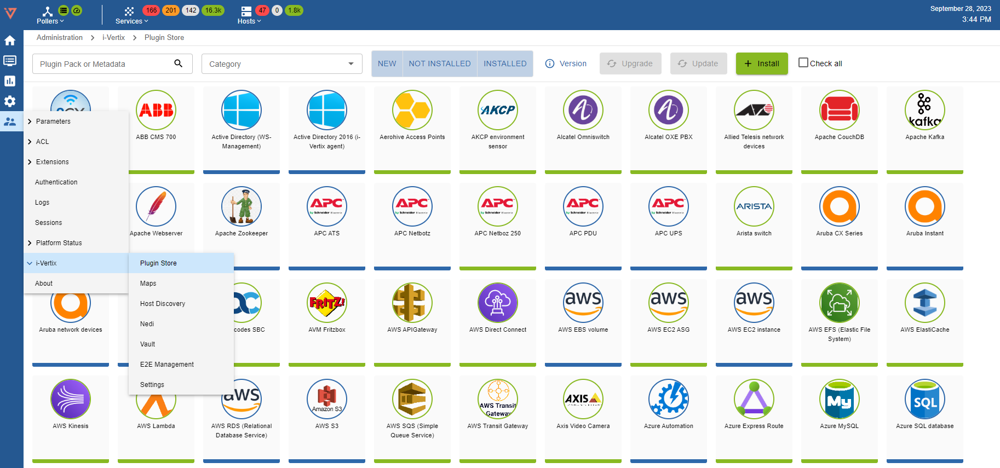

You can search by name or metadata, using the **Plugin Pack or Metadata** field

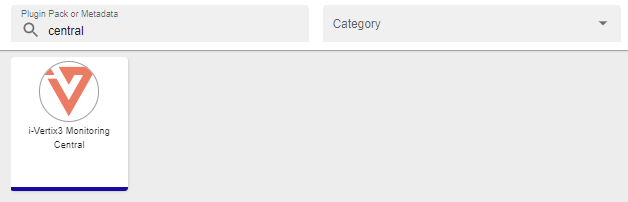

A short and not comprehensive list of values for metadata:

```text
API
HTTP
HTTPS
SNMP
SSH
UPS
VOIP
```

For example, searching for UPS will return all the packs that have the UPS tag

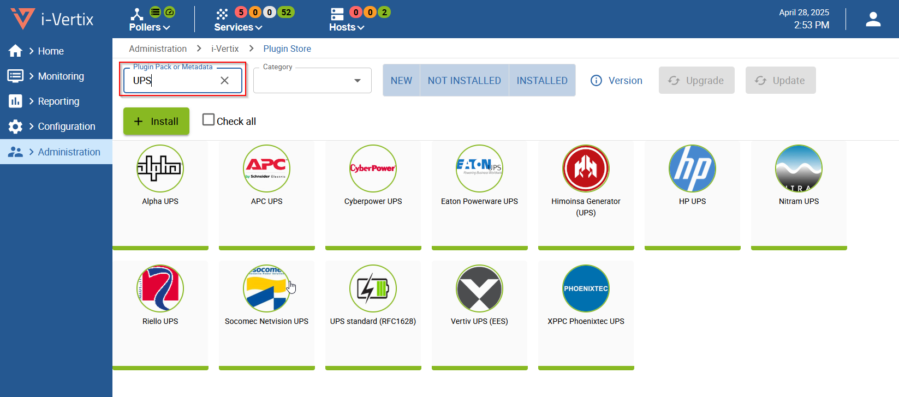

It is also possible to refine the search using the **Category selector** (in the second image **Operating System**) selection

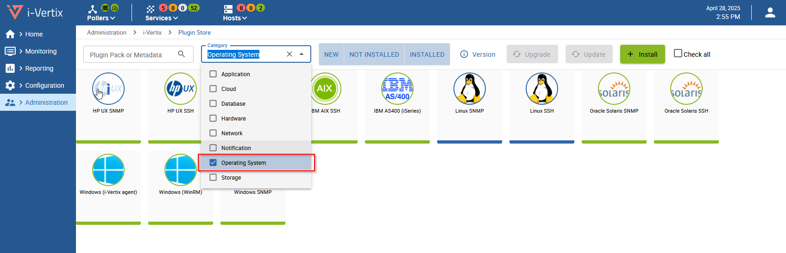

or by installation status

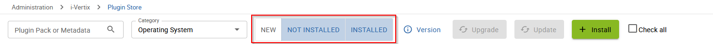

To get more information about a Plugin Pack, it is possible to show the Description tab, clicking on the **i** icon

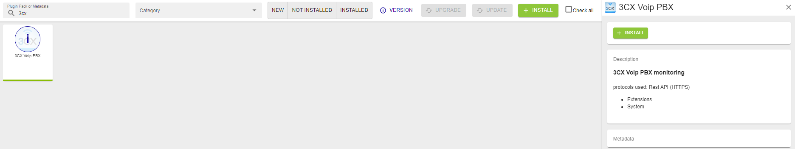


To install a pack, hover over the icon with the mouse and click on the ``+``


Once the pack is installed, it has a green outline and a green check mark.

| **Before installation**                                                      | **After installation**                                                             |
|------------------------------------------------------------------------------|------------------------------------------------------------------------------------|
|  |  |

It is possible to select a group of Plugin Packs for installation like in the screenshot at <ImageCounter num={1} /> :
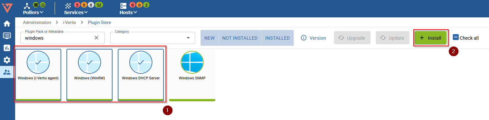
and install all of them in a single operation clicking on <ImageCounter num={2} />

Please note that some Plugin Packs might require additional configuration to function correctly, particularly those involving Rest APIs, SNMP, SSH, and similar protocols.

For example the AS400 monitoring plugin requires some packages to be installed in the Central Virtual Machine.
Similarly, monitoring Windows Hosts via the i-Vertix agent, requires the package to be installed and configured for each monitored host.

:::tip

Always check the Description sidebar of the Plugin for more information about the installation procedure and the extra steps needed to complete the installation.
:::

---

### Updating/Upgrading the Plugin Store

The Plugin Stores receives updates directly from the internet, but user intervention is required for installation.
Most of the time, new Plugin versions introduce new features or fix existing bug.

Updates are handled through two different procedures, called **Update** and **Upgrade**.
It is not uncommon that both of them are available at the same time.

The changes brought by the upcoming *Update/Upgrade* are shown clicking on the
Version button:

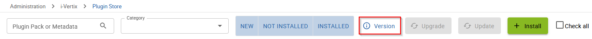

which will show an overview like the following:

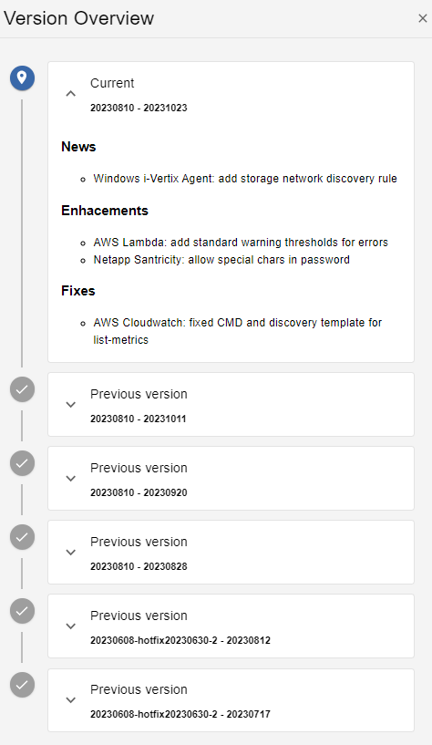

<Tabs>
<TabItem value="update" label="Update" default>

An **Update** involves changes limited to command or template configurations - for example the addition of a new parameter or the adjustment of a service threshold.

:::note

When installing a new *Plugin Pack*, any pending *Update* will be applied automatically before installation.

:::

Usually, *Updates* can be performed at any time, since they do not involve operations that requires downtimes or that might disrupt, even temporarily, the monitoring.

When an *Update* is available, the `Update` button is available and lights up in orange:

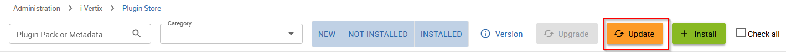

The procedure can be started by clicking on the button and, after its completion, we need to [export the monitoring configuration to the `Pollers`](./export-configuration).

</TabItem>
<TabItem value="upgrade" label="Upgrade">

When you **Upgrade** the *Plugin Store*, a new *plugin version* is downloaded and installed to your monitoring system. New *plugin versions* , such as the support for new technologies.

Please note that, performing an **Upgrade**, will automatically execute any pending **Update**.

When an **Upgrade** is available, the Upgrade button lights up in blue:

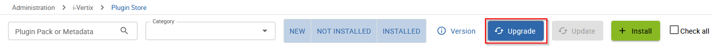

The procedure can be started by clicking on the button.

:::caution Mandatory

After an **Upgrade**, it is recommended to manually synchronize the new plugins with the Pollers. Otherwise, the Central Manager will perform the synchronization automatically every 4 hours, and the Pollers will not be able to use the new plugins until then.

:::

To manually synchronize the new monitoring plugins, log on to the *Central Management* through SSH and launch

```bash
sudo /opt/i-vertix/scripts/i-vertix/sync_poller.sh
```

To complete the procedure, we need to export the configuration to the *Pollers*, while selecting `Restart` as the given `Restart monitoring Engine` Method.
See the link [Deploy the configuration](./export-configuration) for the full explanation on how to export the configuration to the *Pollers*.

</TabItem>
</Tabs>
