import ImageCounter from "@site/src/components/ImageCounter";
import Tabs from '@theme/Tabs';
import TabItem from '@theme/TabItem';

While configuring hosts and services on your monitoring system, you may:

- have difficulties setting the correct thresholds for your services
- be unsure how to reach your host
- want to retrieve a full SNMP walk of your devices
- encounter routing or DNS problems

and many other situations that require you to analyze or test configurations or devices.

To assist you, you can use the built-in *Monitoring Troubleshooter*, available on every page of the monitoring interface.

## Troubleshooting Capabilities

Our built-in *Monitoring Troubleshooter* offers the following features:

<Tabs>
<TabItem value="plugins" label="Monitoring Plugins">

Configure and test services on the fly, without the need to export the configuration each time:

- change service macros as needed
- import values from credentials
- create a new service from your current configuration
- update an existing service (service macros, host macros, and affected host values)

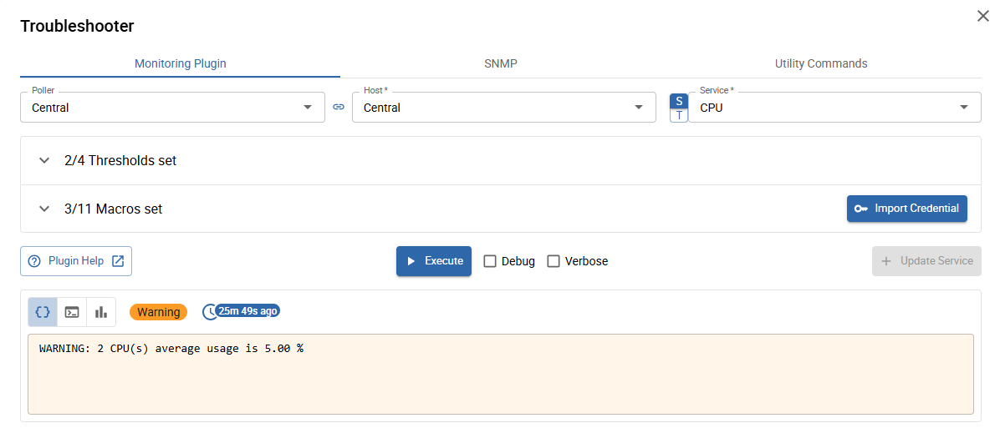

</TabItem>
<TabItem value="snmp" label="SNMP">

Launch snmpget requests or snmpwalks from any poller.

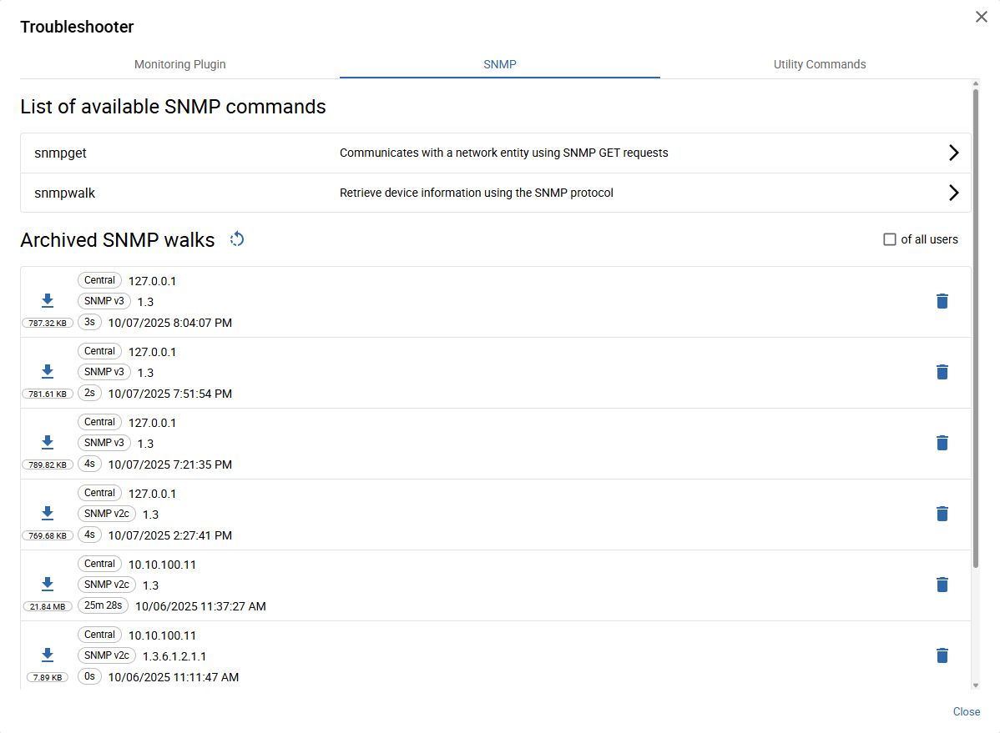

</TabItem>
<TabItem value="commands" label="Utility Commands">

Execute various utility commands from any poller.

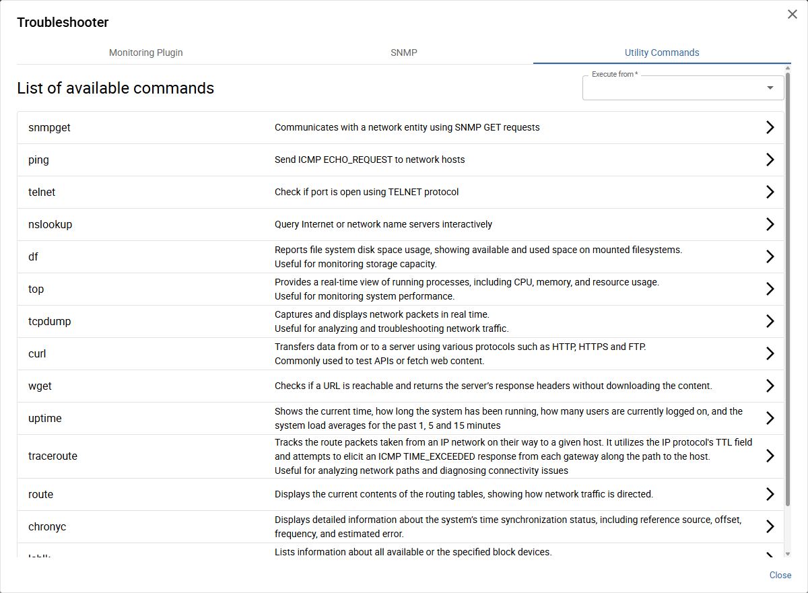

List of available utility commands

- snmpget
- ping
- telnet
- nslookup
- df
- top
- tcpdump
- curl
- wget
- uptime
- traceroute
- route
- chronyc
- lsblk
- virt-what

</TabItem>
</Tabs>

## Accessing the Monitoring Troubleshooter

There are two ways to open the *Monitoring Troubleshooter*:

### From the [Resource Status](../events-alerts/viewing-events/resources-status.md) page

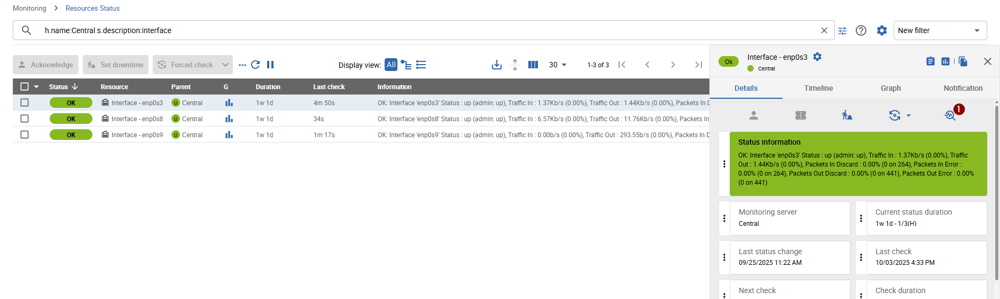

By clicking the <ImageCounter num={1} disableMargin /> `Troubleshoot` icon, the *Troubleshooter* popup opens on the `Monitoring Plugin`
tab with the current host/service resource pre-selected.

### From the Sidebar

*accessible on **every** page*

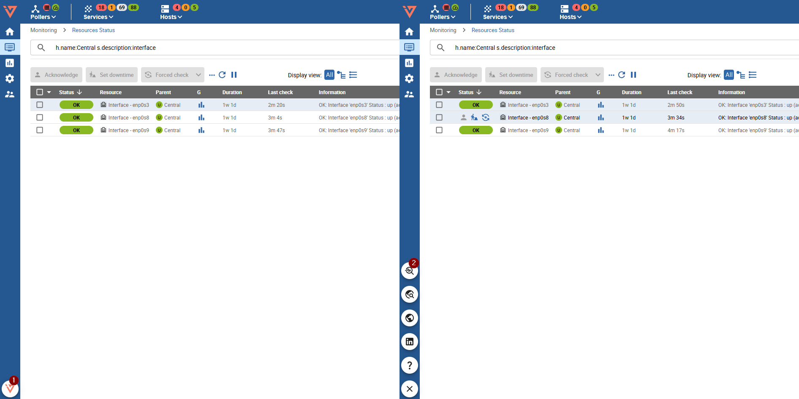

By first clicking the <ImageCounter num={1} disableMargin /> `i-Vertix` icon and then the <ImageCounter num={2} disableMargin /> `Troubleshoot` icon,
the *Troubleshooter* popup opens by default on the `Monitoring Plugin` tab with the last used host/service resource pre-selected.

### Grant Access to Functionalities

The Troubleshooter is enabled by default only for administrators, who have full access to all monitoring features by default.
If you want to grant access to specific Troubleshooter functionalities to other users, you must configure the permissions in the *Menu ACL*.

Navigate to <Breadcrumbs crumbs={["Administration", "ACL", "Menu Access"]} /> and select the *Menu ACL* to which you want to grant access.

Then, expand the `Monitoring` → `Troubleshooter` section and select the features (`Monitoring Plugin`, `SNMP`, `Utility Commands`) you want to make accessible.

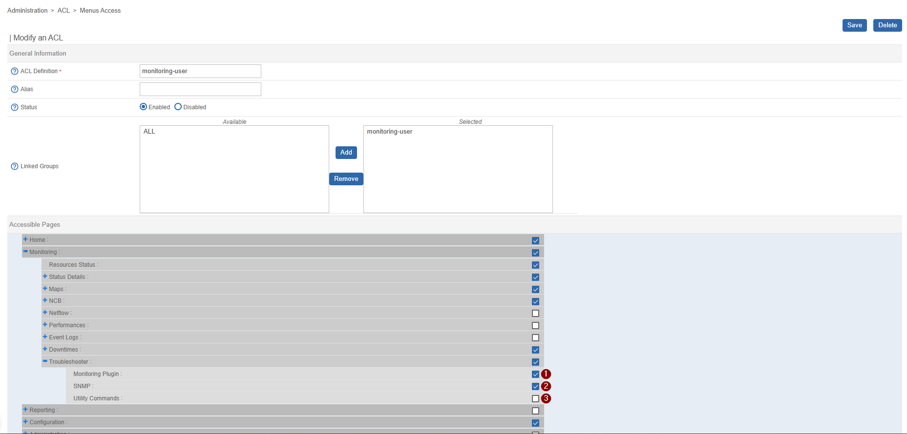

Click `Save` once you are done.
After saving, all monitoring users associated with the *access groups* assigned to the modified *Menu ACL* will have access to the selected Troubleshooter features.

## Troubleshooting Monitoring Plugins

*accessible from the **Monitoring Plugin** tab*

When opening the Monitoring Plugin tab for the first time, you will see the following view:

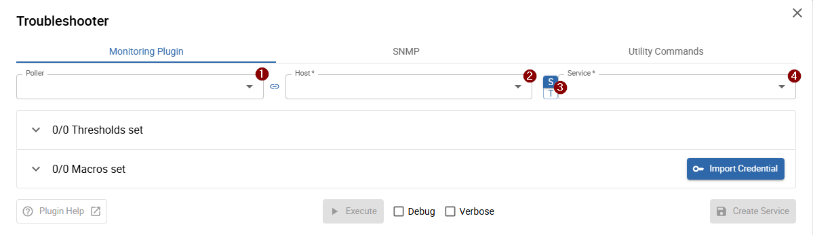

### Select a resource

- <ImageCounter num={1} /> *Poller* (optional)
- <ImageCounter num={2} /> *Host*
- <ImageCounter num={3} /> *Switch between service & service template*: switch to `T` to start from a service template, or keep it on `S` to select an existing service
- <ImageCounter num={4} /> *Service/Service template*

:::note

All resources are loaded directly from the monitoring configuration — there is no need to export it to use the *Troubleshooter*.

:::

After selecting a resource, all macros are automatically loaded based on the selected service/service template and host.

### Define or change macros

The "heart" of the *Monitoring Plugin Troubleshooter* are the *Macro* sections.
In these sections, **all** (set and unset) service and host macros of the underlying *command* are displayed and configurable.

Click on one of the two sections (*Macros* or *Thresholds*) to expand the list:

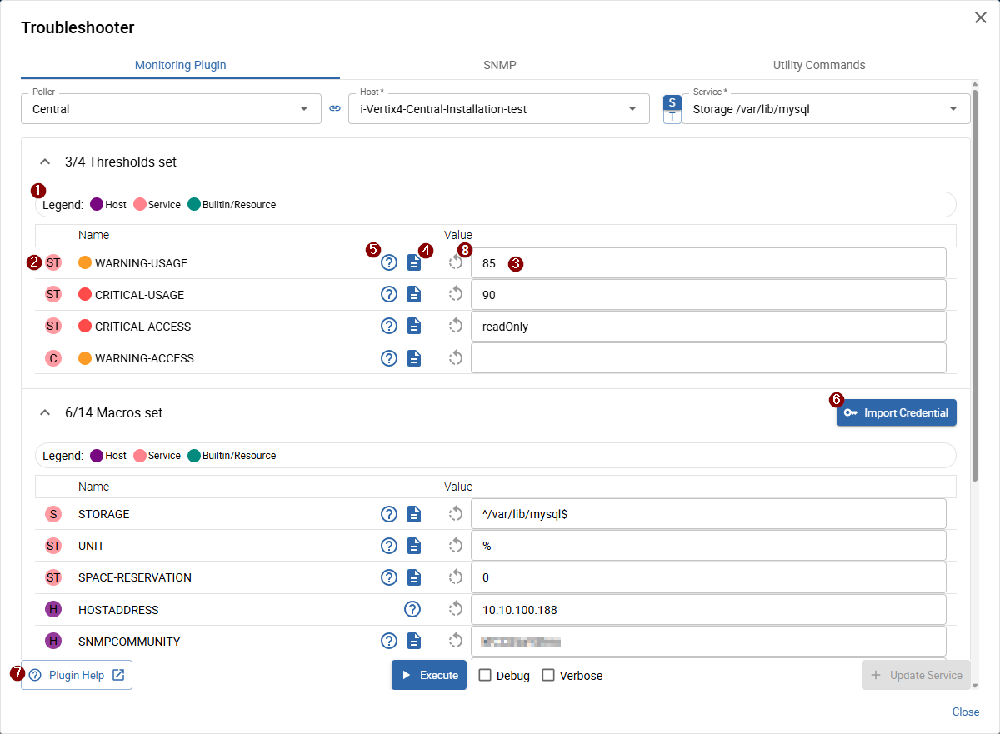

- <ImageCounter num={1} /> *Macro type legend* (<ImageCounter num={2} disableMargin />)
- <ImageCounter num={2} /> *Macro type and source*: host and service macros are defined on the command and can be set/overwritten on service & host templates and/or directly on the service and host
- <ImageCounter num={3} /> *Macro value*: the current macro value (check the <ImageCounter num={2} disableMargin /> macro source to see where it is defined)
- <ImageCounter num={4} /> *Macro description*
- <ImageCounter num={5} /> *Macro help*: opens a small popover showing the help text for the underlying command option linked to the macro
- <ImageCounter num={6} /> *Import credential*: opens the credential list with the following credential types available: SNMP, SSH, Agent, and WSMAN
- <ImageCounter num={7} /> *Plugin help*: opens a new browser tab with the complete monitoring plugin help
- <ImageCounter num={7} /> *Reset value* (only available when macro value changed): resets the current value to the originally configured value

You can perform the following actions:

- Change and tune macro values in the <ImageCounter num={3} disableMargin /> input field
- Use the plugin/macro help to better understand the purpose and effect of a macro
- Import credentials for faster and more consistent configuration

### Execute and save

After defining or tuning the macros, you can execute your current service configuration by clicking the <ImageCounter num={1} disableMargin /> `Execute` button at the bottom of the popup.

The result view appears below the `Execute` button and shows the following information:

- <ImageCounter num={2} /> *Command output* (default): click to switch the <ImageCounter num={7} disableMargin /> output to the *command output* 
- <ImageCounter num={3} /> *Command*: click to switch the <ImageCounter num={7} disableMargin /> output to the *executed command line*
- <ImageCounter num={4} /> *Performance data*: click to switch the <ImageCounter num={7} disableMargin /> output to the *performance data*
- <ImageCounter num={5} /> *Status*: the monitoring status returned by the command 
- <ImageCounter num={6} /> *Execution time*: when the command was last executed 
- <ImageCounter num={7} /> *Output*: determined by <ImageCounter num={2} disableMargin />, <ImageCounter num={3} disableMargin />, and <ImageCounter num={4} disableMargin />
- <ImageCounter num={8} /> *Debug* & *Verbose*: select to include debug and/or extended information (displayed according to the selected output mode)
- <ImageCounter num={9} /> *Update Service* or *Create Service* (only visible when changes were made): updates the modified macro values on the current service, or creates a new service on the selected host when using a service template 

## Launch SNMP commands

*accessible from the **SNMP** tab*

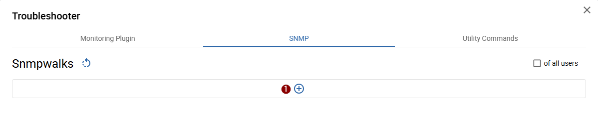

Click the <ImageCounter num={1} disableMargin /> `+` button to start a new SNMP-Get request or <ImageCounter num={2} disableMargin /> to start a new SNMP walk.

Let's start off with a new snmpwalk.

### Define walk properties

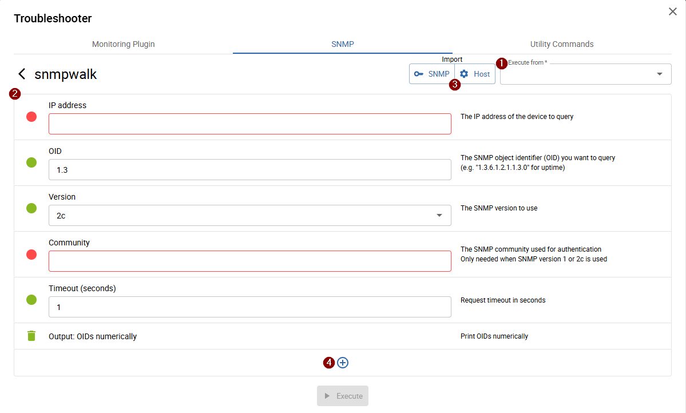

On the opened page, define the <ImageCounter num={1} disableMargin /> poller from which the walk should be executed,
the target address, the SNMP credentials, and the OID for the walk (<ImageCounter num={2} disableMargin />).

You can also <ImageCounter num={3} disableMargin /> import values from a configured *Monitoring Host* or *SNMP Credential*:

Import from Host

Click `Host` under *Import* to open the host selector.

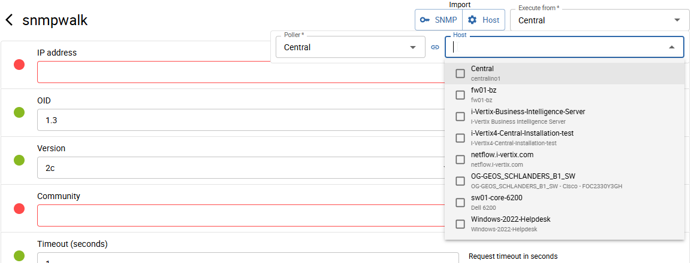

After selecting a host, all available values including *Poller* (Execute from), *Host address*, and *SNMP version* + *community* or *v3 credentials* are loaded.

Import from SNMP credential

Click `SNMP` under *Import* to open the credential selection popup.

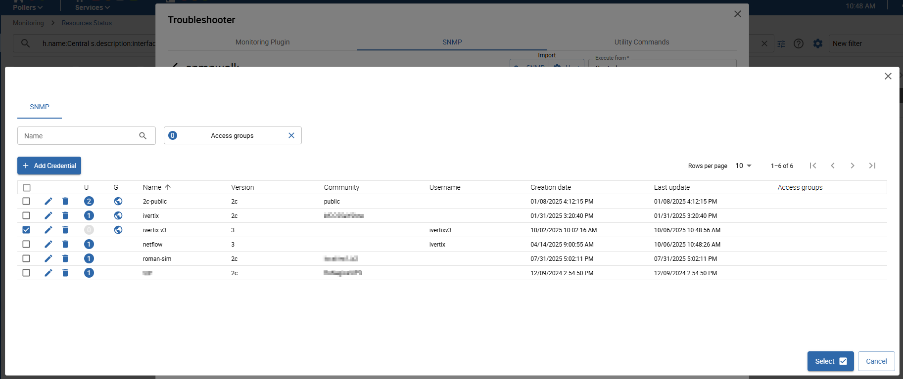

Select the credential you want to import and click `Select`. Shortly after, the credential values will be loaded into your walk configuration.
You still need to define the *Host address* and *Poller* (Execute from) manually.

:::tip[Best practice]

You can combine imports from *Host* and *SNMP Credential*. The last import always overwrites previously imported values.

If you need to use different SNMP authentication than configured on the host,
first import values from the *Host* and then import the desired *SNMP Credential*. 

:::

:::info

Some parameters may become invalid during configuration. When hovering over the **red dot**, you can see the reason why.

For example, when selecting *Version* "3", the *Community* parameter becomes obsolete.
In that case, you need to delete or clear its value.
The same applies for *Version* "2c" or "1" — in those cases, clear all version "3"-related parameters (username, authentication protocol, passphrases, etc.).

:::

To manually add parameters, click <ImageCounter num={4} disableMargin /> `+` at the bottom of the page.

### Execute walk

To launch the walk, click `Execute` after defining the required parameters.

After a maximum of *~5 seconds*, the result will be displayed below with three possible outcomes:

<Tabs>
<TabItem value="snmp_finished" label="Finished (< 100 lines output)">

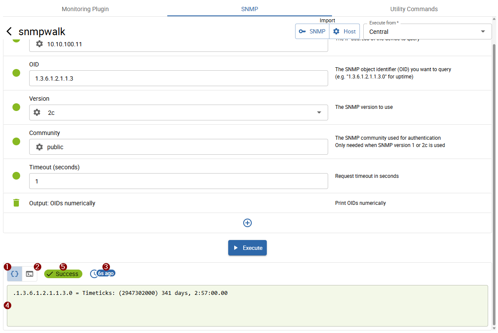

The walk finished in under *5 seconds* and returned fewer than 100 lines. The result is displayed directly on the screen.

- <ImageCounter num={1} /> *Walk output*
- <ImageCounter num={2} /> *Executed command*
- <ImageCounter num={3} /> *Execution time*
- <ImageCounter num={4} /> *Output*: shows the walk output or executed command depending on <ImageCounter num={1} disableMargin /> or <ImageCounter num={2} disableMargin /> selection
- <ImageCounter num={5} /> *Execution status*

You can also download the walk by hovering over the output and clicking the download button:

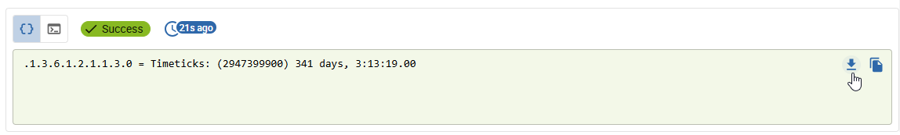

If the walk finished quickly but returned more than 100 lines, refer to the next tab (*Finished (> 100 lines output)*).

</TabItem>
<TabItem value="snmp_finished_download" label="Finished (> 100 lines output)">

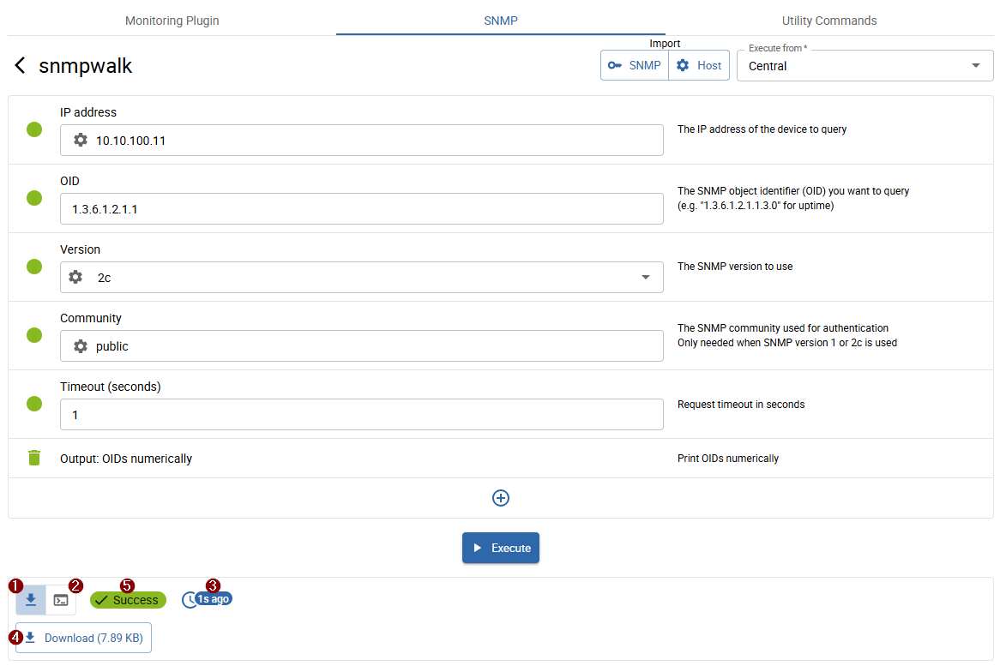

The walk finished in under *5 seconds* and returned more than 100 lines. The walk is available for download.

- <ImageCounter num={1} /> *Walk download*
- <ImageCounter num={2} /> *Executed command*
- <ImageCounter num={3} /> *Execution time*
- <ImageCounter num={4} /> *Output*: shows the download button or executed command depending on <ImageCounter num={1} disableMargin /> or <ImageCounter num={2} disableMargin /> selection
- <ImageCounter num={5} /> *Execution status*

The walk is also archived and available in the *SNMP Walk* list for future downloads.

</TabItem>
<TabItem value="snmp_loading" label="Still in progress">

The walk did not finish within *5 seconds* and is still in progress.

- <ImageCounter num={1} /> *Walk in progress*
- <ImageCounter num={2} /> *Executed command*
- <ImageCounter num={3} /> *Execution time*
- <ImageCounter num={4} /> *Output*: shows general information or the executed command depending on <ImageCounter num={1} disableMargin /> or <ImageCounter num={2} disableMargin /> selection

In the meantime, you can:

- wait on the current page until the walk finishes (the walk status updates automatically)
- launch another walk
- return to the walk list (`<` button in the top-left near *snmpwalk*)

Once the walk finishes, the result will be available for download from the walk list (or directly on the same page if you waited for it).

</TabItem>
<TabItem value="snmp_failed" label="Failed">

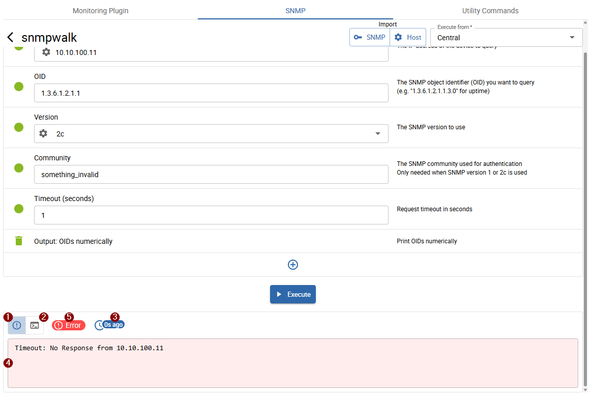

The walk failed.

- <ImageCounter num={1} /> *Error*
- <ImageCounter num={2} /> *Executed command*
- <ImageCounter num={3} /> *Execution time*
- <ImageCounter num={4} /> *Output*: shows the error or executed command depending on <ImageCounter num={1} disableMargin /> or <ImageCounter num={2} disableMargin /> selection
- <ImageCounter num={5} /> *Execution status*

</TabItem>
</Tabs>

### Access archived SNMP walks

All <ImageCounter num={1} /> archived walks or *walks in progress* are accessible from the SNMP walk list
(initially displayed when opening the *SNMP* tab or by clicking the `<` button after launching a walk).

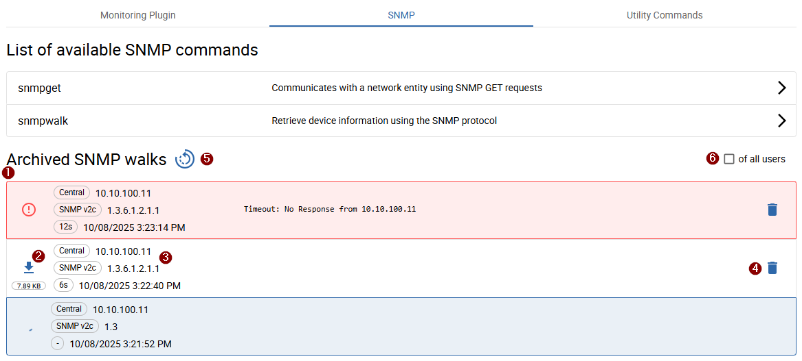

Each walk is represented with <ImageCounter num={3} disableMargin /> details such as *OID*, *Version*, *Poller*, *IP address*, and *duration*.

Walks *currently in progress* are displayed with a loading icon and a *blue background*.
Failed walks are displayed with a *red background*.

To download a completed walk, click the <ImageCounter num={2} disableMargin /> `Download` button.
To delete a walk, click the <ImageCounter num={4} disableMargin /> `Delete` button.

:::note

Archived walks are automatically deleted after *7 days*.

:::

:::tip[For Administrators]

Use the <ImageCounter num={6} disableMargin /> `of all users` checkbox to view **all** archived SNMP walks of all users.

:::

### Execute SNMP-Get Request

As previously stated you can also launch a new SNMP-Get Request from the *SNMP* tab.

The definition and handling of the command paramters is equal to the parameters of the snmpwalk command.
The only noticeable difference between these two commands are, that snmpget requests only query one value and walks can request more values.
`snmpget` results also won't be archived.

## Execute Utility Commands

*accessible from the **Utility Commands** tab*

Select one of the available commands you want to execute.

### Define Command Parameters

On the opened page, define the <ImageCounter num={1} disableMargin /> poller from which the command should be executed and all <ImageCounter num={2} disableMargin /> required parameters.

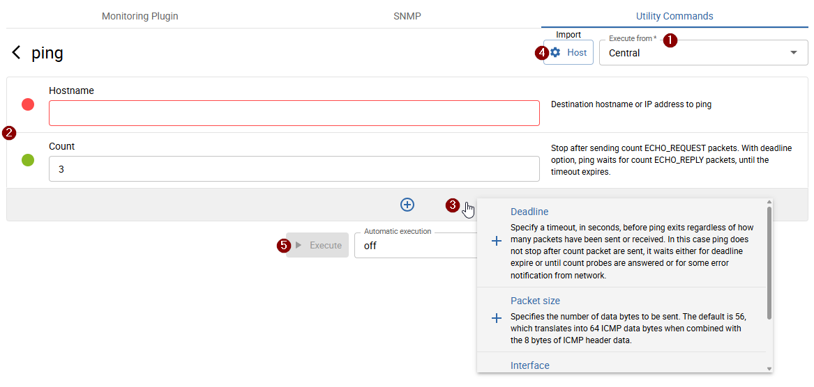

The *indicator dot* next to each parameter shows its validity.
Required parameters are always displayed; additional optional parameters can be added by clicking the <ImageCounter num={3} disableMargin /> `+` button at the bottom of the page.

For some commands, it is also possible to <ImageCounter num={4} disableMargin /> import values from *configured hosts* or *SNMP credentials*.

### Execute Command

After defining the parameters and setting the *Poller*, execute the command by clicking the <ImageCounter num={5} disableMargin /> `Execute` button.
It is also possible to run the command automatically *every x seconds*. To do so, first select the automatic execution interval, then click `Execute`.

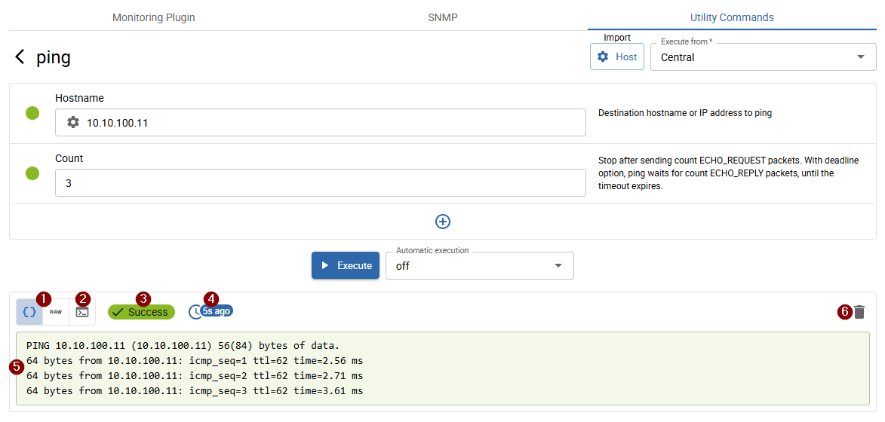

The result is displayed as follows:

- <ImageCounter num={1} /> *Output* (default selected): in some cases, the output is formatted or truncated. In such cases, an additional `Raw` output option is available to view the original content.
- <ImageCounter num={2} /> *Executed command*
- <ImageCounter num={3} /> *Status*
- <ImageCounter num={4} /> *Execution time*
- <ImageCounter num={5} /> *Output* (depending on <ImageCounter num={1} disableMargin /> / <ImageCounter num={2} disableMargin /> selection)
- <ImageCounter num={6} /> *Clear output*

:::note

When automatic execution is enabled, the output of each executed command is appended to the previous output.

Only certain commands, such as `top`, overwrite the existing output.

:::
