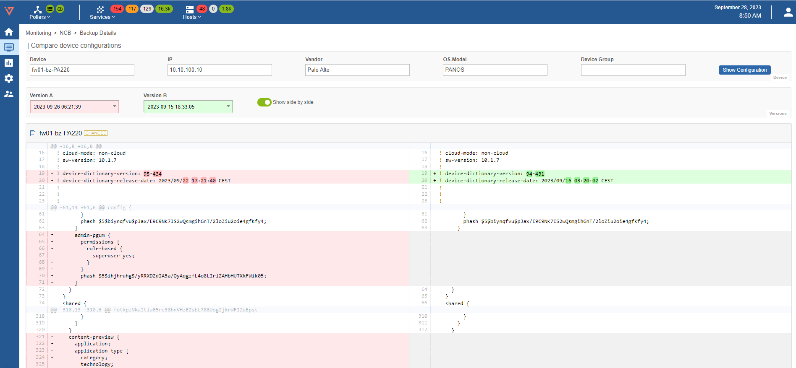
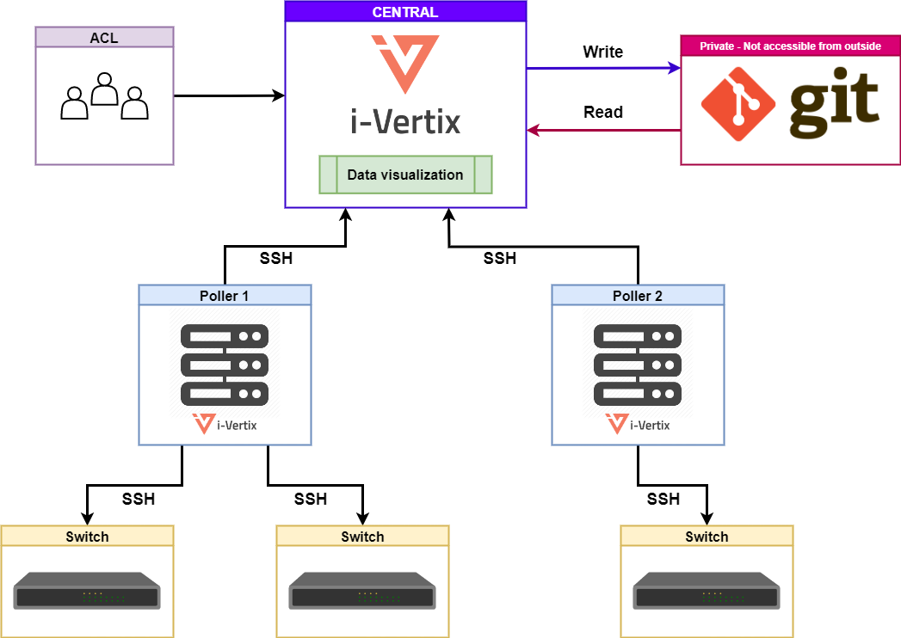

* Automatic backup of network devices configurations
* Multi brand support
* Configurations saved in a GIT repository
* Versions comparison
* Integrated in i-Vertix IT Monitoring
* MSP ready

## Technical diagram and data flow

**Central**: data visualisation via HTTPS, backup storage on GIT repository, monitored device configurations. Users can access data according to the type of permissions assigned to them via ACLs.

**Git**: the repository is private and not accessible from outside, data is read and updated from Central.

**Poller**: SSH on TCP port 22 (encrypted) is used to communicate with Central to send configuration backups.

**Network device** (switch, firewall, router): Pollers connect via SSH on TCP port 22 (encrypted) and depending on the device (vendor) a command is executed to show the configuration (e.g. show config) and then communicate it to Central.
