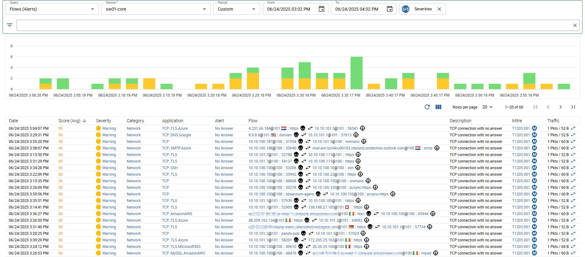
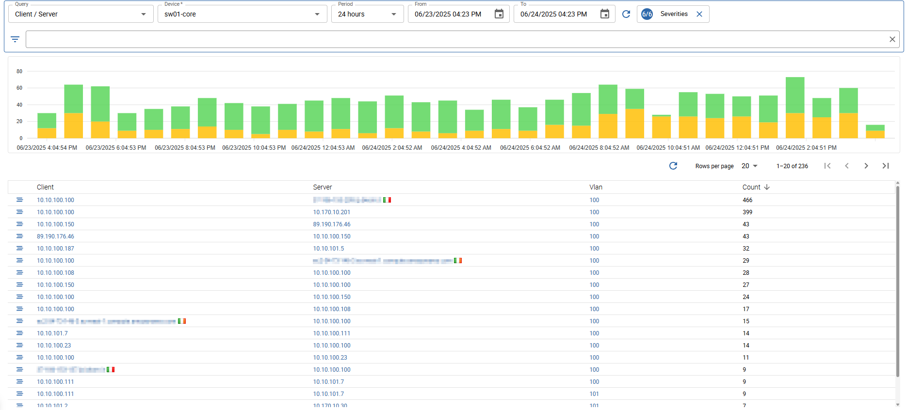
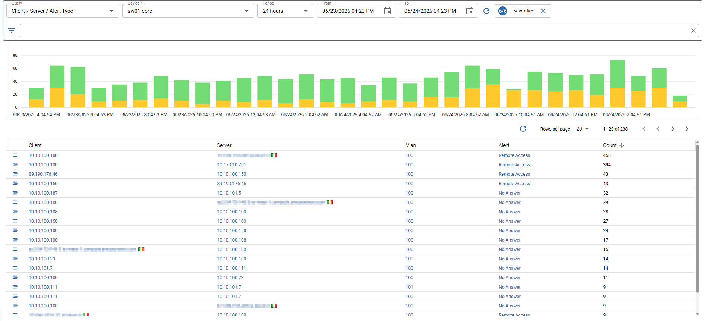
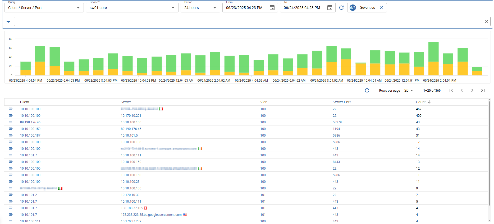
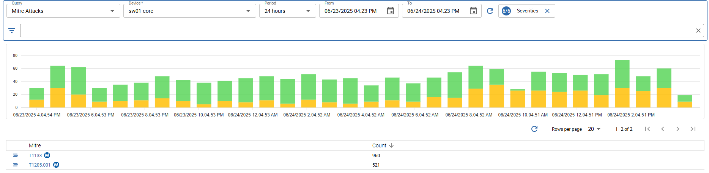
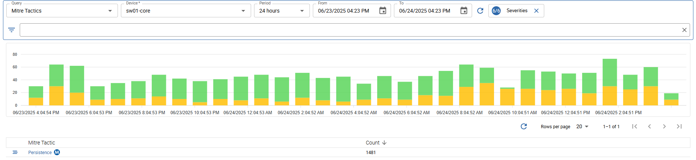
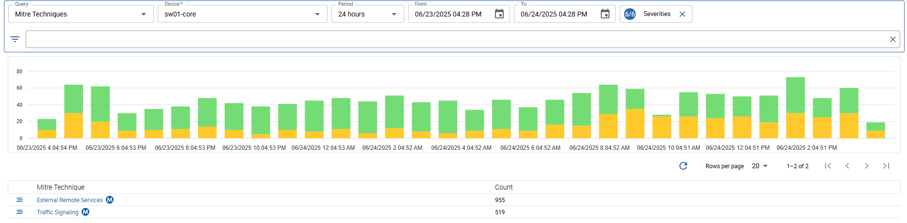

import Breadcrumb from "../../../src/components/Breadcrumb";

<Breadcrumb crumbs={["Monitoring", "NetFlow", "Alerting Flows"]} />

The *Alerting Flows* view can be used to scan for problematic network traffic and security leaks.
The data displayed depends on the retention settings. By default the data is stored for 180 days.

You can choose between a pre-defined period or select a custom time range. Also the latest caputred data is available in this view.

The view can be changed using the *Query* settings at the top left and is separated into two parts: a timeseries graph and a list.

Avilable filters

On the top right of the page you can find the *Severity* filter.

A lot of other filters are also avilable to get more specific results:

- *Alert Type*: filter by alert type (more specific than category)
- *Alert Category*: filter by alert category
- *Mitre Attack*: filter by [mitre attack](https://attack.mitre.org/) (combined technique and tactic)
- *Mitre Technique*: filter by [mitre technique](https://attack.mitre.org/techniques/enterprise/)
- *Mitre Sub-Technique*: filter by mitre sub-technique
- *Mitre Tactic*: filter by [mitre tactic](https://attack.mitre.org/tactics/enterprise/)
- *IP*: filter by client or server ip
- *Client IP*: filter by client ip
- *Server IP*: filter by server ip
- *Client Country*: filter by client country
- *Server Country*: filter by server country
- *Client Port*: filter by client port
- *Server Port*: filter by server port
- *Application*: filter by application (L7) protocol
- *Protocol*: filter by transport (L4) protocol
- *Vlan*: filter by vlan
- *Interface*: filter by input or output interface
- *Input Interface*: filter by input interface
- *Output Interface*: filter by output interface

## Flows (Alerts)

Shows single flows with at least one problem. When a single flow is considered to have more than one problem, the most severe is displayed, but the average score is displayed.
Each problematic flow is *categorized* and also the type of *Alert* is displayed along with a *Description* and the corresponding *Mitre ID*.

The *Mitre ID* is a catalogue number, belonging to [ATT&CK](https://attack.mitre.org/),
which is a public knowledge base of adversary tactics and techniques based on real-world observations.

The flow is displayed as *Attacker* (flow initiator) on the left and *Victim* (receiver) on the right. 

## Alert Type

Lists all alert types which occurred during the selected period.

## Client / Server

Lists all combinations of clients and servers and how many alerts resulted in their traffic exchange.

## Client / Server / Alert Type

Lists all combinations of clients, servers and alert types and how many of such alerts were generated during their traffic exchange.

## Client / Server / Port

Lists all combinations of clients, servers and server ports and how many alerts were generated during the traffic exchange on that specific port.

## Mitre Attacks

Lists all *Mitre Attack Ids* which occurred during the selected period.

## Mitre Tactics

Lists all used *Mitre Tactics* which occurred on alerting flows during the selected period.

## Mitre Techniques

Lists all used *Mitre Techniques* which occurred on alerting flows during the selected period.

## Understanding Alert Scores \{#scores}

The *Alert score* indicates that a flow comes with some kind of issue.
Each problem is categorized and assigned a [Mitre Id](https://attack.mitre.org/). The value of the score depends on the severity of the problem.

It is also possible that a single flow has more than one problem. In that particular case the scores are added together.
Practically said, the higher the score, the more serious the problem(s).
