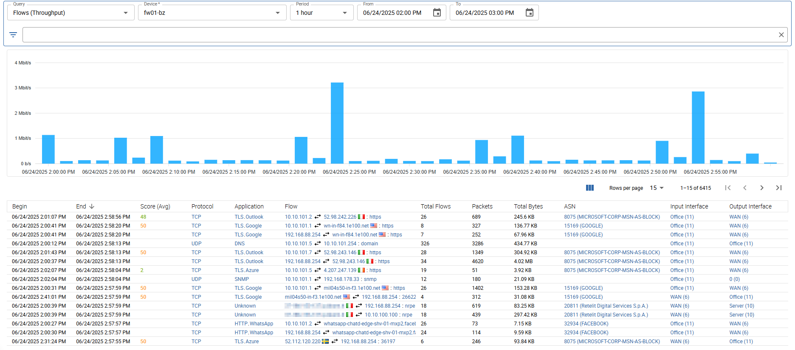
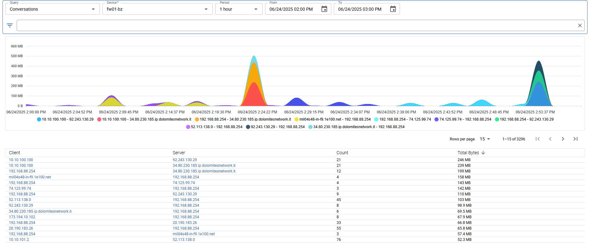
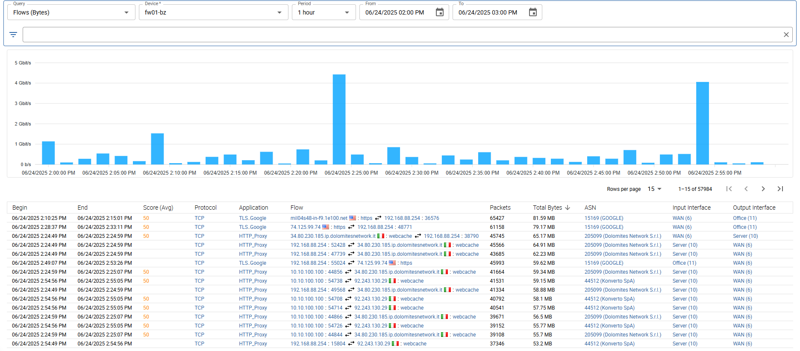
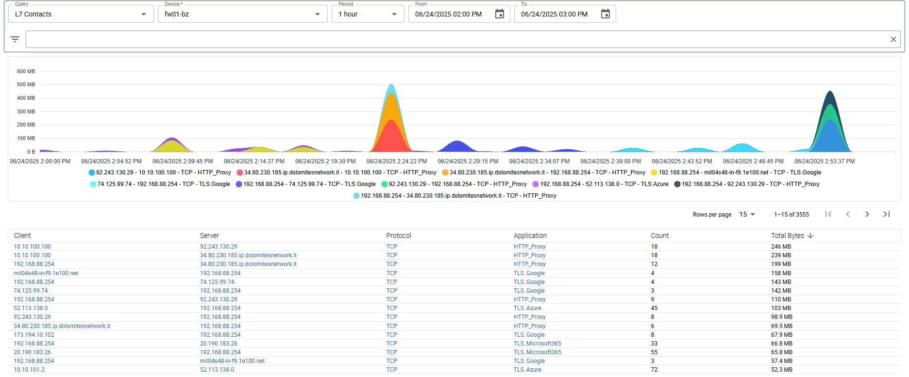
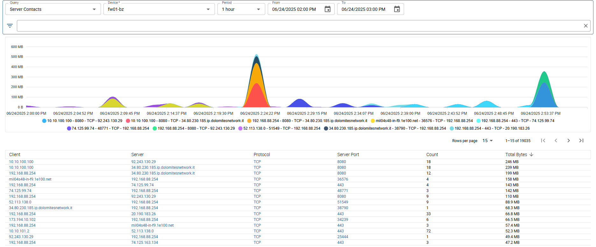
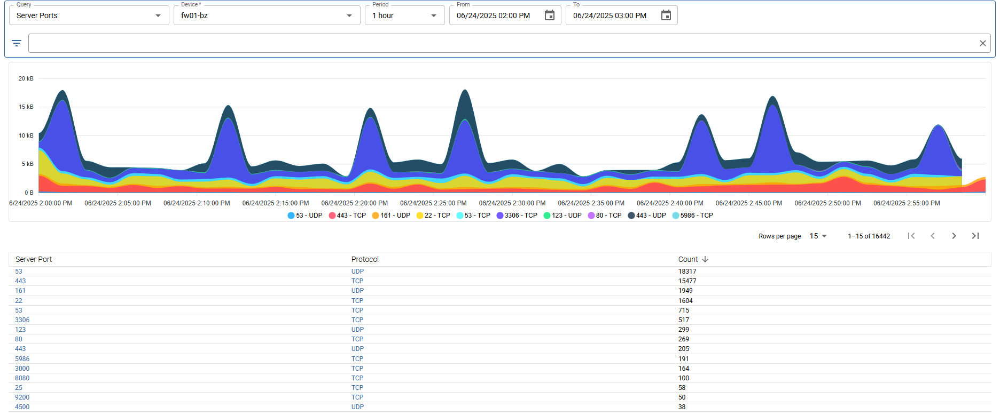
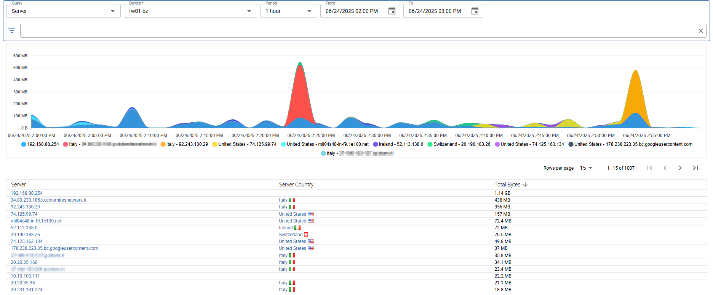

import Breadcrumb from "../../../src/components/Breadcrumb";

<Breadcrumb crumbs={["Monitoring", "NetFlow", "Historical Flow Analysis"]} />

The *Historical Flow Analysis* can be used to search for older flows, not longer present in the [*Live Flows*](./netflow-live-flows#live-flows) list.
The age of the flows that can be displayed depends on the retention settings. By default flows are stored for 180 days.

You can choose a pre-defined period or select a custom time range. When using a pre-defined period, the data ranges always to the begin of the current hour.

The view can be changed using the *Query* settings at the top left and is separated into two parts:
a timeseries graph and a list, displaying the flows or the relvant information.

Avilable filters

A lot of filters are avilable to get specific flows and results:

- *IP*: filter by client or server ip
- *Client IP*: filter by client ip
- *Server IP*: filter by server ip
- *Network*: filter by client or server IP using the network CIDR notation
- *Client Network*: filter by client IP using the network CIDR notation
- *Server Network*: filter by server IP using the network CIDR notation
- *ASN*: filter client or server by asn number
- *Client ASN*: filter client by asn number
- *Server ASN*: filter server by asn number
- *Country*: filter by client or server country
- *Client Country*: filter by client country
- *Server Country*: filter by server country
- *Port*: filter by client or server port
- *Client Port*: filter by client port
- *Server Port*: filter by server port
- *Application*: filter by application (L7) protocol
- *Protocol*: filter by transport (L4) protocol
- *Vlan*: filter by vlan
- *Interface*: filter by input or output interface
- *Input Interface*: filter by input interface
- *Output Interface*: filter by output interface

## Flows (Throughput)

## Conversations

## Flows (Bytes)

## L7 Contacts

## Server Contacts

## Server Ports

## Server

