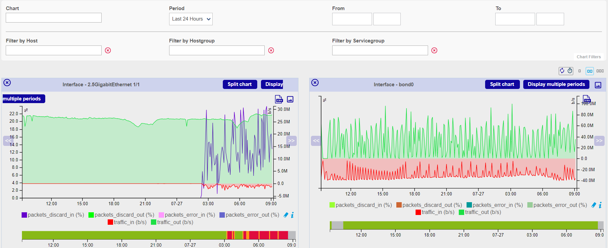
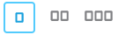
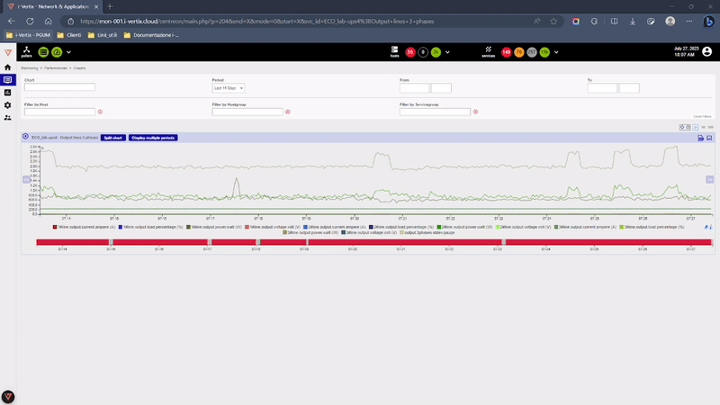

i-Vertix can be used to generate graphs from monitoring information. There are two types of graph:

* Performance graphs serve to view the evolution of services intuitively. E.g.: filling level of a hard disc, network
  traffic, etc.
* History graphs (or status graphs) serve to view the evolution of the statuses of a service.

Performance graphs always have a time period for the x-axis and a unit as the y-axis (Volts, Octets, etc.). History
graphs always have a time period for the x-axis, their y-axes do not vary. Only the color of the graph can be used to
view the status of the object:

* Green for OK status 
* Orange for WARNING status
* Red for CRITICAL status
* Grey for UNKNOWN status

Example of performance graph:

## Performance graphs

There are several ways to view performance graphs:

* Viewing the graph in the list of services, from **Monitoring \> Status Details \> Services** menu, by mouse-over the
  icon 
* Viewing the graphs from the host' detail page by clicking on **View graphs for host**
* Viewing the graph from the service' details page
* From the **Monitoring \> Performances \> Graphs** menu to view multiple graphs

## Status graphs

In the same way as for the performance graphs, there are several ways of accessing status history graphs:

* From the service' details page
* From the **Monitoring \> Performances \> Graphs** menu, by first selecting a specific service.

## Viewing multiple graphs

To view all graphs, go to the **Monitoring \> Performances \> Graphs** menu.

This page offers several selection options as well as filtering options:

* The **Chart** option allows to select the chart you want to display
* The **Period** option allows you to select a predefined the time window to display the data
* The **From** and **To** fields allow to select a manual time window to display the data
* The **Filter by Host** option allows to filter the **Chart** list by presenting only the graphics linked to the
  selected resources
* The **Filter by Hostgroup** option allows to filter the **Chart** list by presenting only the graphics linked to the
  selected resources
* The **Filter by Servicegroup** option allows to filter the **Chart** list by presenting only the graphics linked to
  the selected resources

Several actions are possible on the page:

* To refresh manually the data by clicking on the icon 
* To automatically refresh the data by clicking on the icon  and by selecting a
  predefined period
* To display charts on 1, 2 or 3 columns by clicking on the associated icon 

Several actions are possible on each graph:

* **Split chart**: separates multiple curves of a graph into multiple graphs each containing one curve
* **Display multiple periods**: displays the graph over a period of 1 day, 1 week, 1 month, 1 year
* To export the graph in a CSV format by clicking on the icon  or in PNG by clicking on the
  icon 
* To move back in time by clicking on the icon  or backward by clicking on the
  icon 
* It is also possible to zoom in on a time period by clicking on the graph and then selecting a time window:

