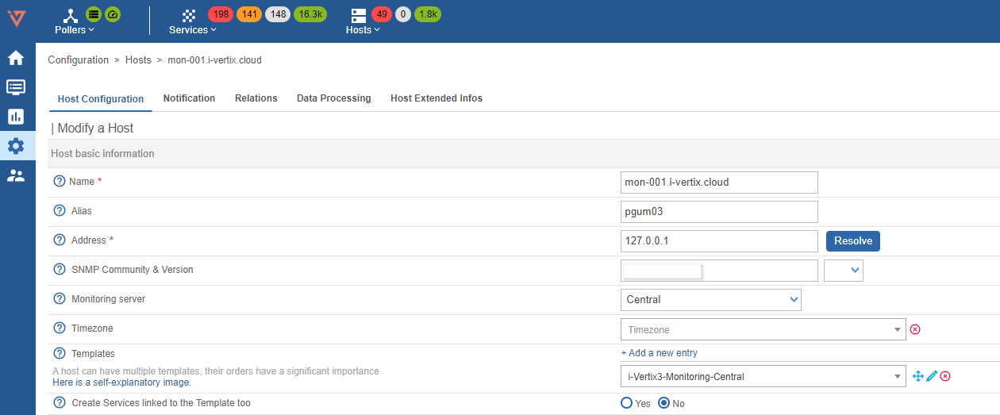
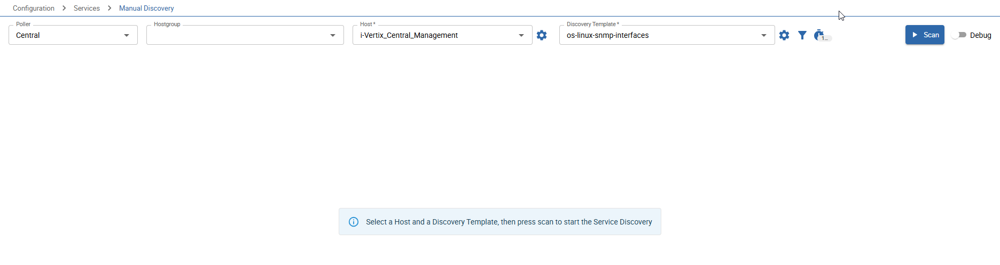
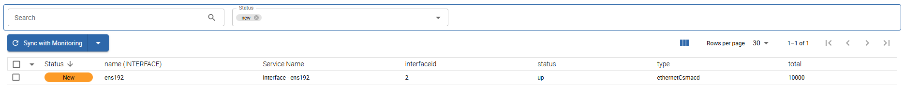

import Breadcrumb from "../../../src/components/Breadcrumb";

After completing the previous steps your system is now ready for it's first real monitoring tasks.

:::tip

Study our [Monitoring Principles](../monitoring-resources/monitoring-principles) and the [Deploy Monitoring Configuration](../monitoring-resources/export-configuration) 
process to get a better understanding of the main concepts of *Monitoring with i-Vertix*.

:::

We provide several ways of creating your monitoring configuration:

- [the default, manual way](#manually-configure-your-first-host)
- [a network topology discovery to onboard network devices](../monitoring-resources/discovery/nedi)
- [a network scan using nmap and snmp](../monitoring-resources/discovery/host-discovery)
- [vmware discovery to onboard whole vmware datacenters](../monitoring-resources/discovery/vmware-discovery) in combination with the [further virtual machine OS scan](../monitoring-resources/discovery/vmware-os-discovery)
- [meraki discovery to import your cisco meraki ecosystem](../monitoring-resources/discovery/meraki-discovery)
- [a easy-to-use service discovery](../monitoring-resources/discovery/service-discovery) to increase the monitoring quality of your monitored servers and devices

To start off, let's create the monitoring configuration for the *Central Management* server itself by hand.

---

## Manually configure your first host

1. Make sure you have the following plugin pack installed:

    ```text
    i-Vertix4 Monitoring Central
    ```

    :::tip

    The process of installing plugin packs was part of [this previous chapter](./plugin-store-init) of the *Quick Start Guide* or is fully described in the [Plugin Packs Guide](../monitoring-resources/plugin-packs).

    :::

2. Navigate to <Breadcrumb crumbs={["Configuration", "Hosts"]} />
3. Click the `Add` button on top of the list to open the form for creating a new host
4. Fill in following information:

    

    - **Name:** insert the ***device name*** / ***host name*** (no spaces allowed)
    - **Alias:** insert an ***alternative name*** / ***readable name***
    - **IP Address / DNS:** IP address or FQDN of the host (insert ***127.0.0.1*** in this case). If you enter a FQDN you can click on `Resolve` to check if the system is able to resolve the hostname
    - **Monitored from:** select ***Central*** from the dropdown menu
    - **Templates:** Click ***Add a new entry*** and select `i-Vertix4-Monitoring-Central` from the dropdown list
    - **Create Services linked to the Template too:** select **Yes**

5. Click `Save` to add the new host

The monitoring configuration for the *Central Management* server is now created.
Most of the configuration comes from the assigned *Host Template*: snmp community & version, the default readonly credentials for the database and default ports.
In combination with the applied *Create Services linked to the Template too* the most relevant monitoring services are automatically created, such as:
CPU, important storages, inodes, RAM, ntp, swap, load, uptime, important processes providing the monitoring service and the database.

This example shows the true power of *Plugin Packs* and the *monitoring templates* they bring along.

To finish off this example, let's discover the server's *interfaces* and monitor them as well.

1. Navigate to <Breadcrumb crumbs={["Configuration", "Services", "Manual Discovery"]} />
2. Select the *Host* you have created just now

    
3. Select the `os-linux-snmp-interfaces` *Discovery Template* and hit `Scan`
4. Shortly after you should see the discovered *interfaces* which are configured on the *Central Management* system

    

5. Check the boxes of *interfaces* you want to monitor and click `Sync with Monitoring`

Now you have monitored also the interfaces of your fresh *Central Management* server.

Let's *Export the Monitoring Configuration* now to start monitoring your first host.
Please read [this quick guide on how to export the monitoring configuration for a poller](../monitoring-resources/export-configuration) 
