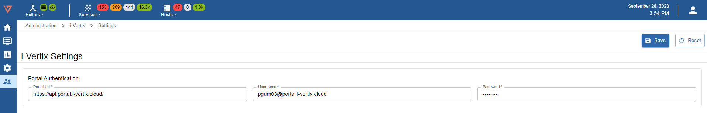

import Breadcrumb from "../../../src/components/Breadcrumb";

To enable the *i-Vertix Plugin Store* on your system you need to deposit your *i-Vertix Portal* credentials.

Navigate to <Breadcrumb crumbs={["Administration", "Stores", "Settings"]} /> while being logged in as admin and insert following information:



* *Portal Url:*
    ```text

    https://api.portal.i-vertix.cloud/
    
    ```
* *Username & Password:* received together with your i-Vertix license, otherwise ask our [support team](mailto:support@i-vertix.com) to receive your personal credentials

:::warning[Mandatory]

This task is mandatory to ensure a properly working monitoring experience.

After completion, please proceed to the next step to complete the procedure: [Plugin installation](./plugin-store-init)

:::
