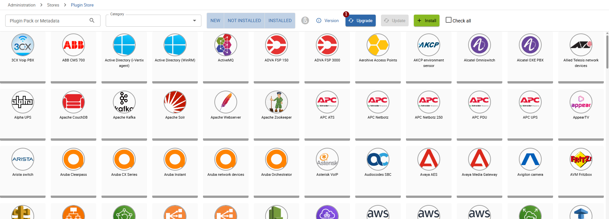
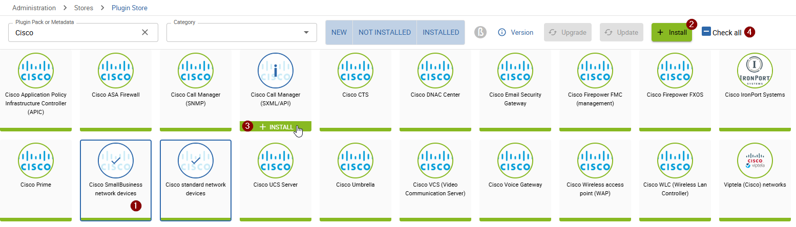
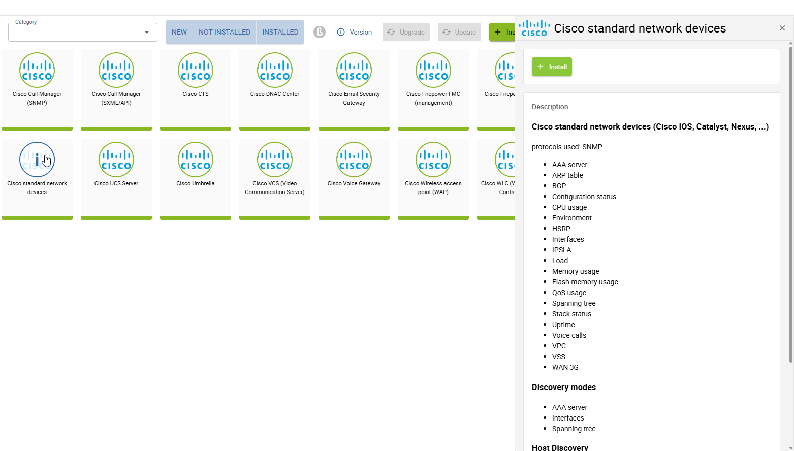

import Breadcrumb from "../../../src/components/Breadcrumb";
import ImageCounter from "../../../src/components/ImageCounter";

:::caution Mandatory

This task is mandatory to ensure a properly working monitoring experience.

This step needs to be done after completing the [*Plugin Store Configuration*](./plugin-store-configuration).

:::

Access the *i-Vertix Plugin Store* by navigating to <Breadcrumb crumbs={["Administration", "Stores", "Plugin Store"]} />.

## Perform the first monitoring plugins upgrade

When accessing the *Plugin Store*, you should see a grid of available *plugin packs* and a blue <ImageCounter num={1} disableMargin /> `Upgrade` button on the top right of the page.

Click the <ImageCounter num={1} disableMargin /> `Upgrade` button to install the latest plugin versions on your fresh monitoring system. Please do not close the page - the process may take some time.

:::info

In case you see an alert, stating that you don't have access to the resources of the *plugin store*, you might have not configured the [*plugin store credentials*](./plugin-store-configuration)
or the credentials provided are not correct. Please make sure to provide the correct credentials.

:::

After the first *Upgrade* of the plugins is complete you can start installing *plugin packs*.

To learn more about the *Upgrade* process, visit the detailed [*Plugin Store* Guide](../monitoring-resources/monitoring-basics/plugin-packs) which covers the whole *Plugin Store* ecosystem.

## Install your first plugin pack

The *plugin store* contains over 400 *plugin packs*, covering over 750+ technologies ready to monitor.
You can read more about plugin packs in the [What is a Plugin Pack](../monitoring-resources/monitoring-basics/plugin-packs#pluign-pack) chapter of the documentation.

To install one or more *plugin packs* you have different possiblities:

* Select multiple *plugin packs* by <ImageCounter num={1} disableMargin /> clicking on visible items and click the <ImageCounter num={2} disableMargin /> `+ Install` button
* Install only a single *plugin pack* by <ImageCounter num={3} disableMargin /> hovering over an item and clicking the `+ Install` element
* Select all visible items by clicking the <ImageCounter num={4} disableMargin /> `Check all` checkbox and the <ImageCounter num={2} disableMargin /> `+ Install` button

You can also filter the *plugin store* by *plugin pack name*, *metadata* (technologies used, i.e. SNMP) and by *category*.

Check what is contained in a plugin pack

To see what is inside of a *plugin pack*, hover over an item and click the `i` in the middle.
The details appear in the sidebar to the right of the page.

:::caution

Some plugin packs require additional connectors to later function properly when used.
Check each plugin pack detail you are about to install to verify if any additional actions are required.

:::

We suggest to start with installing the `i-Vertix4 Monitoring Central` *plugin pack*.
This pack includes everything you need to monitor the *i-Vertix Monitoring* server itself and is required in a next step of this *Quick Start Guide*.
