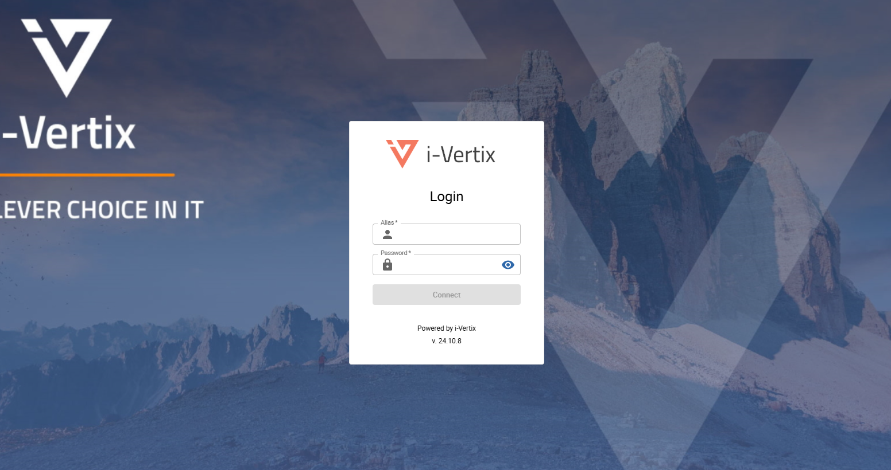
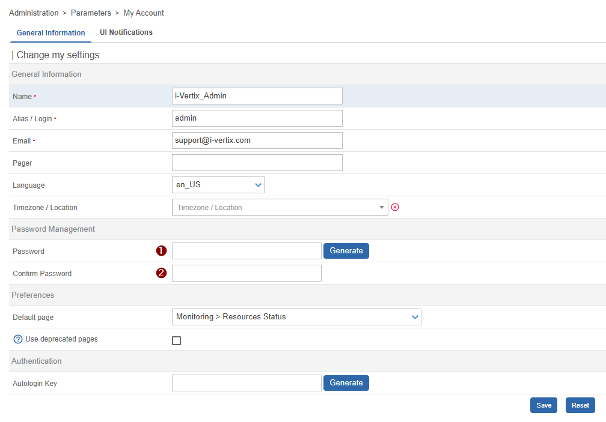

import ImageCounter from "../../../src/components/ImageCounter";

After you have made sure that your organization fulfills the [requirements](./requirements) you can now start with the setup of your *i-Vertix Monitoring* solution.
This guide only describes the minimum steps to install and configure the system. For a more detailed installation, check the complete [Installtion Guide](../installation/before-you-start/platform).

:::note

The following steps assume you already know which architecture you are about to install and how much resources you need for each virtual appliance as listed in the [requirements](./requirements).

:::

## Import the Central Management System

Our sales team should have sent you a *.ova* file (or similar) for the *Central Manager* system to download.
Once the file has been downloaded, import the appliance into your hypervisor and assign the calculated hardware resources to the new virtual machine.

:::tip

Check our [import a virtual appliance](../installation/setup-central-poller/import-virtual-appliance) guide if you are not 100% sure how to import the appliance correctly.

:::

After the ova file is successfully imported, start the new virtual machine.

### Login

Open the console of the new virtual machine to perform the most important tasks.

Use following default credentials for the first login:

* **User:** `admin`

* **Password:** `changeme` (change as soon as possible)

After you have successfully logged in the i-Vertix Central menu should appear:


:::info

If the menu does not appear, you can always reopen it using following command:

```bash
menu
```

:::

### Change default password

First things first: change the insecure default password to a new, secure password of your choice by selecting option `11) Set i-Vertix system passwords` from the menu.

### Network configuration

Enter option `6) Network settings` from the menu to enter the system network configuration.


Most importantly you need to assign an IP address to the new virtual machine along with internet access.
Our [*Network configuration*](../installation/setup-central-poller/network-configuration) article explains how to use the network manager (nmtui).

:::warning

Internet access is needed to complete the initial system setup. In case no internet access is available, please ask our [support team](mailto:support@i-vertix.com) for a detailed offline procedure.

:::

It may be necessary to restart the virtual machine after completing the network settings configuration.

After the network is configured you can also open a console connection via SSH to this virtual machine on port 22.

### Change timezone

By default the timezone `Europe/Rome` is configured. You can change the timezone by selecting option `5) i-Vertix settings` -> `2) change timezone` from the menu.
The provided timezone must be an [official timezone identifier](https://en.wikipedia.org/wiki/List_of_tz_database_time_zones).

After changing the timezone, realod the system time by selecting option `5) i-Vertix settings` -> `1) NTP time settings` from the menu.

### License activation

Open the license management by selecting option `9) i-Vertix license management`.
Send the displayed UUID to our [support team](mailto:support@i-vertix.com). Shortly after you will receive a notification that your license is ready and can be downloaded.
You can download the new license always from the license management using option `3) Download license key informations`.

To fully activate your system after activating the license please restart the system.

### Access to Web console

Open any browser and enter the host address of the Central Manager. A login form should appear to which you can insert following default credentials to log in as admin:

* **Username:** `admin`
* **Password:** `ChangeMe$2024`



After you have successfully logged in, immediately change your password:

1. Click the user icon in the top right corner of the page and select `Edit Profile`
    
    
2. Insert a new <ImageCounter num={1} disableMargin /> strong password
3. Retype your new <ImageCounter num={2} disableMargin /> strong password
4. Save the form

---

You can now proceed with the [*Plugin Store Configuration*](./plugin-store-configuration) in case you don't have to set up *i-Vertix Pollers* or if you want to do that later.

---

## Import the Poller appliance

:::tip

Repeat the following steps for every poller you need to install

:::

Our sales team should have sent you a *.ova* file (or similar) for the *i-Vertix Poller* system to download.
Once the file has been downloaded, import the appliance into your hypervisor and assign the calculated hardware resources to the new virtual machine.

:::tip

Check our [import a virtual appliance](../installation/setup-central-poller/import-virtual-appliance) guide if you are not 100% sure how to import the appliance correctly.

:::

After the ova file is successfully imported, start the new virtual machine.

### Login

Open the console of the new virtual machine to perform the most important tasks.

Use following default credentials for the first login:

* **User:** `admin`

* **Password:** `changeme` (change as soon as possible)

After you have successfully logged in the i-Vertix Central menu should appear:


:::info

If the menu does not appear, you can always reopen it using following command:

```bash
menu
```

:::

### Change default password

First things first: change the insecure default password to a new, secure password of your choice by selecting option `10) i-Vertix Poller passwords` from the menu.

### Network configuration

Enter option `6) Network settings` from the menu to enter the system network configuration.


Most importantly you need to assign an IP address to the new virtual machine along with internet access.
Our [*Network configuration*](../installation/setup-central-poller/network-configuration) article explains how to use the network manager (nmtui).

:::warning

Internet access is needed to complete the initial system setup. In case no internet access is available, please ask our [support team](mailto:support@i-vertix.com) for a detailed offline procedure.

:::

It may be necessary to restart the virtual machine after completing the network settings configuration.

After the network is configured you can also open a console connection via SSH to this virtual machine on port 22.

### Change timezone

By default the timezone `Europe/Rome` is configured. You can change the timezone by selecting option `5) i-Vertix Poller settings` -> `2) change timezone` from the menu.
The provided timezone must be an [official timezone identifier](https://en.wikipedia.org/wiki/List_of_tz_database_time_zones).

After changing the timezone, realod the system time by selecting option `5) i-Vertix Poller settings` -> `1) NTP time settings` from the menu.

### Connect Pollers to the Central Management

:::note

This step requires the finished setup of the [*Central Management System*](#import-the-central-management-system).

:::

Please read and run through the complete [Attach a Poller to the Central Management](../installation/attach-a-poller-to-a-central-server) process to add the new pollers to your monitoring system.
