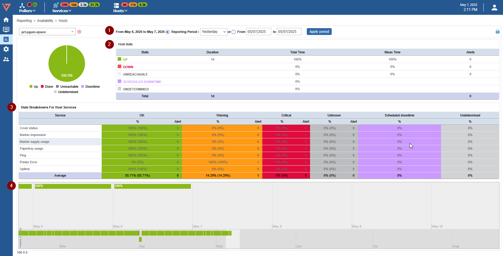
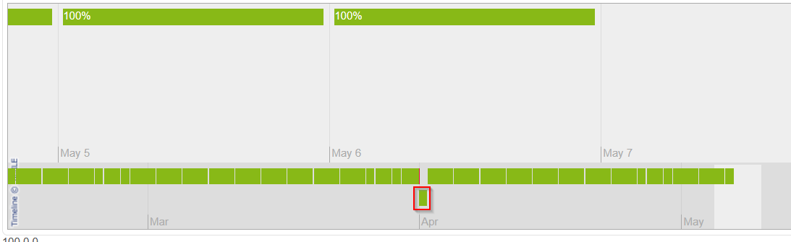
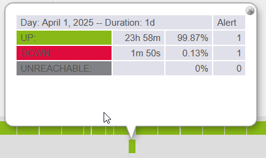

import ImageCounter from "../../../src/components/ImageCounter";

Through the i-Vertix Web interface, you can view availability reports showing how much time specific hosts,
host groups, or service groups were available during a selected period.

To access the availability reports:

- Go to **Reporting > Availability > Hosts**.
- Select a host from the **Host** list in the upper left.

- <ImageCounter num={1} /> The <b>Reporting Period</b> lets you select a predefined period or define it manually using <b>From</b> to <b>to</b> fields.
- <ImageCounter num={2} /> The <b>Host state</b> table displays the availability rates of objects.
- <ImageCounter num={3} /> The <b>State Breakdowns For Host Services</b> table displays the availability of linked objects.
- <ImageCounter num={4} /> The timeline provides a quick and intuitive overview of the status of the object.

Click a day in the timeline to obtain the report for that day:

It is also possible to view web reports:

* The groups of hosts: by clicking **Reporting > Availability > Hosts groups**.
* The groups of services: by clicking **Reporting > Availability > Service groups**.

The CSV icon in the upper right corner is used to export data as a CSV file.

> You can also see the availability of a service by clicking the service name in the host or servicegroup report.